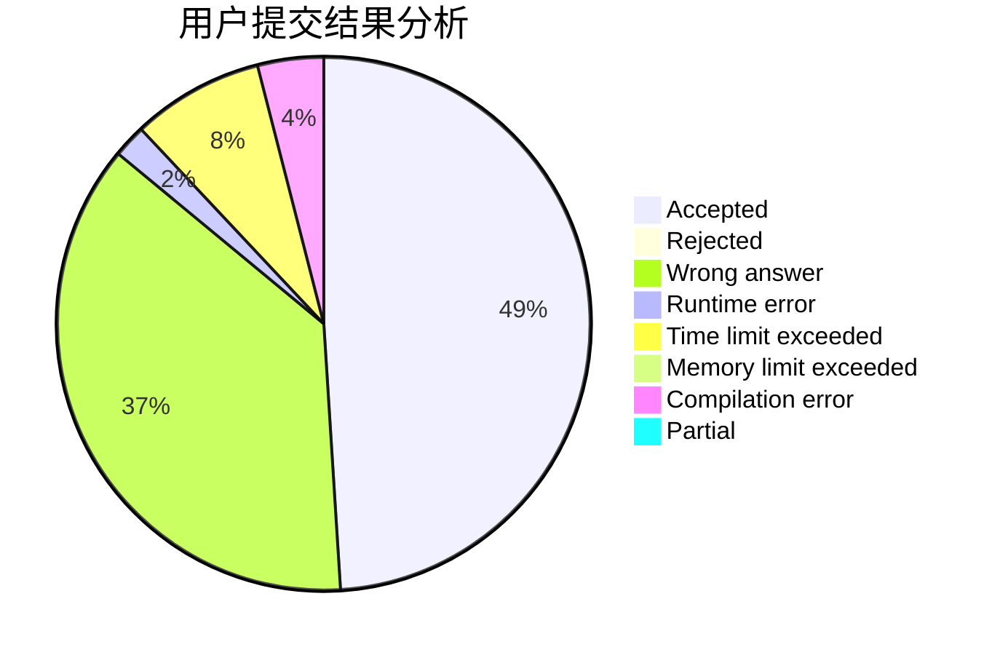
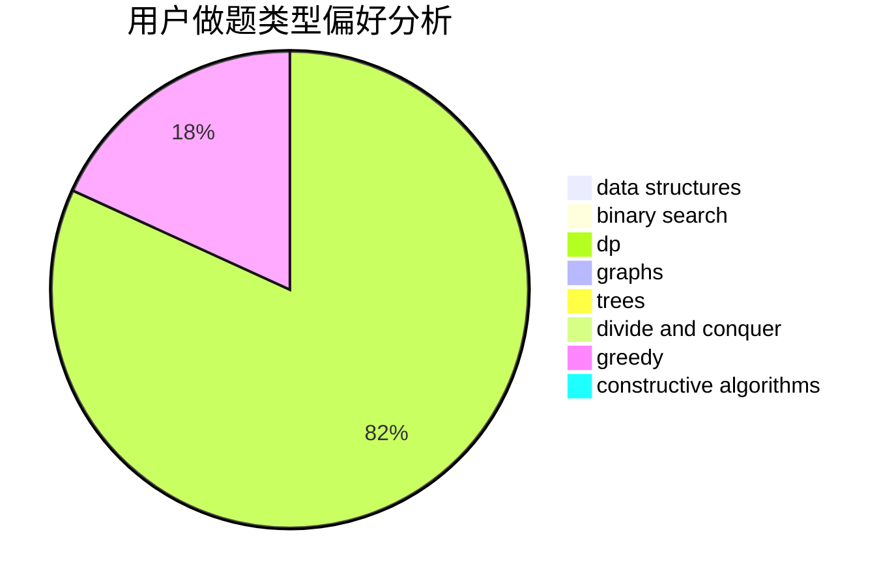
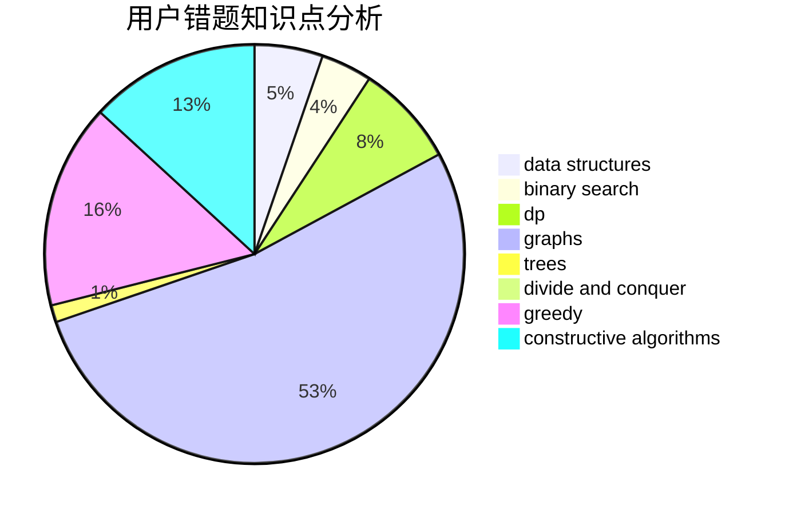

# mr_lolololol

<!-- tabs:start -->

#### **用户提交结果分析**

#### **用户做题类型偏好分析**

#### **用户错题知识点分析**

<!-- tabs:end -->
# 推荐题目
[1510I](https://codeforces.com/contest/1510/problem/I)		greedy,
                        interactive,
                        math,
                        probabilities		  
[1451A](https://codeforces.com/contest/1451/problem/A)		greedy,
                        math		  
[1265D](https://codeforces.com/contest/1265/problem/D)		dsu,graphs,sortings,trees		  
[504E](https://codeforces.com/contest/504/problem/E)		binary search,
                        dfs and similar,
                        hashing,
                        string suffix structures,
                        trees		  
[802H](https://codeforces.com/contest/802/problem/H)		constructive algorithms,
                        strings		  
[1474A](https://codeforces.com/contest/1474/problem/A)		greedy		  
[1436B](https://codeforces.com/contest/1436/problem/B)		constructive algorithms,
                        math		  
[1097E](https://codeforces.com/contest/1097/problem/E)		constructive algorithms,
                        greedy		  
[1388C](https://codeforces.com/contest/1388/problem/C)		dfs and similar,
                        greedy,
                        math,
                        trees		  
[1482E](https://codeforces.com/contest/1482/problem/E)		data structures,
                        divide and conquer,
                        dp		  
