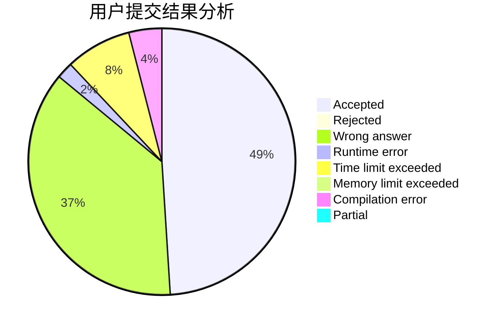
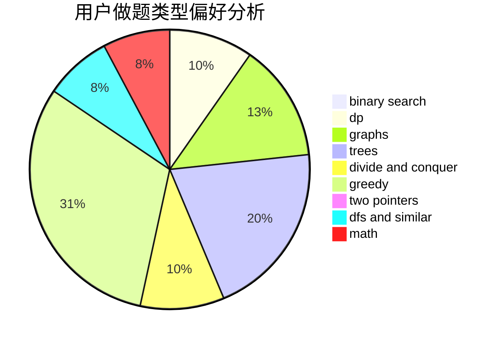

# mr_lolololol

<!-- tabs:start -->

#### **用户提交结果分析**

#### **用户做题类型偏好分析**

<!-- tabs:end -->
# 推荐题目
[166A](https://codeforces.com/contest/166/problem/A)
[145A](https://codeforces.com/contest/145/problem/A)
[1270I](https://codeforces.com/contest/1270/problem/I)
[525B](https://codeforces.com/contest/525/problem/B)
[817E](https://codeforces.com/contest/817/problem/E)
[1482E](https://codeforces.com/contest/1482/problem/E)
[14462](https://codeforces.com/contest/1446/problem/2)
[1098A](https://codeforces.com/contest/1098/problem/A)
[1398A](https://codeforces.com/contest/1398/problem/A)
[1490C](https://codeforces.com/contest/1490/problem/C)
