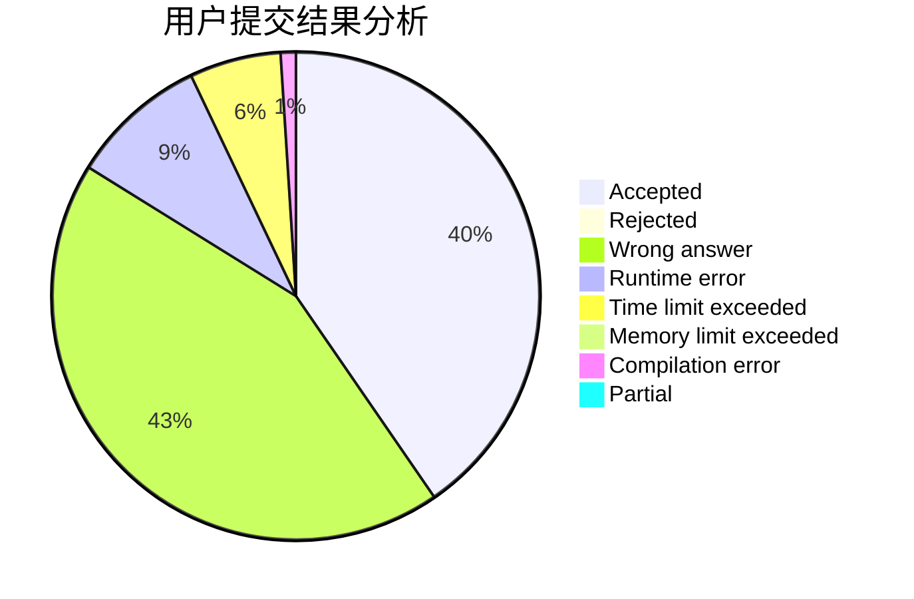
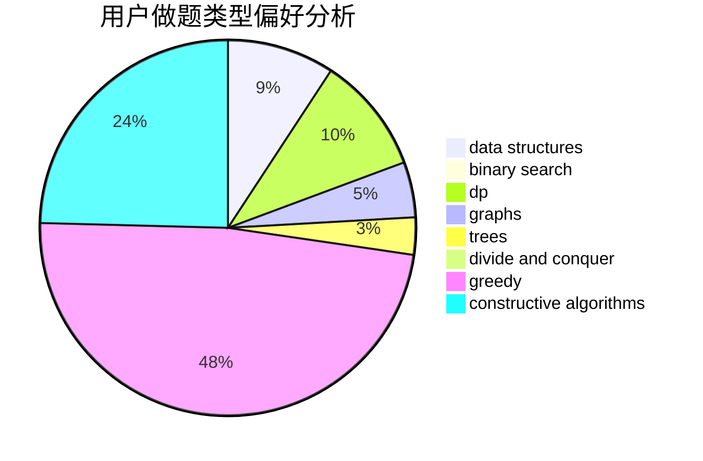
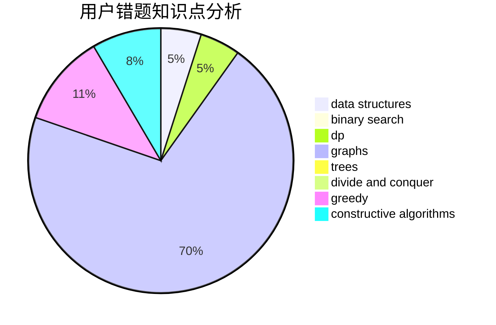

# mrsrz

<!-- tabs:start -->

#### **用户提交结果分析**

#### **用户做题类型偏好分析**

#### **用户错题知识点分析**

<!-- tabs:end -->
# 推荐题目
[158A](https://codeforces.com/contest/158/problem/A)		*special problem,
                        implementation		  
[949D](https://codeforces.com/contest/949/problem/D)		binary search,
                        brute force,
                        greedy,
                        sortings		  
[1293C](https://codeforces.com/contest/1293/problem/C)		dsu,graphs,sortings,trees		  
[605C](https://codeforces.com/contest/605/problem/C)		geometry		  
[261D](https://codeforces.com/contest/261/problem/D)		dp		  
[98E](https://codeforces.com/contest/98/problem/E)		dp,
                        games,
                        math,
                        probabilities		  
[998B](https://codeforces.com/contest/998/problem/B)		dp,
                        greedy,
                        sortings		  
[886C](https://codeforces.com/contest/886/problem/C)		dsu,
                        greedy,
                        implementation,
                        trees		  
[215D](https://codeforces.com/contest/215/problem/D)		greedy		  
[1102A](https://codeforces.com/contest/1102/problem/A)		math		  
