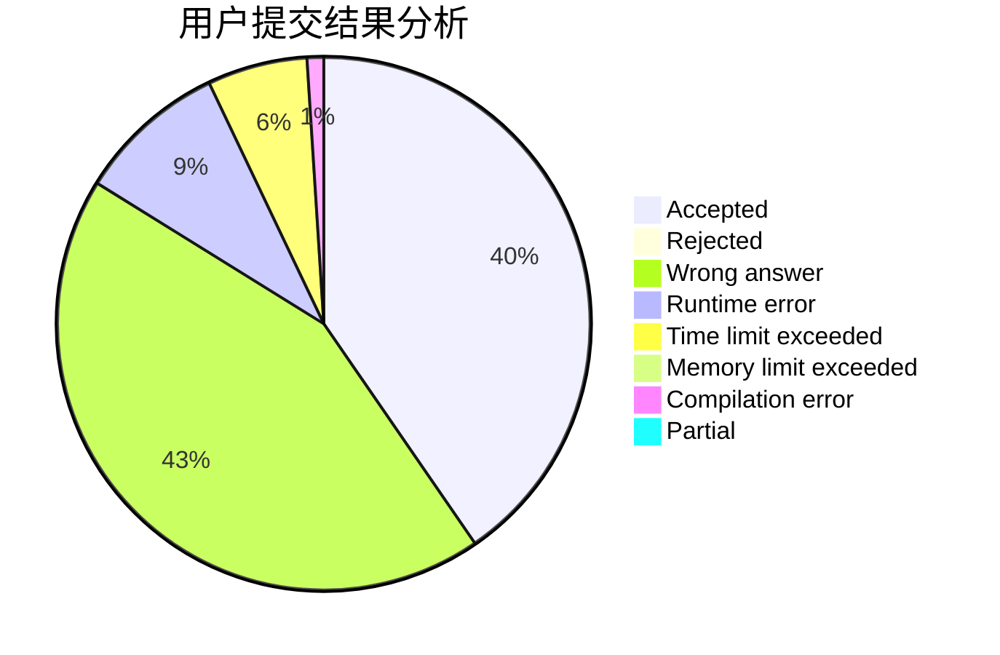
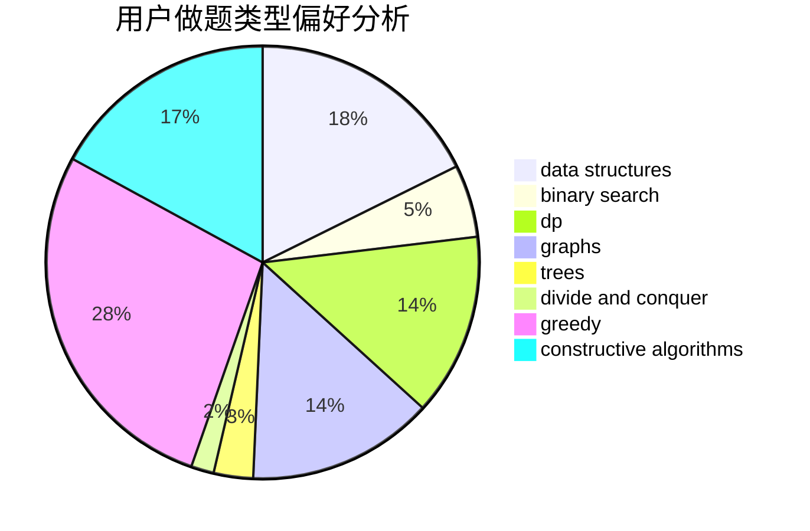
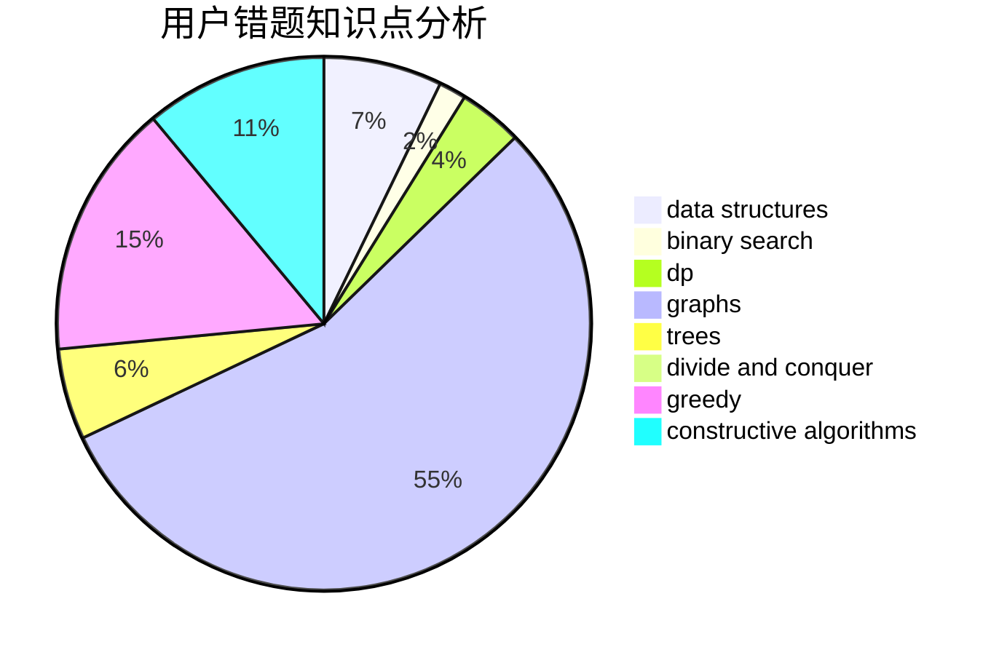

# mrsrz

<!-- tabs:start -->

#### **用户提交结果分析**

#### **用户做题类型偏好分析**

#### **用户错题知识点分析**

<!-- tabs:end -->
# 推荐题目
[1506D](https://codeforces.com/contest/1506/problem/D)		constructive algorithms,
                        data structures,
                        greedy		  
[926J](https://codeforces.com/contest/926/problem/J)		data structures		  
[1286B](https://codeforces.com/contest/1286/problem/B)		constructive algorithms,
                        data structures,
                        dfs and similar,
                        graphs,
                        greedy,
                        trees		  
[585B](https://codeforces.com/contest/585/problem/B)		dfs and similar,
                        graphs,
                        shortest paths		  
[240F](https://codeforces.com/contest/240/problem/F)		data structures		  
[976A](https://codeforces.com/contest/976/problem/A)		implementation		  
[982D](https://codeforces.com/contest/982/problem/D)		brute force,
                        data structures,
                        dsu,
                        trees		  
[865G](https://codeforces.com/contest/865/problem/G)		combinatorics,
                        math,
                        matrices		  
[190C](https://codeforces.com/contest/190/problem/C)		dfs and similar		  
[1101E](https://codeforces.com/contest/1101/problem/E)		implementation		  
