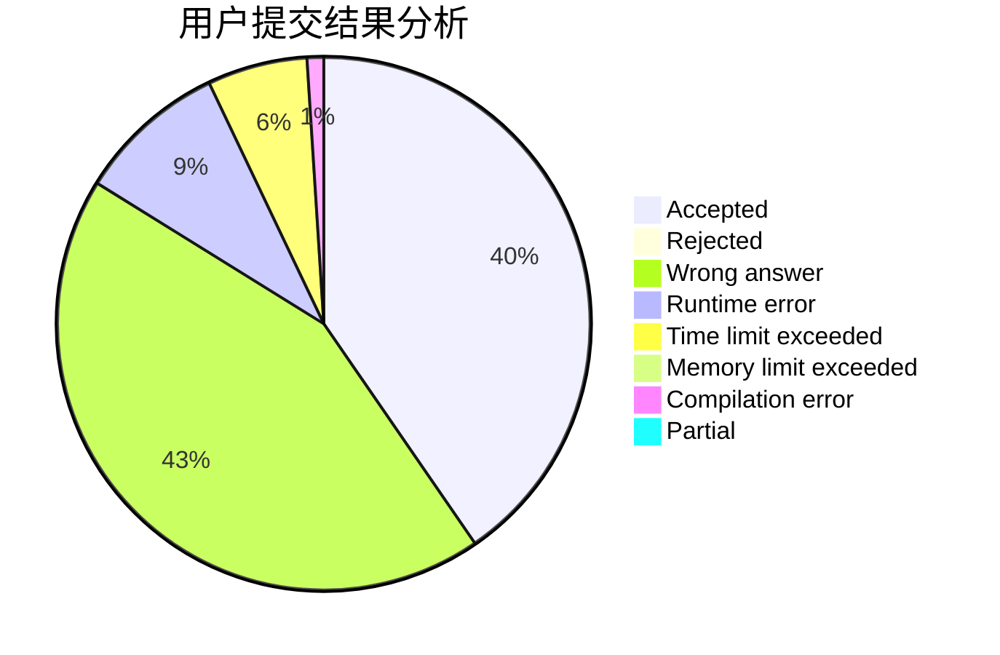
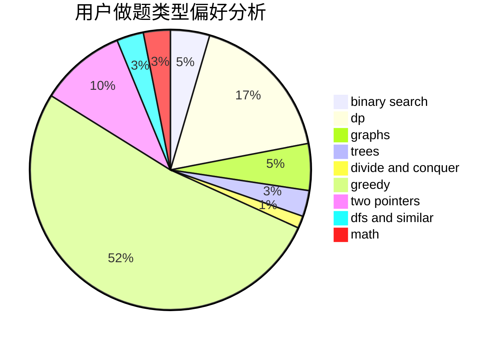

# mrsrz

<!-- tabs:start -->

#### **用户提交结果分析**

#### **用户做题类型偏好分析**

<!-- tabs:end -->
# 推荐题目
[158A](https://codeforces.com/contest/158/problem/A)
[949D](https://codeforces.com/contest/949/problem/D)
[1293C](https://codeforces.com/contest/1293/problem/C)
[605C](https://codeforces.com/contest/605/problem/C)
[261D](https://codeforces.com/contest/261/problem/D)
[98E](https://codeforces.com/contest/98/problem/E)
[998B](https://codeforces.com/contest/998/problem/B)
[886C](https://codeforces.com/contest/886/problem/C)
[215D](https://codeforces.com/contest/215/problem/D)
[1102A](https://codeforces.com/contest/1102/problem/A)
