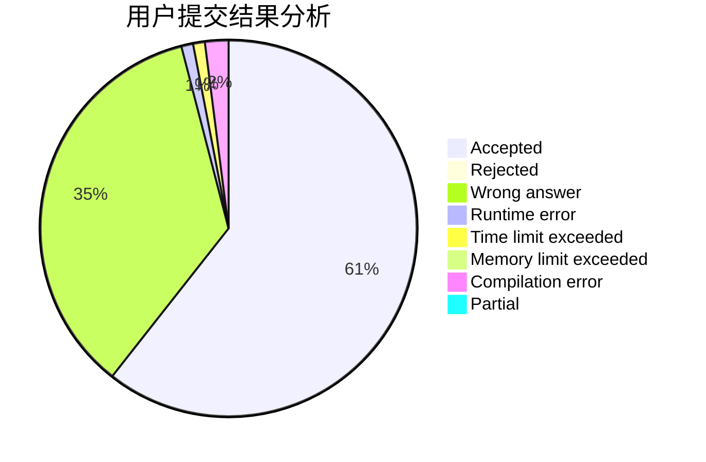
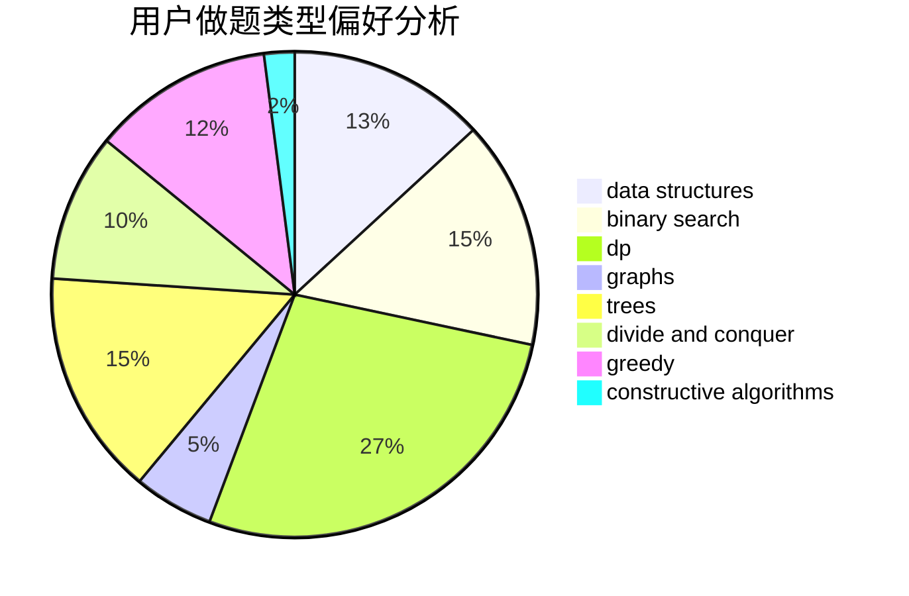
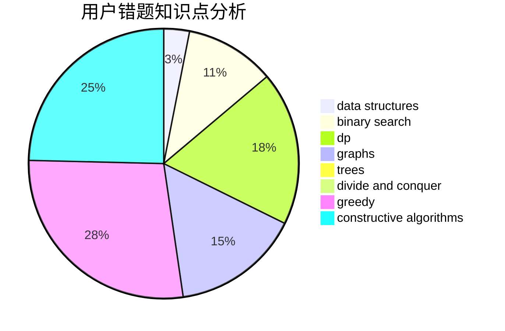

# 135esque

<!-- tabs:start -->

#### **用户提交结果分析**

#### **用户做题类型偏好分析**

#### **用户错题知识点分析**

<!-- tabs:end -->
# 推荐题目
[11411](https://codeforces.com/contest/1141/problem/1)		dsu,graphs,sortings,trees		  
[1141D](https://codeforces.com/contest/1141/problem/D)		greedy,
                        implementation		  
[1146A](https://codeforces.com/contest/1146/problem/A)		implementation,
                        strings		  
[1144F](https://codeforces.com/contest/1144/problem/F)		dfs and similar,
                        graphs		  
[1142D](https://codeforces.com/contest/1142/problem/D)		dp		  
[1144B](https://codeforces.com/contest/1144/problem/B)		greedy,
                        implementation,
                        sortings		  
[11412](https://codeforces.com/contest/1141/problem/2)		dsu,graphs,sortings,trees		  
[1141B](https://codeforces.com/contest/1141/problem/B)		implementation		  
[1145B](https://codeforces.com/contest/1145/problem/B)		brute force		  
[1142C](https://codeforces.com/contest/1142/problem/C)		geometry		  
