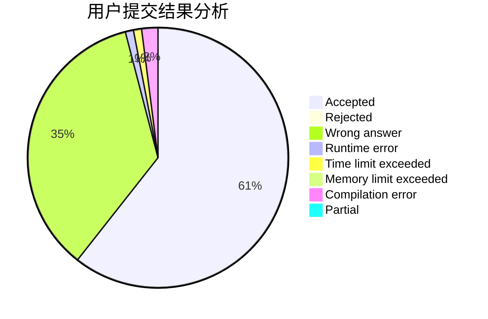
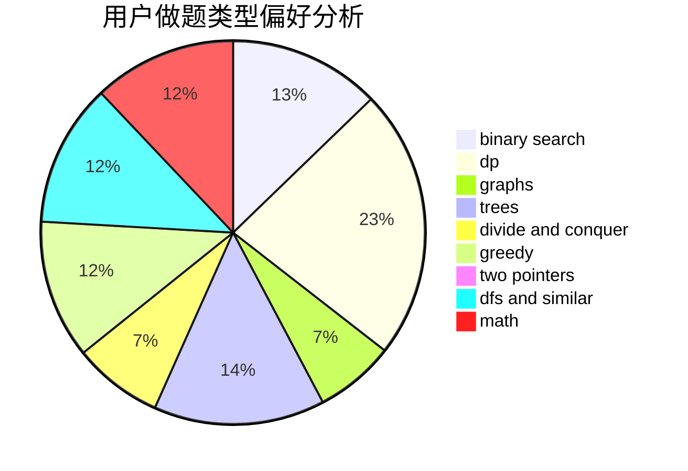

# 135esque

<!-- tabs:start -->

#### **用户提交结果分析**

#### **用户做题类型偏好分析**

<!-- tabs:end -->
# 推荐题目
[11411](https://codeforces.com/contest/1141/problem/1)
[1141D](https://codeforces.com/contest/1141/problem/D)
[1146A](https://codeforces.com/contest/1146/problem/A)
[1144F](https://codeforces.com/contest/1144/problem/F)
[1142D](https://codeforces.com/contest/1142/problem/D)
[1144B](https://codeforces.com/contest/1144/problem/B)
[11412](https://codeforces.com/contest/1141/problem/2)
[1141B](https://codeforces.com/contest/1141/problem/B)
[1145B](https://codeforces.com/contest/1145/problem/B)
[1142C](https://codeforces.com/contest/1142/problem/C)
