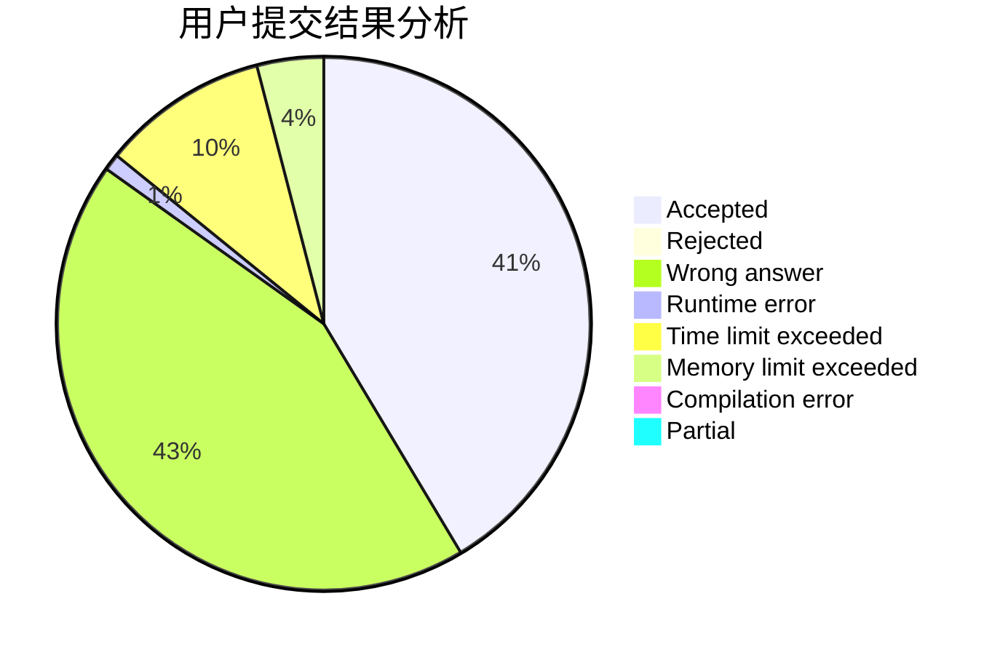
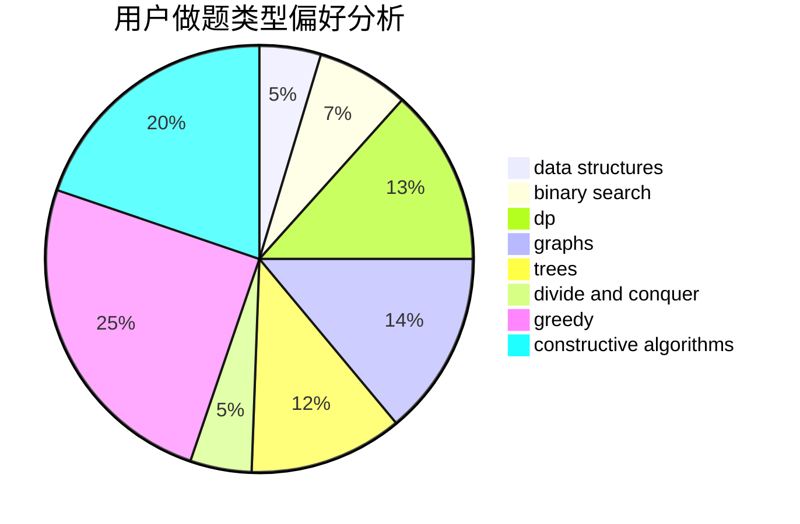

# Bolke

<!-- tabs:start -->

#### **用户提交结果分析**

#### **用户做题类型偏好分析**

#### **用户错题知识点分析**

<!-- tabs:end -->
# 推荐题目
[1237F](https://codeforces.com/contest/1237/problem/F)		combinatorics,
                        dp		  
[578B](https://codeforces.com/contest/578/problem/B)		brute force,
                        greedy		  
[576C](https://codeforces.com/contest/576/problem/C)		constructive algorithms,
                        divide and conquer,
                        geometry,
                        greedy,
                        sortings		  
[122C](https://codeforces.com/contest/122/problem/C)		dsu,graphs,sortings,trees		  
[1054C](https://codeforces.com/contest/1054/problem/C)		constructive algorithms,
                        implementation		  
[543D](https://codeforces.com/contest/543/problem/D)		dp,
                        trees		  
[577A](https://codeforces.com/contest/577/problem/A)		implementation,
                        number theory		  
[1119F](https://codeforces.com/contest/1119/problem/F)		data structures,
                        dp,
                        trees		  
[577E](https://codeforces.com/contest/577/problem/E)		dsu,graphs,sortings,trees		  
[414E](https://codeforces.com/contest/414/problem/E)		data structures		  
