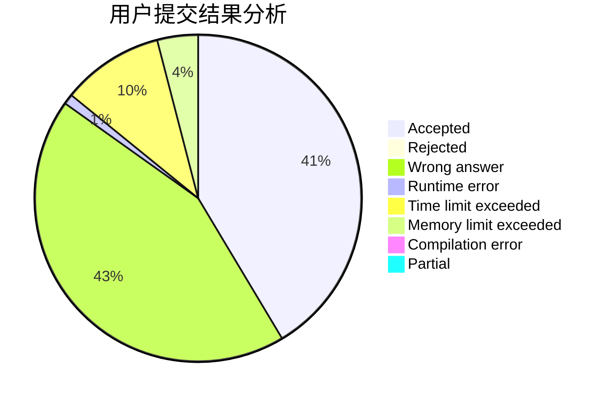
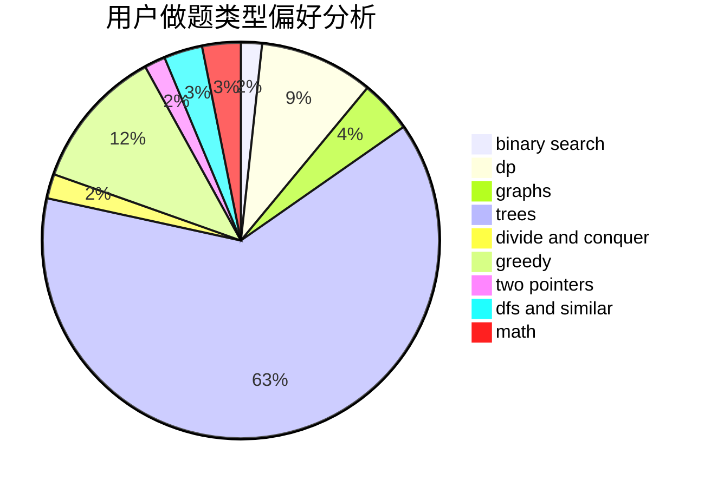

# Bolke

<!-- tabs:start -->

#### **用户提交结果分析**

#### **用户做题类型偏好分析**

<!-- tabs:end -->
# 推荐题目
[1237F](https://codeforces.com/contest/1237/problem/F)
[578B](https://codeforces.com/contest/578/problem/B)
[576C](https://codeforces.com/contest/576/problem/C)
[122C](https://codeforces.com/contest/122/problem/C)
[1054C](https://codeforces.com/contest/1054/problem/C)
[543D](https://codeforces.com/contest/543/problem/D)
[577A](https://codeforces.com/contest/577/problem/A)
[1119F](https://codeforces.com/contest/1119/problem/F)
[577E](https://codeforces.com/contest/577/problem/E)
[414E](https://codeforces.com/contest/414/problem/E)
