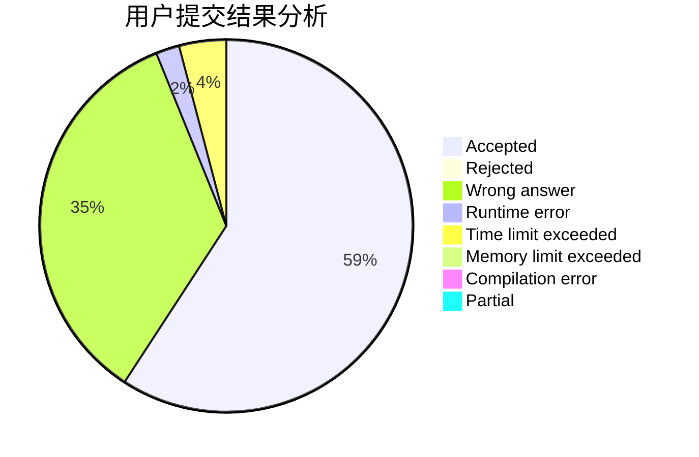
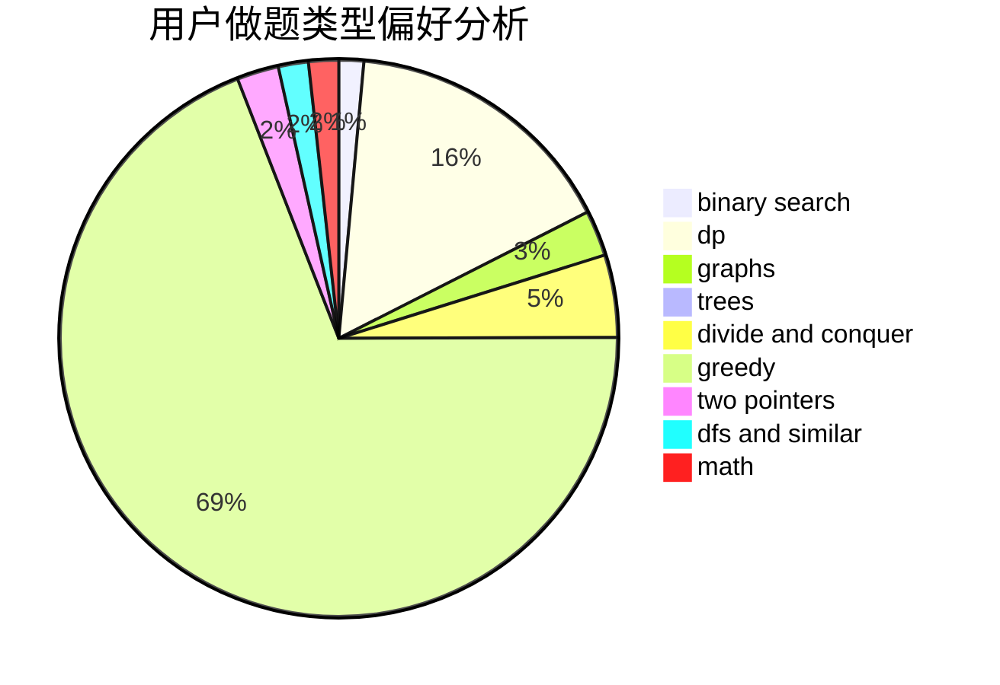

# mtmsq

<!-- tabs:start -->

#### **用户提交结果分析**

#### **用户做题类型偏好分析**

<!-- tabs:end -->
# 推荐题目
[14802](https://codeforces.com/contest/1480/problem/2)
[1100A](https://codeforces.com/contest/1100/problem/A)
[798C](https://codeforces.com/contest/798/problem/C)
[665C](https://codeforces.com/contest/665/problem/C)
[1105D](https://codeforces.com/contest/1105/problem/D)
[483D](https://codeforces.com/contest/483/problem/D)
[1221G](https://codeforces.com/contest/1221/problem/G)
[216B](https://codeforces.com/contest/216/problem/B)
[791C](https://codeforces.com/contest/791/problem/C)
[61B](https://codeforces.com/contest/61/problem/B)
