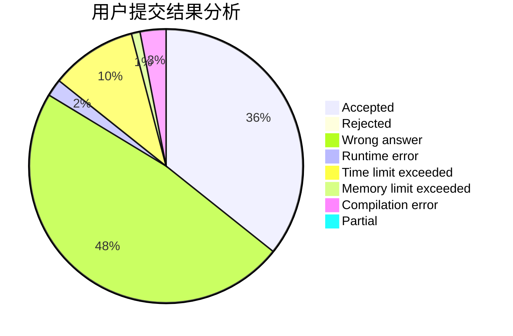
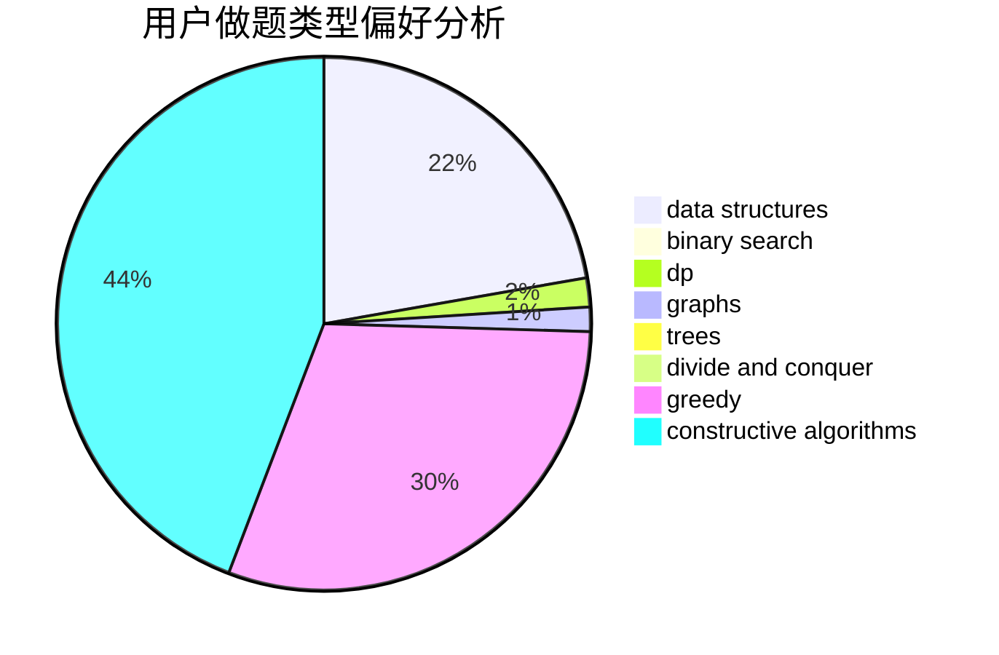
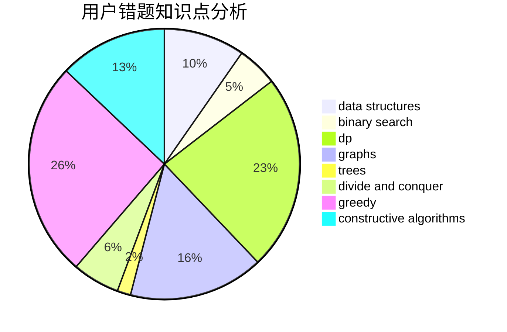

# muoshuo

<!-- tabs:start -->

#### **用户提交结果分析**

#### **用户做题类型偏好分析**

#### **用户错题知识点分析**

<!-- tabs:end -->
# 推荐题目
[1278F](https://codeforces.com/contest/1278/problem/F)		combinatorics,
                        dp,
                        math,
                        number theory,
                        probabilities		  
[758D](https://codeforces.com/contest/758/problem/D)		constructive algorithms,
                        dp,
                        greedy,
                        math,
                        strings		  
[723D](https://codeforces.com/contest/723/problem/D)		dfs and similar,
                        dsu,
                        graphs,
                        greedy,
                        implementation		  
[911D](https://codeforces.com/contest/911/problem/D)		brute force,
                        math		  
[1090M](https://codeforces.com/contest/1090/problem/M)		implementation		  
[594D](https://codeforces.com/contest/594/problem/D)		data structures,
                        number theory		  
[27A](https://codeforces.com/contest/27/problem/A)		implementation,
                        sortings		  
[1032D](https://codeforces.com/contest/1032/problem/D)		geometry,
                        implementation		  
[215B](https://codeforces.com/contest/215/problem/B)		greedy,
                        math		  
[289E](https://codeforces.com/contest/289/problem/E)		dsu,graphs,sortings,trees		  
