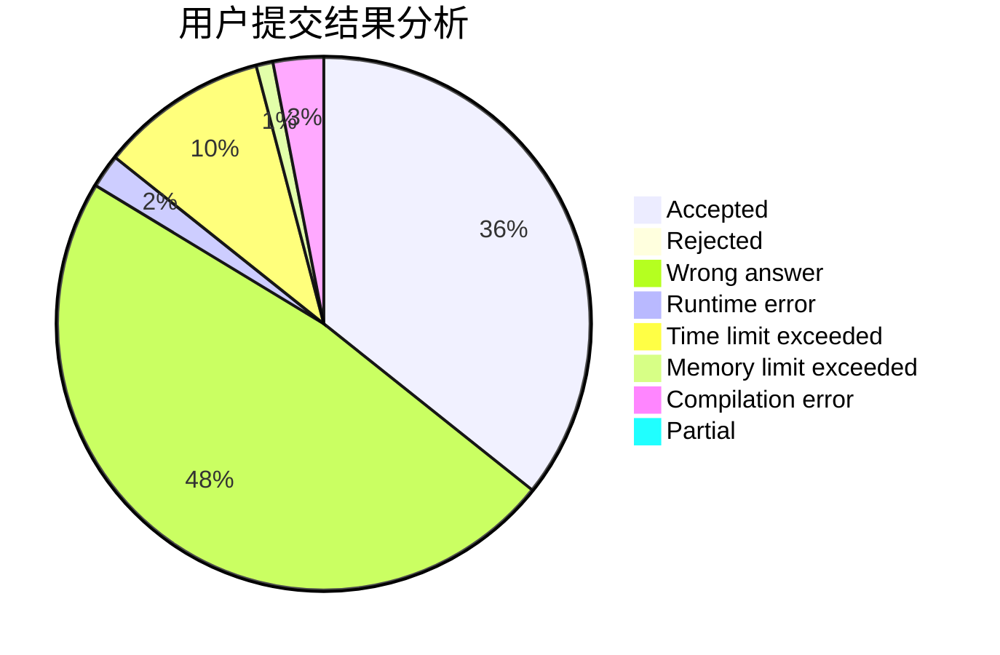
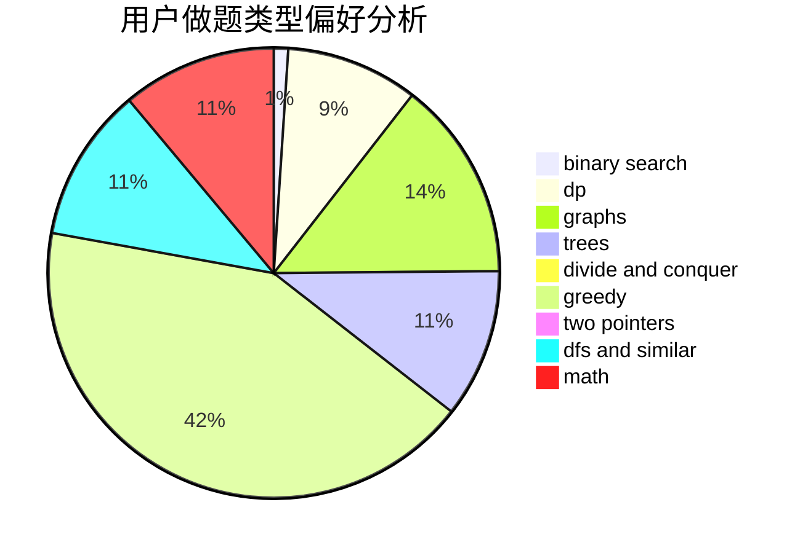

# muoshuo

<!-- tabs:start -->

#### **用户提交结果分析**

#### **用户做题类型偏好分析**

<!-- tabs:end -->
# 推荐题目
[1278F](https://codeforces.com/contest/1278/problem/F)
[758D](https://codeforces.com/contest/758/problem/D)
[723D](https://codeforces.com/contest/723/problem/D)
[911D](https://codeforces.com/contest/911/problem/D)
[1090M](https://codeforces.com/contest/1090/problem/M)
[594D](https://codeforces.com/contest/594/problem/D)
[27A](https://codeforces.com/contest/27/problem/A)
[1032D](https://codeforces.com/contest/1032/problem/D)
[215B](https://codeforces.com/contest/215/problem/B)
[289E](https://codeforces.com/contest/289/problem/E)
