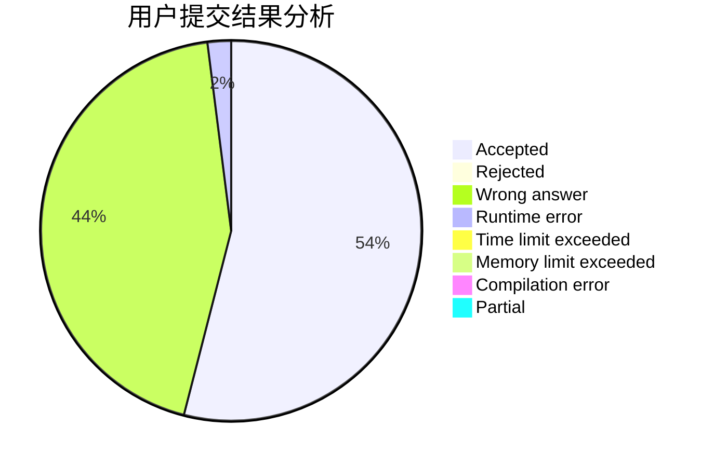
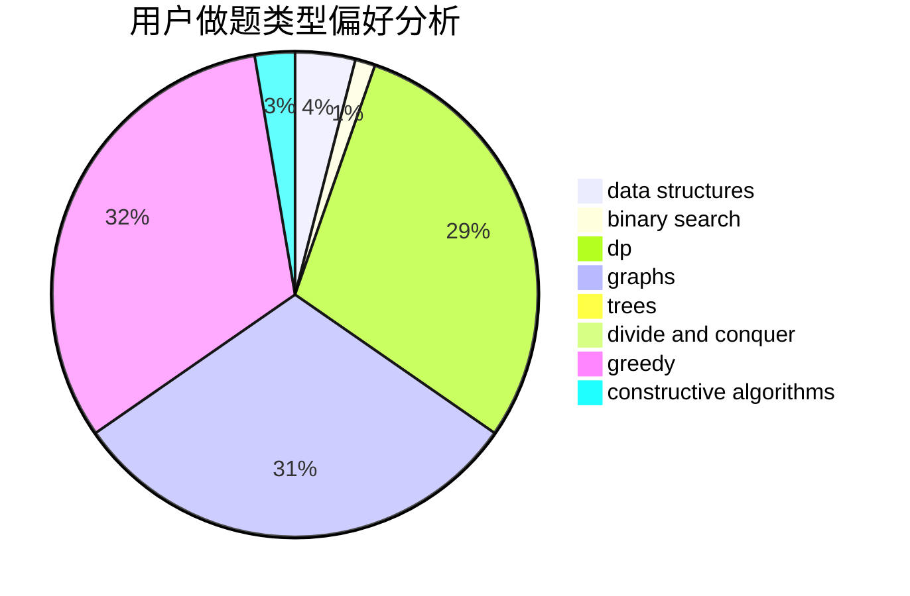
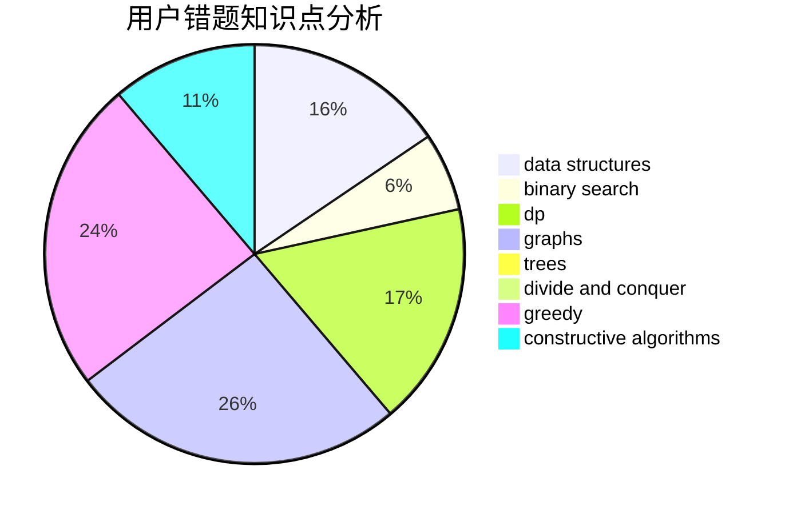

# mxi

<!-- tabs:start -->

#### **用户提交结果分析**

#### **用户做题类型偏好分析**

#### **用户错题知识点分析**

<!-- tabs:end -->
# 推荐题目
[269D](https://codeforces.com/contest/269/problem/D)		data structures,
                        dp,
                        graphs,
                        sortings		  
[1199E](https://codeforces.com/contest/1199/problem/E)		dsu,graphs,sortings,trees		  
[416E](https://codeforces.com/contest/416/problem/E)		dp,
                        graphs,
                        shortest paths		  
[475F](https://codeforces.com/contest/475/problem/F)		data structures		  
[715E](https://codeforces.com/contest/715/problem/E)		combinatorics,
                        fft,
                        graphs,
                        math		  
[1091C](https://codeforces.com/contest/1091/problem/C)		math,
                        number theory		  
[1164H](https://codeforces.com/contest/1164/problem/H)		dsu,graphs,sortings,trees		  
[1182B](https://codeforces.com/contest/1182/problem/B)		dfs and similar,
                        implementation,
                        strings		  
[788A](https://codeforces.com/contest/788/problem/A)		dp,
                        two pointers		  
[1423H](https://codeforces.com/contest/1423/problem/H)		data structures,
                        divide and conquer,
                        dsu,
                        graphs		  
