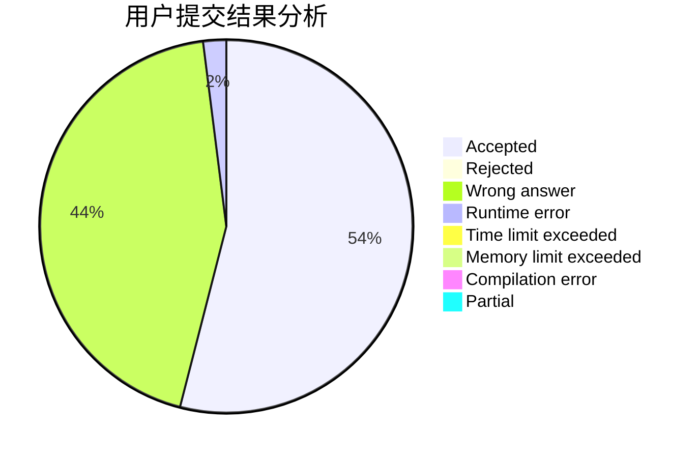
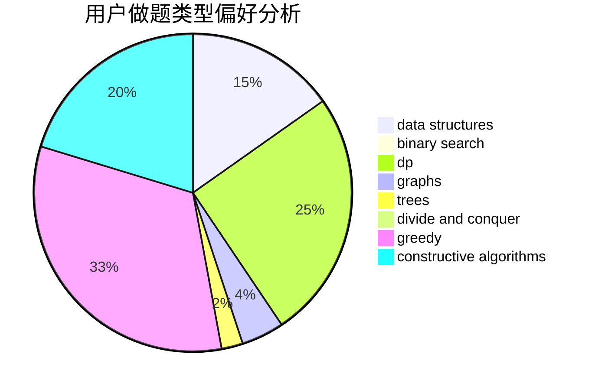
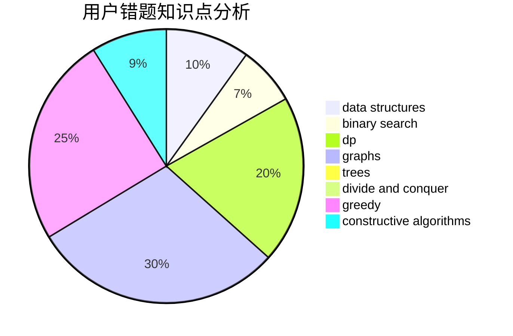

# mxi

<!-- tabs:start -->

#### **用户提交结果分析**

#### **用户做题类型偏好分析**

#### **用户错题知识点分析**

<!-- tabs:end -->
# 推荐题目
[285E](https://codeforces.com/contest/285/problem/E)		combinatorics,
                        dp,
                        math		  
[1203A](https://codeforces.com/contest/1203/problem/A)		implementation		  
[441E](https://codeforces.com/contest/441/problem/E)		bitmasks,
                        dp,
                        math,
                        probabilities		  
[494D](https://codeforces.com/contest/494/problem/D)		data structures,
                        dfs and similar,
                        dp,
                        trees		  
[733F](https://codeforces.com/contest/733/problem/F)		data structures,
                        dsu,
                        graphs,
                        trees		  
[1091F](https://codeforces.com/contest/1091/problem/F)		constructive algorithms,
                        greedy		  
[1165E](https://codeforces.com/contest/1165/problem/E)		greedy,
                        math,
                        sortings		  
[11843](https://codeforces.com/contest/1184/problem/3)		dsu,graphs,sortings,trees		  
[803E](https://codeforces.com/contest/803/problem/E)		dp,
                        graphs		  
[1431C](https://codeforces.com/contest/1431/problem/C)		*special problem,
                        implementation		  
