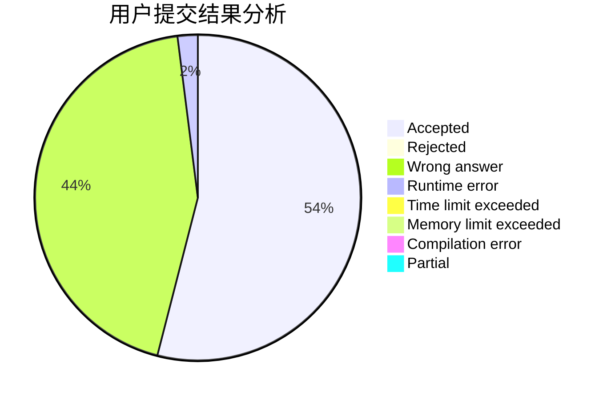
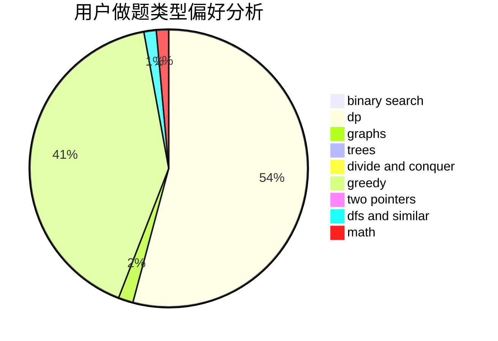

# mxi

<!-- tabs:start -->

#### **用户提交结果分析**

#### **用户做题类型偏好分析**

<!-- tabs:end -->
# 推荐题目
[285E](https://codeforces.com/contest/285/problem/E)
[1203A](https://codeforces.com/contest/1203/problem/A)
[441E](https://codeforces.com/contest/441/problem/E)
[494D](https://codeforces.com/contest/494/problem/D)
[733F](https://codeforces.com/contest/733/problem/F)
[1091F](https://codeforces.com/contest/1091/problem/F)
[1165E](https://codeforces.com/contest/1165/problem/E)
[11843](https://codeforces.com/contest/1184/problem/3)
[803E](https://codeforces.com/contest/803/problem/E)
[1431C](https://codeforces.com/contest/1431/problem/C)
