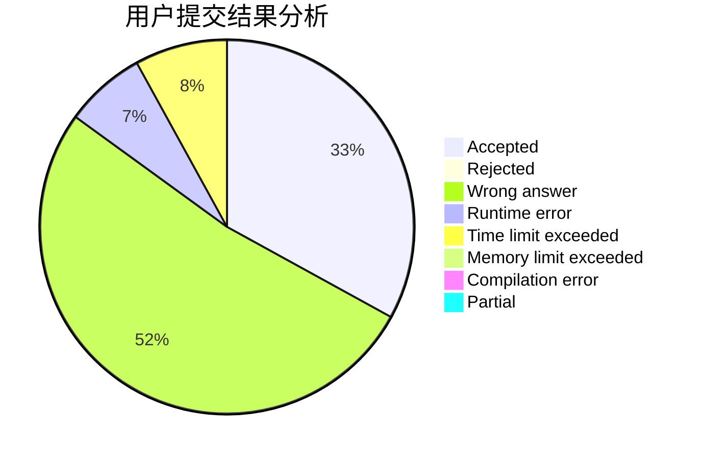
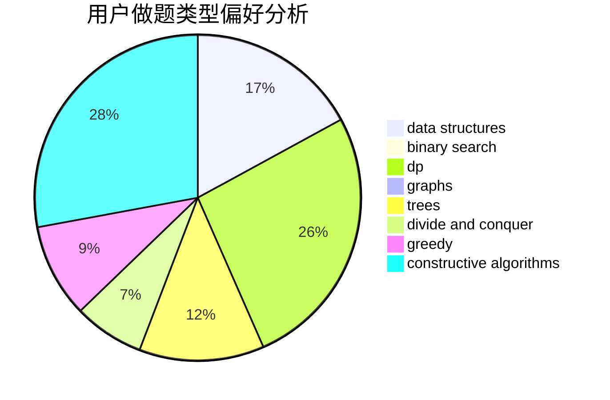
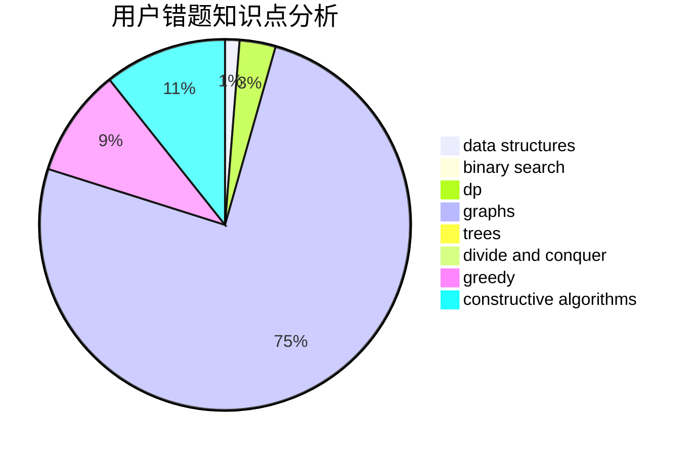

# mydiplomacy

<!-- tabs:start -->

#### **用户提交结果分析**

#### **用户做题类型偏好分析**

#### **用户错题知识点分析**

<!-- tabs:end -->
# 推荐题目
[673B](https://codeforces.com/contest/673/problem/B)		greedy,
                        implementation		  
[794C](https://codeforces.com/contest/794/problem/C)		games,
                        greedy,
                        sortings		  
[785A](https://codeforces.com/contest/785/problem/A)		implementation,
                        strings		  
[12271](https://codeforces.com/contest/1227/problem/1)		dsu,graphs,sortings,trees		  
[47B](https://codeforces.com/contest/47/problem/B)		implementation		  
[482E](https://codeforces.com/contest/482/problem/E)		data structures,
                        trees		  
[1101D](https://codeforces.com/contest/1101/problem/D)		data structures,
                        dfs and similar,
                        dp,
                        number theory,
                        trees		  
[1195C](https://codeforces.com/contest/1195/problem/C)		dp		  
[4B](https://codeforces.com/contest/4/problem/B)		constructive algorithms,
                        greedy		  
[878B](https://codeforces.com/contest/878/problem/B)		data structures,
                        implementation		  
