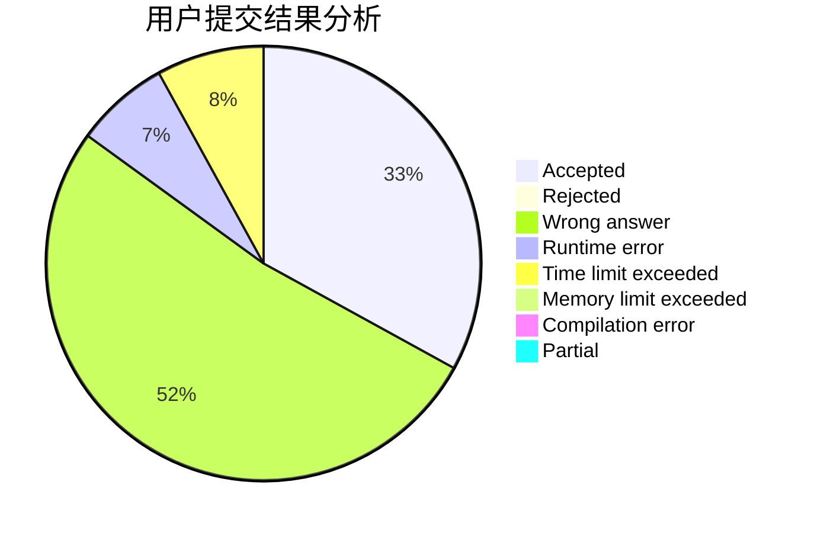
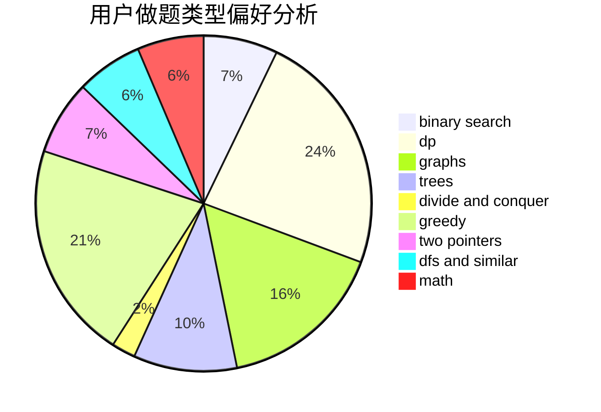

# mydiplomacy

<!-- tabs:start -->

#### **用户提交结果分析**

#### **用户做题类型偏好分析**

<!-- tabs:end -->
# 推荐题目
[673B](https://codeforces.com/contest/673/problem/B)
[794C](https://codeforces.com/contest/794/problem/C)
[785A](https://codeforces.com/contest/785/problem/A)
[12271](https://codeforces.com/contest/1227/problem/1)
[47B](https://codeforces.com/contest/47/problem/B)
[482E](https://codeforces.com/contest/482/problem/E)
[1101D](https://codeforces.com/contest/1101/problem/D)
[1195C](https://codeforces.com/contest/1195/problem/C)
[4B](https://codeforces.com/contest/4/problem/B)
[878B](https://codeforces.com/contest/878/problem/B)
