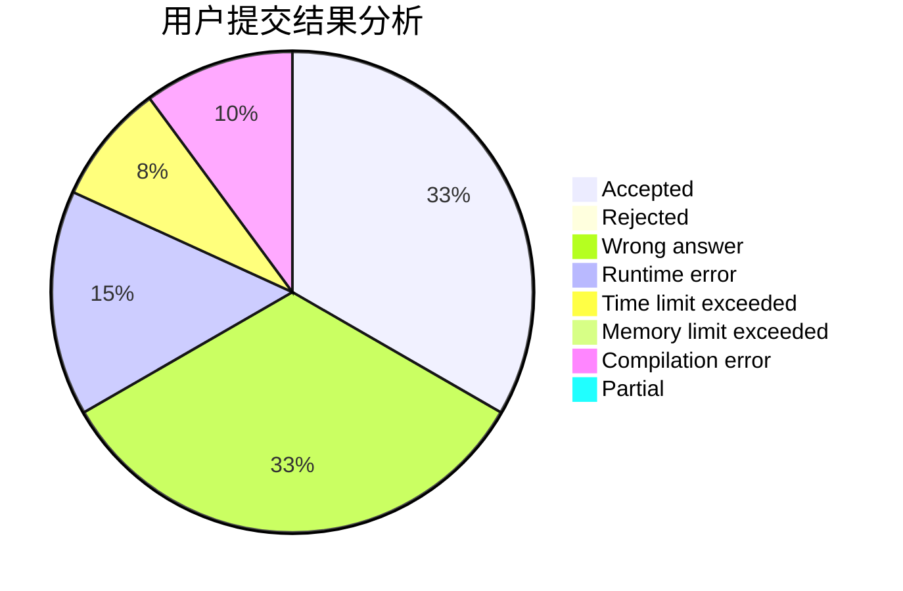
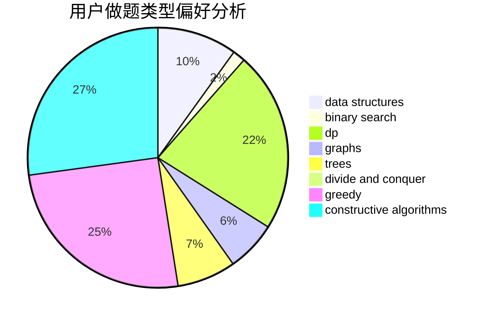
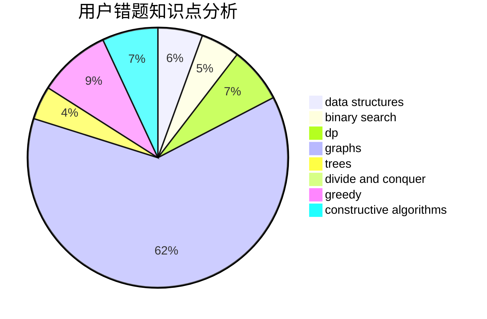

# myvegatablehasexplode

<!-- tabs:start -->

#### **用户提交结果分析**

#### **用户做题类型偏好分析**

#### **用户错题知识点分析**

<!-- tabs:end -->
# 推荐题目
[963C](https://codeforces.com/contest/963/problem/C)		brute force,
                        math,
                        number theory		  
[949E](https://codeforces.com/contest/949/problem/E)		brute force		  
[51A](https://codeforces.com/contest/51/problem/A)		implementation		  
[1104C](https://codeforces.com/contest/1104/problem/C)		dsu,graphs,sortings,trees		  
[567A](https://codeforces.com/contest/567/problem/A)		greedy,
                        implementation		  
[506A](https://codeforces.com/contest/506/problem/A)		dsu,graphs,sortings,trees		  
[581A](https://codeforces.com/contest/581/problem/A)		implementation,
                        math		  
[802A](https://codeforces.com/contest/802/problem/A)		greedy		  
[713E](https://codeforces.com/contest/713/problem/E)		binary search,
                        dp		  
[1167E](https://codeforces.com/contest/1167/problem/E)		binary search,
                        combinatorics,
                        data structures,
                        two pointers		  
