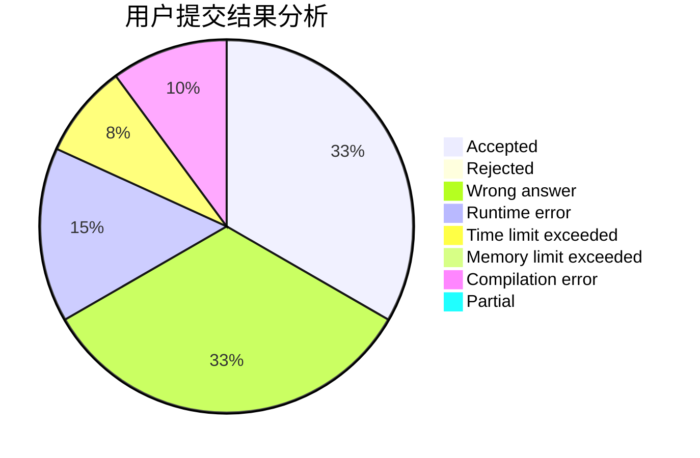
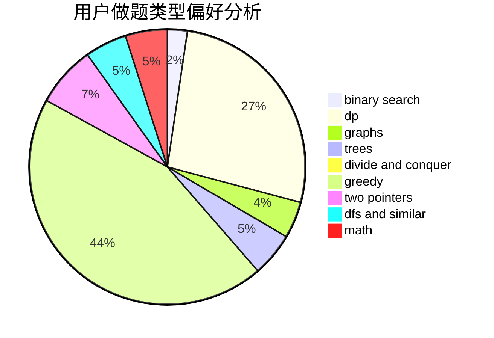

# myvegatablehasexplode

<!-- tabs:start -->

#### **用户提交结果分析**

#### **用户做题类型偏好分析**

<!-- tabs:end -->
# 推荐题目
[963C](https://codeforces.com/contest/963/problem/C)
[949E](https://codeforces.com/contest/949/problem/E)
[51A](https://codeforces.com/contest/51/problem/A)
[1104C](https://codeforces.com/contest/1104/problem/C)
[567A](https://codeforces.com/contest/567/problem/A)
[506A](https://codeforces.com/contest/506/problem/A)
[581A](https://codeforces.com/contest/581/problem/A)
[802A](https://codeforces.com/contest/802/problem/A)
[713E](https://codeforces.com/contest/713/problem/E)
[1167E](https://codeforces.com/contest/1167/problem/E)
