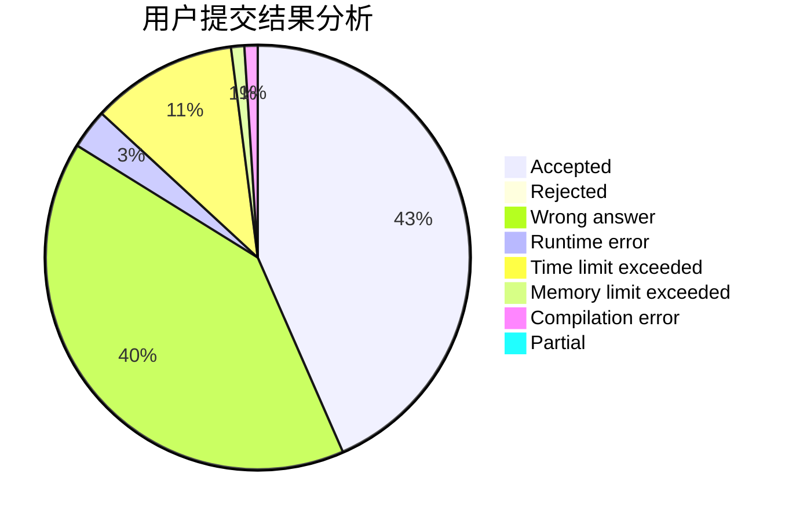
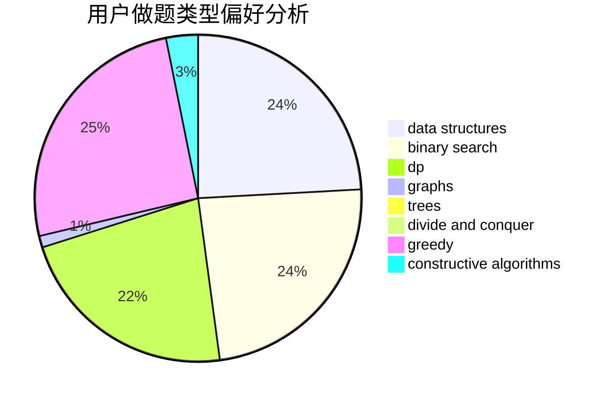

# myx12345

<!-- tabs:start -->

#### **用户提交结果分析**

#### **用户做题类型偏好分析**

#### **用户错题知识点分析**

<!-- tabs:end -->
# 推荐题目
[1417E](https://codeforces.com/contest/1417/problem/E)		dsu,graphs,sortings,trees		  
[716A](https://codeforces.com/contest/716/problem/A)		implementation		  
[321E](https://codeforces.com/contest/321/problem/E)		data structures,
                        divide and conquer,
                        dp		  
[984C](https://codeforces.com/contest/984/problem/C)		dsu,graphs,sortings,trees		  
[180C](https://codeforces.com/contest/180/problem/C)		dp		  
[833B](https://codeforces.com/contest/833/problem/B)		binary search,
                        data structures,
                        divide and conquer,
                        dp,
                        two pointers		  
[238E](https://codeforces.com/contest/238/problem/E)		dp,
                        graphs,
                        shortest paths		  
[331E2](https://codeforces.com/contest/331E/problem/2)		constructive algorithms,
                        dp		  
[1464E](https://codeforces.com/contest/1464/problem/E)		dsu,graphs,sortings,trees		  
[316E2](https://codeforces.com/contest/316E/problem/2)		data structures,
                        math		  
