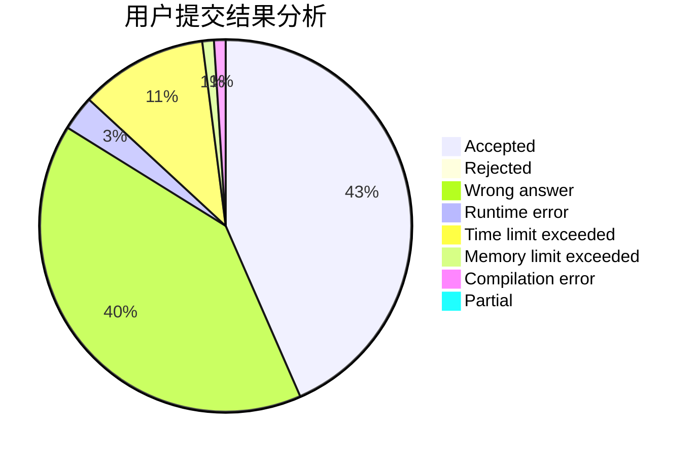
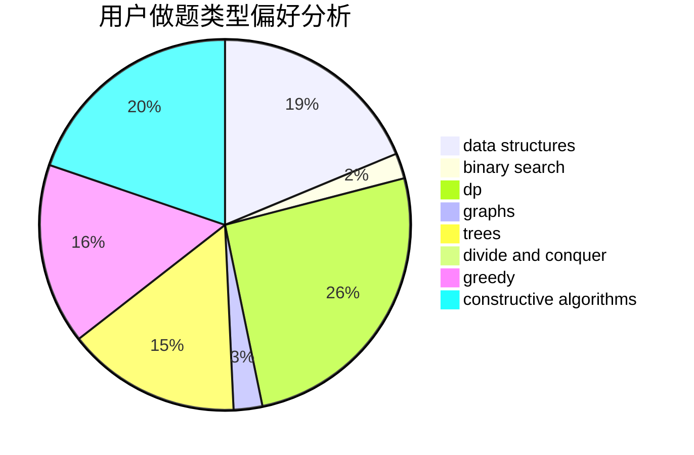
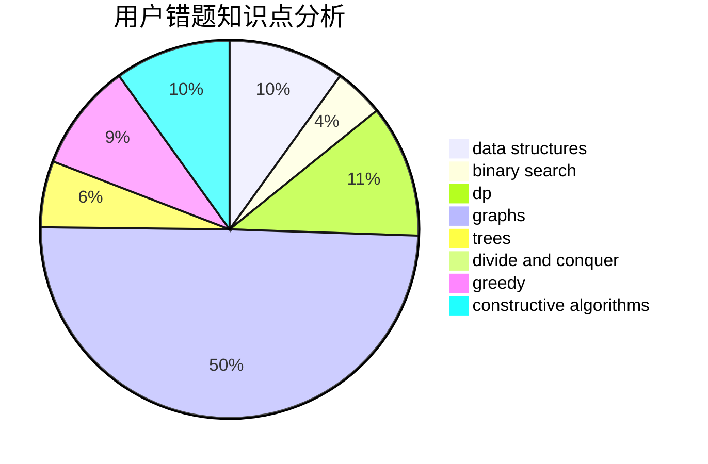

# myx12345

<!-- tabs:start -->

#### **用户提交结果分析**

#### **用户做题类型偏好分析**

#### **用户错题知识点分析**

<!-- tabs:end -->
# 推荐题目
[1425B](https://codeforces.com/contest/1425/problem/B)		divide and conquer,
                        dp		  
[734A](https://codeforces.com/contest/734/problem/A)		implementation,
                        strings		  
[353D](https://codeforces.com/contest/353/problem/D)		constructive algorithms,
                        dp		  
[99B](https://codeforces.com/contest/99/problem/B)		implementation,
                        sortings		  
[205D](https://codeforces.com/contest/205/problem/D)		dsu,graphs,sortings,trees		  
[851B](https://codeforces.com/contest/851/problem/B)		geometry,
                        math		  
[260B](https://codeforces.com/contest/260/problem/B)		brute force,
                        implementation,
                        strings		  
[35C](https://codeforces.com/contest/35/problem/C)		brute force,
                        dfs and similar,
                        shortest paths		  
[1471F](https://codeforces.com/contest/1471/problem/F)		dsu,graphs,sortings,trees		  
[343A](https://codeforces.com/contest/343/problem/A)		math,
                        number theory		  
