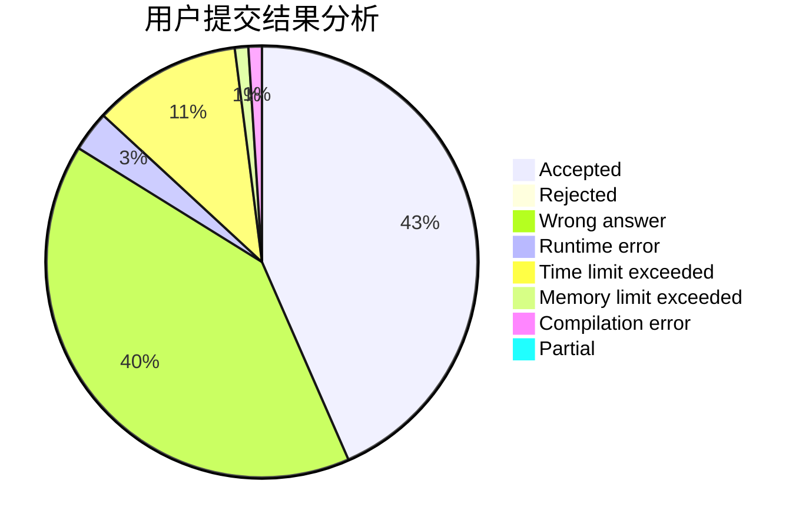
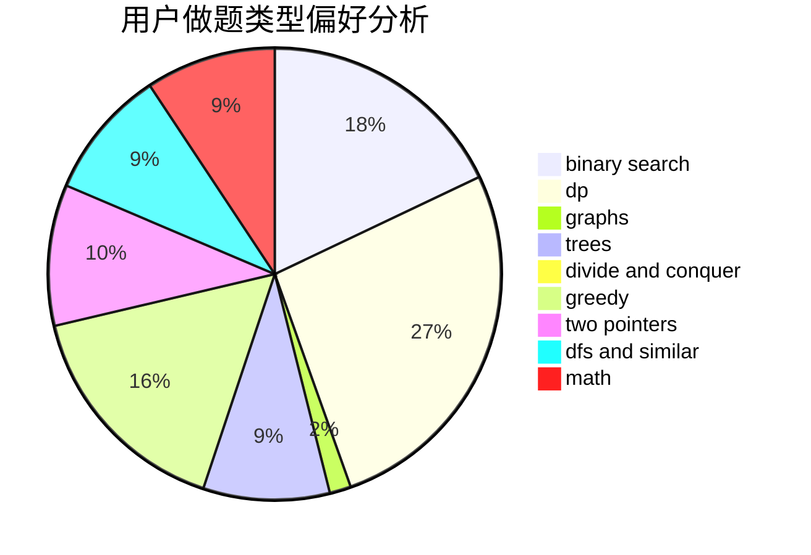

# myx12345

<!-- tabs:start -->

#### **用户提交结果分析**

#### **用户做题类型偏好分析**

<!-- tabs:end -->
# 推荐题目
[1425B](https://codeforces.com/contest/1425/problem/B)
[734A](https://codeforces.com/contest/734/problem/A)
[353D](https://codeforces.com/contest/353/problem/D)
[99B](https://codeforces.com/contest/99/problem/B)
[205D](https://codeforces.com/contest/205/problem/D)
[851B](https://codeforces.com/contest/851/problem/B)
[260B](https://codeforces.com/contest/260/problem/B)
[35C](https://codeforces.com/contest/35/problem/C)
[1471F](https://codeforces.com/contest/1471/problem/F)
[343A](https://codeforces.com/contest/343/problem/A)
