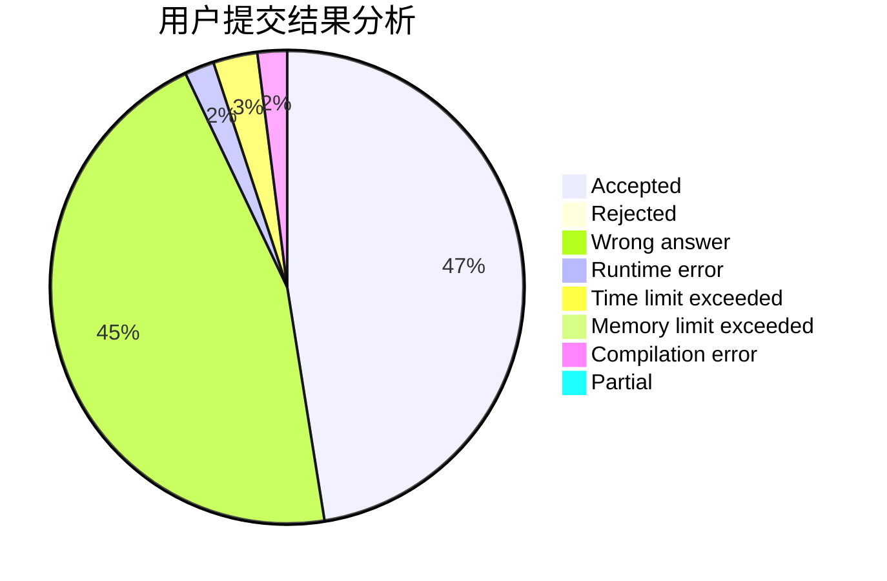
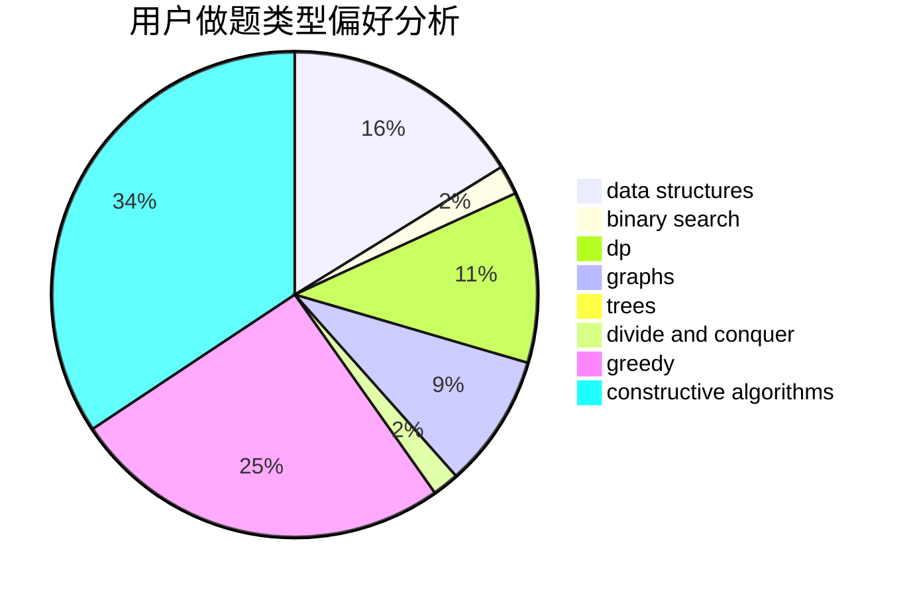
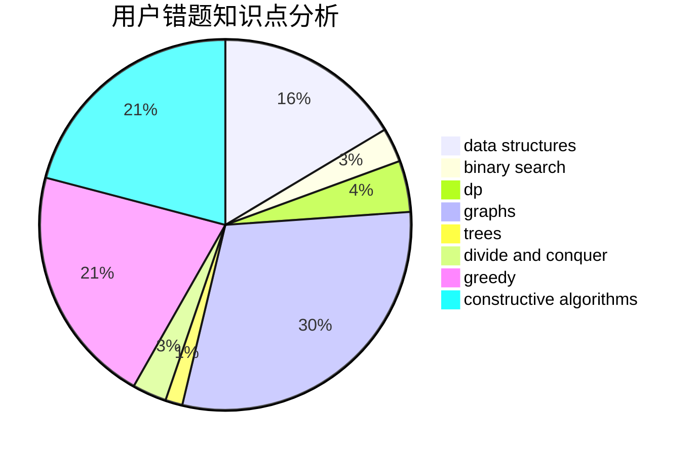

# nacl_jht

<!-- tabs:start -->

#### **用户提交结果分析**

#### **用户做题类型偏好分析**

#### **用户错题知识点分析**

<!-- tabs:end -->
# 推荐题目
[1229B](https://codeforces.com/contest/1229/problem/B)		dsu,graphs,sortings,trees		  
[1017D](https://codeforces.com/contest/1017/problem/D)		bitmasks,
                        brute force,
                        data structures		  
[1260A](https://codeforces.com/contest/1260/problem/A)		math		  
[588B](https://codeforces.com/contest/588/problem/B)		math		  
[791C](https://codeforces.com/contest/791/problem/C)		dsu,graphs,sortings,trees		  
[709A](https://codeforces.com/contest/709/problem/A)		implementation		  
[1089M](https://codeforces.com/contest/1089/problem/M)		constructive algorithms,
                        graphs		  
[341D](https://codeforces.com/contest/341/problem/D)		data structures		  
[750B](https://codeforces.com/contest/750/problem/B)		geometry,
                        implementation		  
[914B](https://codeforces.com/contest/914/problem/B)		games,
                        greedy,
                        implementation		  
