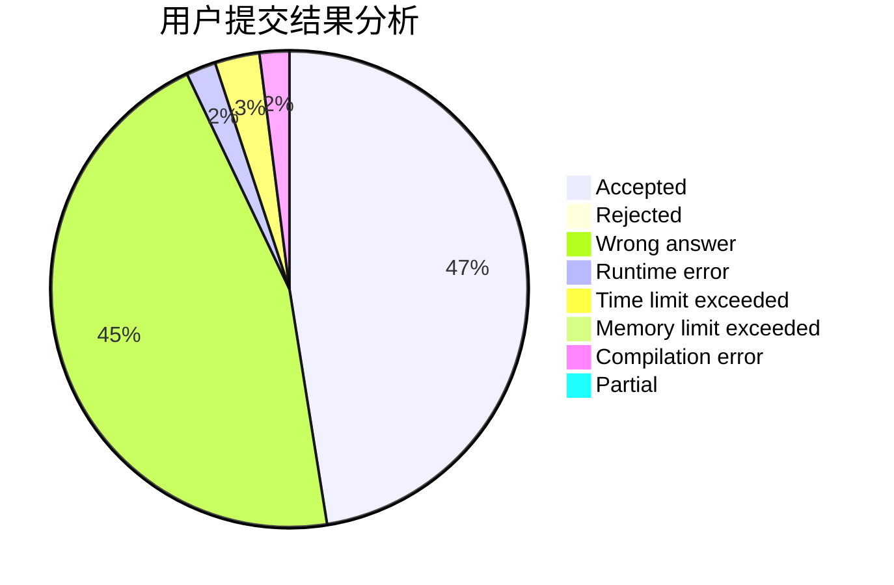
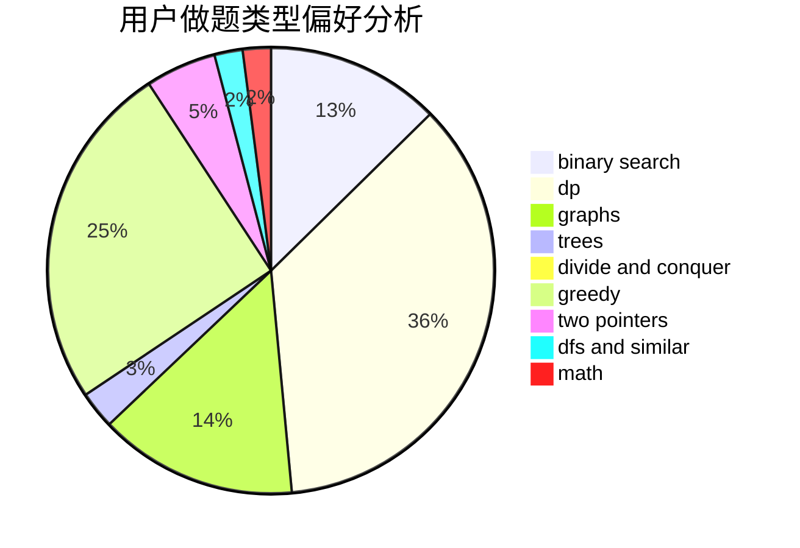

# nacl_jht

<!-- tabs:start -->

#### **用户提交结果分析**

#### **用户做题类型偏好分析**

<!-- tabs:end -->
# 推荐题目
[1237F](https://codeforces.com/contest/1237/problem/F)
[1017G](https://codeforces.com/contest/1017/problem/G)
[1266A](https://codeforces.com/contest/1266/problem/A)
[608D](https://codeforces.com/contest/608/problem/D)
[807A](https://codeforces.com/contest/807/problem/A)
[729B](https://codeforces.com/contest/729/problem/B)
[1090B](https://codeforces.com/contest/1090/problem/B)
[369A](https://codeforces.com/contest/369/problem/A)
[76B](https://codeforces.com/contest/76/problem/B)
[933A](https://codeforces.com/contest/933/problem/A)
