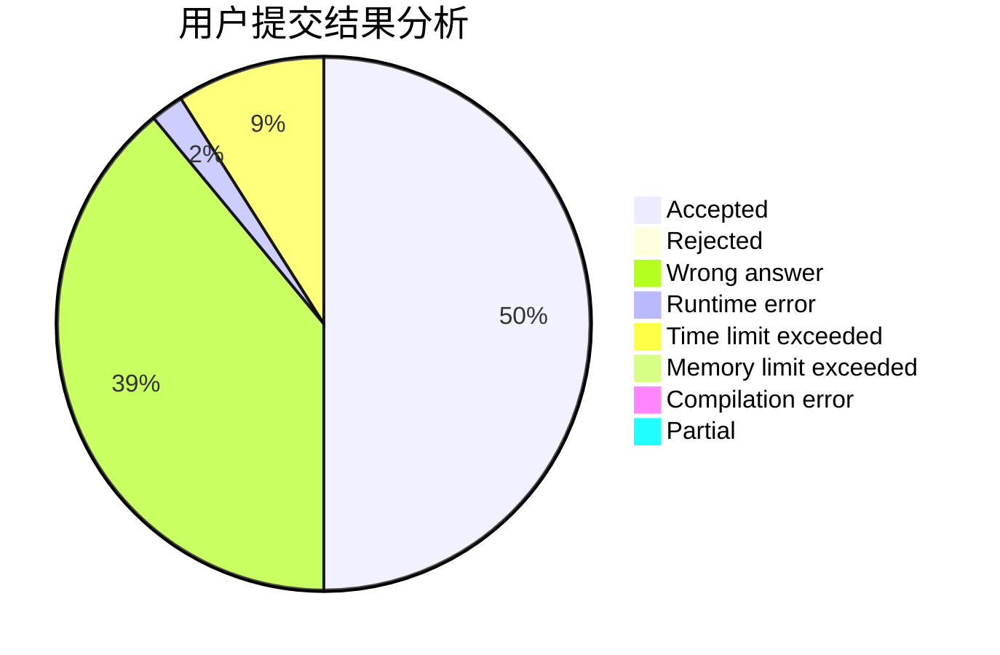
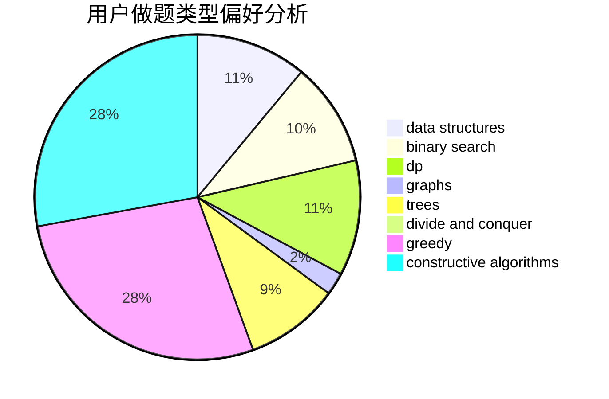
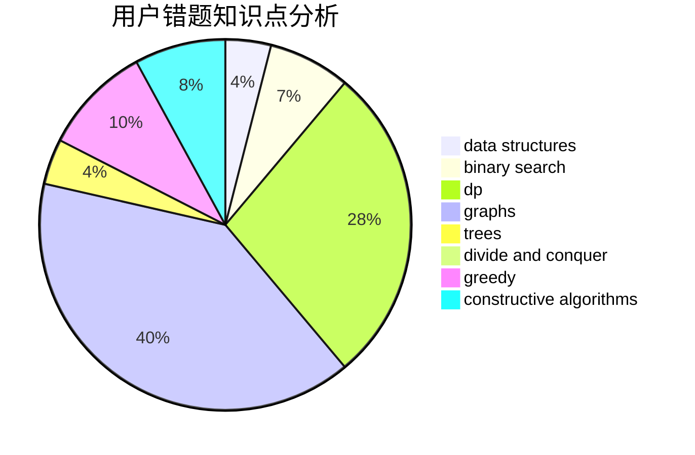

# naive_wcx

<!-- tabs:start -->

#### **用户提交结果分析**

#### **用户做题类型偏好分析**

#### **用户错题知识点分析**

<!-- tabs:end -->
# 推荐题目
[1356A2](https://codeforces.com/contest/1356A/problem/2)		*special problem		  
[1280B](https://codeforces.com/contest/1280/problem/B)		implementation,
                        math		  
[830E](https://codeforces.com/contest/830/problem/E)		constructive algorithms,
                        dp,
                        graphs,
                        implementation,
                        math,
                        trees		  
[1141A](https://codeforces.com/contest/1141/problem/A)		implementation,
                        math		  
[1214G](https://codeforces.com/contest/1214/problem/G)		bitmasks,
                        data structures		  
[593E](https://codeforces.com/contest/593/problem/E)		dp,
                        matrices		  
[714A](https://codeforces.com/contest/714/problem/A)		implementation,
                        math		  
[463A](https://codeforces.com/contest/463/problem/A)		brute force,
                        implementation		  
[773E](https://codeforces.com/contest/773/problem/E)		data structures,
                        sortings		  
[1181C](https://codeforces.com/contest/1181/problem/C)		brute force,
                        combinatorics,
                        dp,
                        implementation		  
