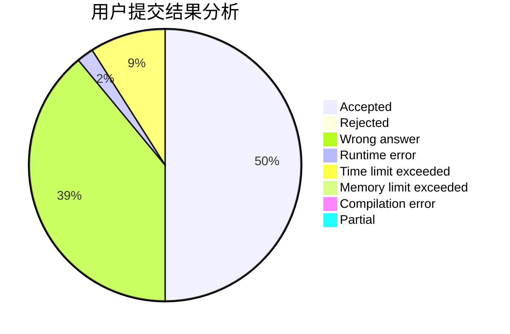
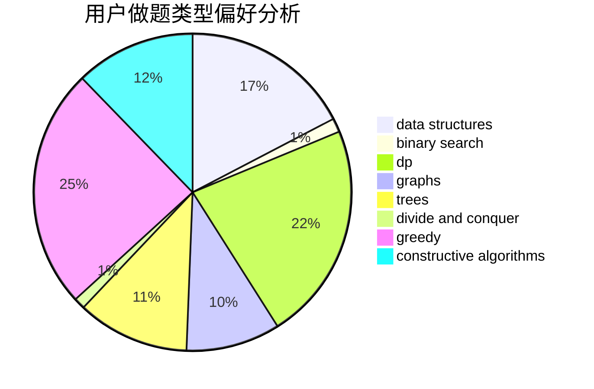
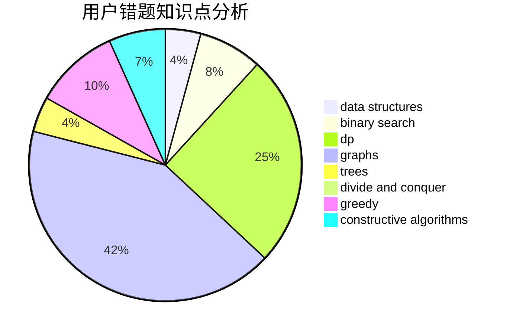

# naive_wcx

<!-- tabs:start -->

#### **用户提交结果分析**

#### **用户做题类型偏好分析**

#### **用户错题知识点分析**

<!-- tabs:end -->
# 推荐题目
[1363A](https://codeforces.com/contest/1363/problem/A)		brute force,
                        implementation,
                        math		  
[1286B](https://codeforces.com/contest/1286/problem/B)		constructive algorithms,
                        data structures,
                        dfs and similar,
                        graphs,
                        greedy,
                        trees		  
[848E](https://codeforces.com/contest/848/problem/E)		combinatorics,
                        divide and conquer,
                        dp,
                        fft,
                        math		  
[1143A](https://codeforces.com/contest/1143/problem/A)		implementation		  
[1220C](https://codeforces.com/contest/1220/problem/C)		games,
                        greedy,
                        strings		  
[612B](https://codeforces.com/contest/612/problem/B)		implementation,
                        math		  
[732F](https://codeforces.com/contest/732/problem/F)		dfs and similar,
                        graphs		  
[482E](https://codeforces.com/contest/482/problem/E)		data structures,
                        trees		  
[792E](https://codeforces.com/contest/792/problem/E)		greedy,
                        math,
                        number theory		  
[1183H](https://codeforces.com/contest/1183/problem/H)		dp,
                        strings		  
