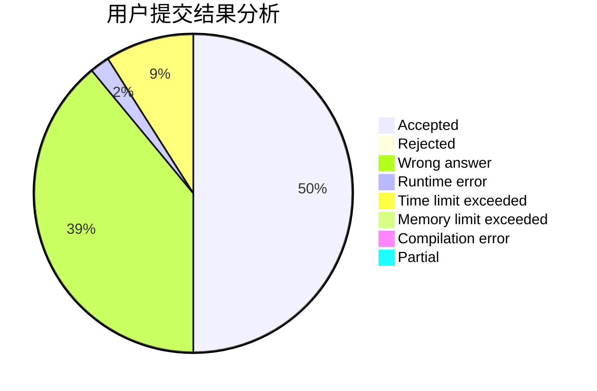
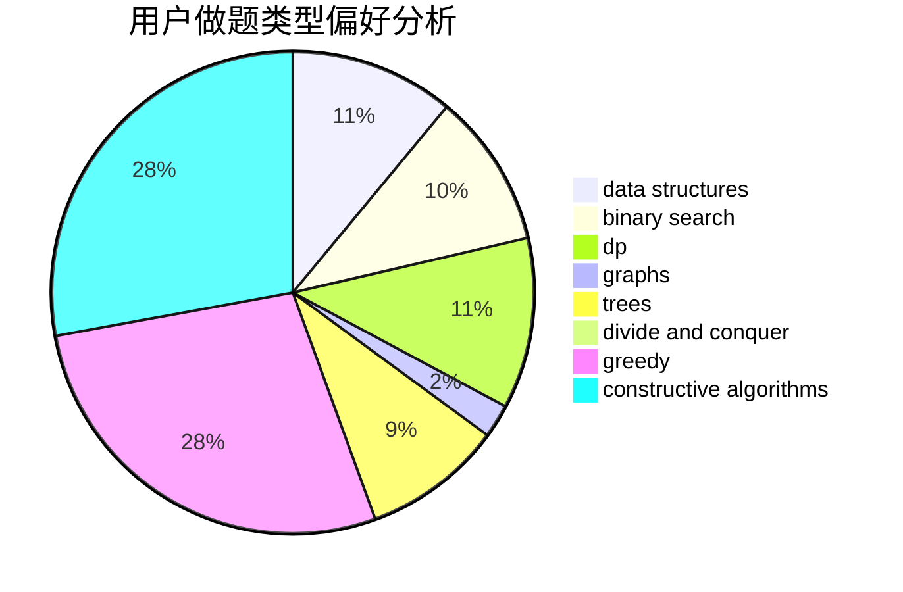
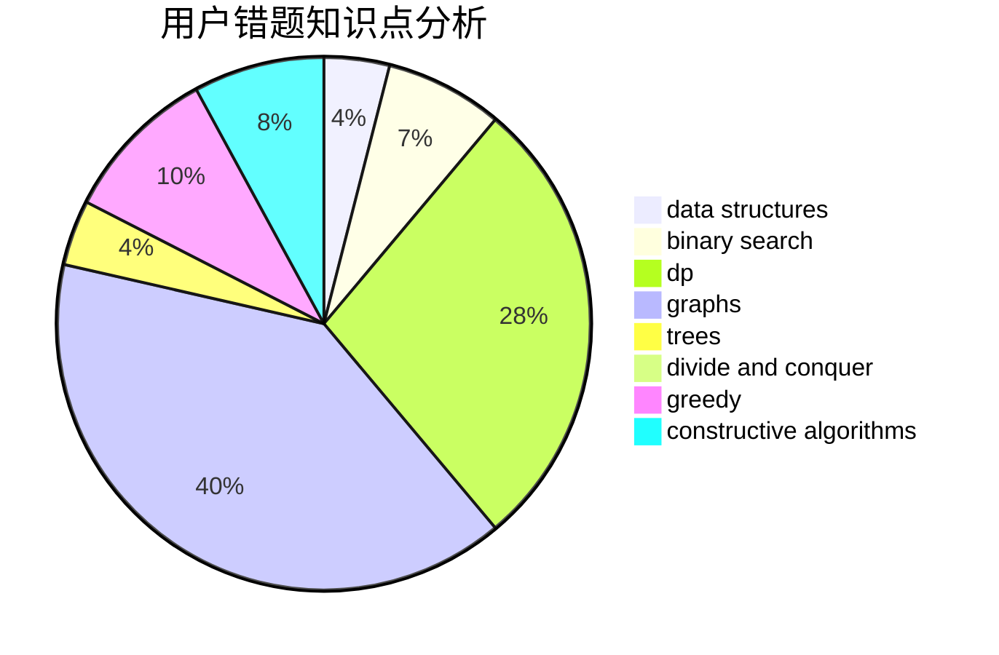

# naive_wcx
<!-- tabs:start -->
#### **用户提交结果分析**

#### **用户做题类型偏好分析**

#### **用户错题知识点分析**

<!-- tabs:end -->
# 推荐题目
[Messenger Simulator](http://codeforces.com/problemset/problem/1288/E)		data structures		  
[Freezing with Style](http://codeforces.com/problemset/problem/150/E)		binary search,
                        data structures,
                        divide and conquer,
                        trees		  
[Beingawesomeism](http://codeforces.com/problemset/problem/1280/B)		implementation,
                        math		  
[Unique Bid Auction](http://codeforces.com/problemset/problem/1454/B)		implementation		  
[Raffles](http://codeforces.com/problemset/problem/626/G)		data structures,
                        dp,
                        greedy,
                        math		  
[Feeling Good](http://codeforces.com/problemset/problem/1214/G)		bitmasks,
                        data structures		  
[Tic-tac-toe](http://codeforces.com/problemset/problem/3/C)		brute force,
                        games,
                        implementation		  
[Copying Homework](http://codeforces.com/problemset/problem/1252/A)		nan		  
[Army](http://codeforces.com/problemset/problem/38/A)		implementation		  
[Borya's Diagnosis](http://codeforces.com/problemset/problem/879/A)		implementation		  
<!-- tabs:start -->
#### **data structures**
[Messenger Simulator](http://codeforces.com/problemset/problem/1288/E)		data structures		  
[Freezing with Style](http://codeforces.com/problemset/problem/150/E)		binary search,
                        data structures,
                        divide and conquer,
                        trees		  
[Beingawesomeism](http://codeforces.com/problemset/problem/626/G)		data structures,
                        dp,
                        greedy,
                        math		  
[Unique Bid Auction](http://codeforces.com/problemset/problem/1214/G)		bitmasks,
                        data structures		  
[Raffles](http://codeforces.com/problemset/problem/1007/A)		combinatorics,
                        data structures,
                        math,
                        sortings,
                        two pointers		  
[Feeling Good](http://codeforces.com/problemset/problem/1402/A)		*special problem,
                        data structures,
                        dsu,
                        implementation,
                        math,
                        sortings		  
[Tic-tac-toe](http://codeforces.com/problemset/problem/983/E)		binary search,
                        data structures,
                        trees		  
[Copying Homework](http://codeforces.com/problemset/problem/1146/E)		bitmasks,
                        data structures,
                        divide and conquer,
                        implementation		  
[Army](http://codeforces.com/problemset/problem/1184/E3)		data structures,
                        dsu,
                        graphs,
                        trees		  
[Borya's Diagnosis](http://codeforces.com/problemset/problem/773/E)		data structures,
                        sortings		  
#### **binary search**
[Messenger Simulator](http://codeforces.com/problemset/problem/150/E)		binary search,
                        data structures,
                        divide and conquer,
                        trees		  
[Freezing with Style](http://codeforces.com/problemset/problem/983/E)		binary search,
                        data structures,
                        trees		  
[Beingawesomeism](http://codeforces.com/problemset/problem/809/B)		binary search,
                        interactive		  
[Unique Bid Auction](https://codeforces.com/contest/1345/problem/F)		binary search,
                        greedy,
                        math		  
[Raffles](http://codeforces.com/problemset/problem/246/E)		binary search,
                        data structures,
                        dfs and similar,
                        dp,
                        sortings		  
[Feeling Good](http://codeforces.com/problemset/problem/371/C)		binary search,
                        brute force		  
[Tic-tac-toe](http://codeforces.com/problemset/problem/1486/B)		binary search,
                        geometry,
                        shortest paths,
                        sortings		  
[Copying Homework](http://codeforces.com/problemset/problem/1492/C)		binary search,
                        data structures,
                        dp,
                        greedy,
                        two pointers		  
[Army](http://codeforces.com/problemset/problem/1463/D)		binary search,
                        constructive algorithms,
                        greedy,
                        two pointers		  
[Borya's Diagnosis](http://codeforces.com/problemset/problem/1490/G)		binary search,
                        data structures,
                        math		  
#### **dp**
[Messenger Simulator](http://codeforces.com/problemset/problem/626/G)		data structures,
                        dp,
                        greedy,
                        math		  
[Freezing with Style](http://codeforces.com/problemset/problem/10/B)		dp,
                        implementation		  
[Beingawesomeism](http://codeforces.com/problemset/problem/279/D)		bitmasks,
                        dp		  
[Unique Bid Auction](http://codeforces.com/problemset/problem/1187/F)		dp,
                        math,
                        probabilities		  
[Raffles](http://codeforces.com/problemset/problem/1181/C)		brute force,
                        combinatorics,
                        dp,
                        implementation		  
[Feeling Good](http://codeforces.com/problemset/problem/593/E)		dp,
                        matrices		  
[Tic-tac-toe](http://codeforces.com/problemset/problem/479/E)		combinatorics,
                        dp		  
[Copying Homework](http://codeforces.com/problemset/problem/39/E)		dp,
                        games		  
[Army](http://codeforces.com/problemset/problem/526/E)		dp,
                        implementation		  
[Borya's Diagnosis](https://codeforces.com/contest/483/problem/E)		bitmasks,
                        dp,
                        probabilities		  
#### **graph**
[Messenger Simulator](http://codeforces.com/problemset/problem/948/A)		brute force,
                        dfs and similar,
                        graphs,
                        implementation		  
[Freezing with Style](http://codeforces.com/problemset/problem/1184/E3)		data structures,
                        dsu,
                        graphs,
                        trees		  
[Beingawesomeism](http://codeforces.com/problemset/problem/763/A)		dfs and similar,
                        dp,
                        dsu,
                        graphs,
                        implementation,
                        trees		  
[Unique Bid Auction](http://codeforces.com/problemset/problem/830/E)		constructive algorithms,
                        dp,
                        graphs,
                        implementation,
                        math,
                        trees		  
[Raffles](http://codeforces.com/problemset/problem/1481/D)		brute force,
                        constructive algorithms,
                        graphs,
                        greedy,
                        implementation		  
[Feeling Good](http://codeforces.com/problemset/problem/1487/C)		brute force,
                        constructive algorithms,
                        dfs and similar,
                        graphs,
                        greedy,
                        implementation,
                        math		  
[Tic-tac-toe](http://codeforces.com/problemset/problem/1437/C)		dp,
                        flows,
                        graph matchings,
                        greedy,
                        math,
                        sortings		  
[Copying Homework](http://codeforces.com/problemset/problem/1470/D)		constructive algorithms,
                        dfs and similar,
                        graph matchings,
                        graphs,
                        greedy		  
[Army](http://codeforces.com/problemset/problem/1476/C)		dp,
                        graphs,
                        greedy		  
[Borya's Diagnosis](http://codeforces.com/problemset/problem/1304/D)		constructive algorithms,
                        graphs,
                        greedy,
                        two pointers		  
#### **trees**
[Messenger Simulator](http://codeforces.com/problemset/problem/150/E)		binary search,
                        data structures,
                        divide and conquer,
                        trees		  
[Freezing with Style](http://codeforces.com/problemset/problem/983/E)		binary search,
                        data structures,
                        trees		  
[Beingawesomeism](http://codeforces.com/problemset/problem/321/C)		constructive algorithms,
                        dfs and similar,
                        divide and conquer,
                        greedy,
                        trees		  
[Unique Bid Auction](http://codeforces.com/problemset/problem/1184/E3)		data structures,
                        dsu,
                        graphs,
                        trees		  
[Raffles](http://codeforces.com/problemset/problem/763/A)		dfs and similar,
                        dp,
                        dsu,
                        graphs,
                        implementation,
                        trees		  
[Feeling Good](http://codeforces.com/problemset/problem/830/E)		constructive algorithms,
                        dp,
                        graphs,
                        implementation,
                        math,
                        trees		  
[Tic-tac-toe](http://codeforces.com/problemset/problem/1479/D)		binary search,
                        bitmasks,
                        brute force,
                        data structures,
                        probabilities,
                        trees		  
[Copying Homework](http://codeforces.com/problemset/problem/1511/C)		brute force,
                        data structures,
                        implementation,
                        trees		  
[Army](http://codeforces.com/problemset/problem/1499/F)		combinatorics,
                        dfs and similar,
                        dp,
                        trees		  
[Borya's Diagnosis](http://codeforces.com/problemset/problem/1491/E)		brute force,
                        dfs and similar,
                        divide and conquer,
                        number theory,
                        trees		  
#### **divide and conquer**
[Messenger Simulator](http://codeforces.com/problemset/problem/150/E)		binary search,
                        data structures,
                        divide and conquer,
                        trees		  
[Freezing with Style](http://codeforces.com/problemset/problem/1146/E)		bitmasks,
                        data structures,
                        divide and conquer,
                        implementation		  
[Beingawesomeism](http://codeforces.com/problemset/problem/321/C)		constructive algorithms,
                        dfs and similar,
                        divide and conquer,
                        greedy,
                        trees		  
[Unique Bid Auction](http://codeforces.com/problemset/problem/1461/D)		binary search,
                        brute force,
                        data structures,
                        divide and conquer,
                        implementation,
                        sortings		  
[Raffles](http://codeforces.com/problemset/problem/1466/G)		combinatorics,
                        divide and conquer,
                        hashing,
                        math,
                        string suffix structures,
                        strings		  
[Feeling Good](http://codeforces.com/problemset/problem/1490/D)		dfs and similar,
                        divide and conquer,
                        implementation		  
[Tic-tac-toe](https://codeforces.com/contest/1483/problem/C)		data structures,
                        divide and conquer,
                        dp		  
[Copying Homework](http://codeforces.com/problemset/problem/1491/E)		brute force,
                        dfs and similar,
                        divide and conquer,
                        number theory,
                        trees		  
[Army](http://codeforces.com/problemset/problem/1303/G)		data structures,
                        divide and conquer,
                        geometry,
                        trees		  
[Borya's Diagnosis](http://codeforces.com/problemset/problem/1494/D)		constructive algorithms,
                        data structures,
                        dfs and similar,
                        divide and conquer,
                        dsu,
                        greedy,
                        sortings,
                        trees		  
#### **greedy**
[Messenger Simulator](http://codeforces.com/problemset/problem/626/G)		data structures,
                        dp,
                        greedy,
                        math		  
[Freezing with Style](http://codeforces.com/problemset/problem/115/B)		greedy,
                        sortings		  
[Beingawesomeism](https://codeforces.com/contest/516/problem/B)		constructive algorithms,
                        greedy		  
[Unique Bid Auction](http://codeforces.com/problemset/problem/1148/E)		constructive algorithms,
                        greedy,
                        math,
                        sortings,
                        two pointers		  
[Raffles](http://codeforces.com/problemset/problem/321/C)		constructive algorithms,
                        dfs and similar,
                        divide and conquer,
                        greedy,
                        trees		  
[Feeling Good](https://codeforces.com/contest/1464/problem/D)		greedy,
                        math		  
[Tic-tac-toe](http://codeforces.com/problemset/problem/1372/D)		brute force,
                        dp,
                        games,
                        greedy		  
[Copying Homework](https://codeforces.com/contest/1345/problem/F)		binary search,
                        greedy,
                        math		  
[Army](http://codeforces.com/problemset/problem/1367/C)		constructive algorithms,
                        greedy,
                        math		  
[Borya's Diagnosis](http://codeforces.com/problemset/problem/1070/D)		greedy		  
#### **constructive algorithms**
[Messenger Simulator](https://codeforces.com/contest/516/problem/B)		constructive algorithms,
                        greedy		  
[Freezing with Style](http://codeforces.com/problemset/problem/1148/E)		constructive algorithms,
                        greedy,
                        math,
                        sortings,
                        two pointers		  
[Beingawesomeism](http://codeforces.com/problemset/problem/321/C)		constructive algorithms,
                        dfs and similar,
                        divide and conquer,
                        greedy,
                        trees		  
[Unique Bid Auction](http://codeforces.com/problemset/problem/1367/C)		constructive algorithms,
                        greedy,
                        math		  
[Raffles](http://codeforces.com/problemset/problem/830/E)		constructive algorithms,
                        dp,
                        graphs,
                        implementation,
                        math,
                        trees		  
[Feeling Good](http://codeforces.com/problemset/problem/1109/B)		constructive algorithms,
                        hashing,
                        strings		  
[Tic-tac-toe](https://codeforces.com/contest/791/problem/C)		constructive algorithms,
                        greedy		  
[Copying Homework](http://codeforces.com/problemset/problem/1365/E)		brute force,
                        constructive algorithms		  
[Army](http://codeforces.com/problemset/problem/1481/D)		brute force,
                        constructive algorithms,
                        graphs,
                        greedy,
                        implementation		  
[Borya's Diagnosis](http://codeforces.com/problemset/problem/1493/A)		constructive algorithms,
                        greedy		  
#### **sortings**
[Messenger Simulator](http://codeforces.com/problemset/problem/1007/A)		combinatorics,
                        data structures,
                        math,
                        sortings,
                        two pointers		  
[Freezing with Style](http://codeforces.com/problemset/problem/115/B)		greedy,
                        sortings		  
[Beingawesomeism](http://codeforces.com/problemset/problem/1402/A)		*special problem,
                        data structures,
                        dsu,
                        implementation,
                        math,
                        sortings		  
[Unique Bid Auction](http://codeforces.com/problemset/problem/1148/E)		constructive algorithms,
                        greedy,
                        math,
                        sortings,
                        two pointers		  
[Raffles](http://codeforces.com/problemset/problem/773/E)		data structures,
                        sortings		  
[Feeling Good](http://codeforces.com/problemset/problem/246/E)		binary search,
                        data structures,
                        dfs and similar,
                        dp,
                        sortings		  
[Tic-tac-toe](http://codeforces.com/problemset/problem/1133/E)		dp,
                        sortings,
                        two pointers		  
[Copying Homework](http://codeforces.com/problemset/problem/1486/B)		binary search,
                        geometry,
                        shortest paths,
                        sortings		  
[Army](https://codeforces.com/contest/1496/problem/C)		geometry,
                        greedy,
                        math,
                        sortings		  
[Borya's Diagnosis](http://codeforces.com/problemset/problem/1495/A)		geometry,
                        greedy,
                        math,
                        sortings		  
<!-- tabs:end -->
