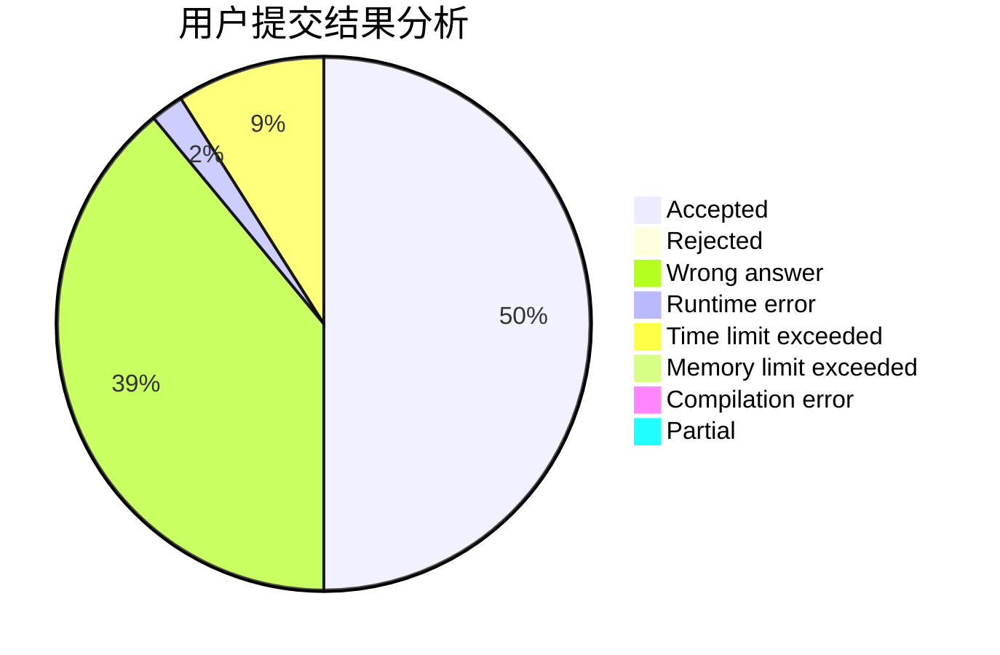
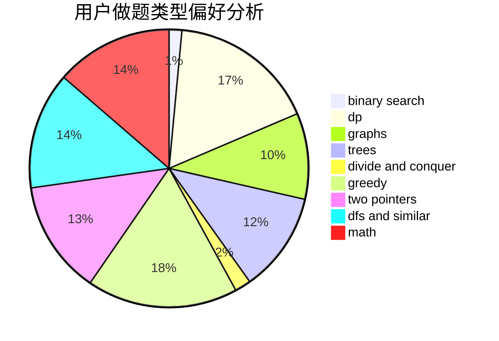

# naive_wcx

<!-- tabs:start -->

#### **用户提交结果分析**

#### **用户做题类型偏好分析**

<!-- tabs:end -->
# 推荐题目
[1363A](https://codeforces.com/contest/1363/problem/A)
[1286B](https://codeforces.com/contest/1286/problem/B)
[848E](https://codeforces.com/contest/848/problem/E)
[1143A](https://codeforces.com/contest/1143/problem/A)
[1220C](https://codeforces.com/contest/1220/problem/C)
[612B](https://codeforces.com/contest/612/problem/B)
[732F](https://codeforces.com/contest/732/problem/F)
[482E](https://codeforces.com/contest/482/problem/E)
[792E](https://codeforces.com/contest/792/problem/E)
[1183H](https://codeforces.com/contest/1183/problem/H)
