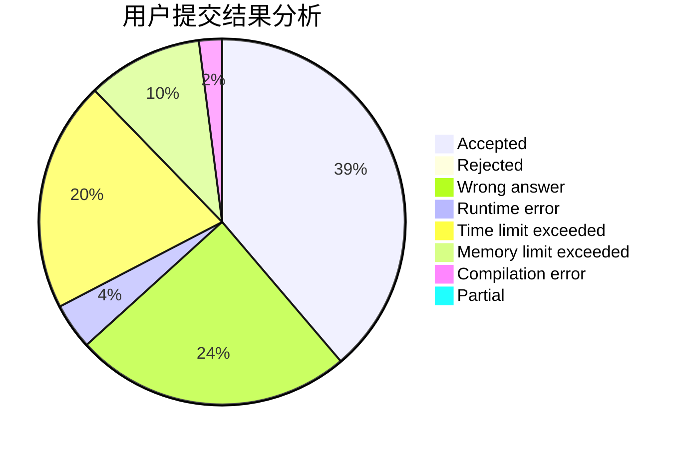
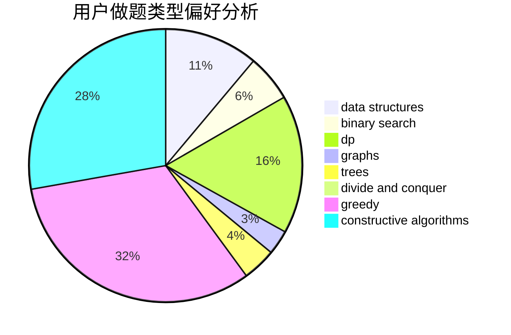
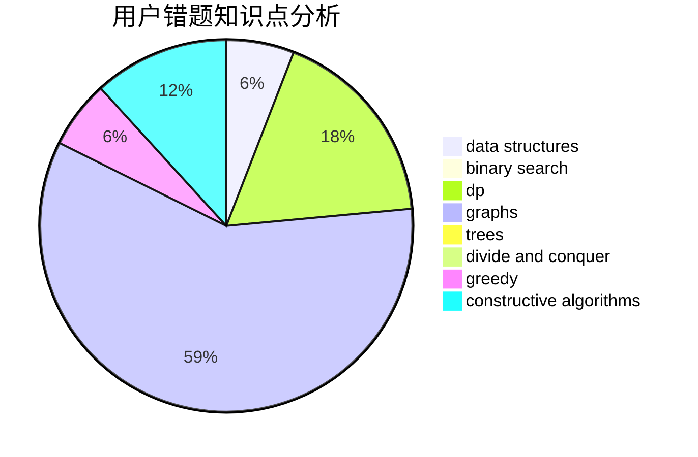

# namespace_std

<!-- tabs:start -->

#### **用户提交结果分析**

#### **用户做题类型偏好分析**

#### **用户错题知识点分析**

<!-- tabs:end -->
# 推荐题目
[288E](https://codeforces.com/contest/288/problem/E)		dp,
                        implementation,
                        math		  
[484E](https://codeforces.com/contest/484/problem/E)		binary search,
                        constructive algorithms,
                        data structures		  
[233A](https://codeforces.com/contest/233/problem/A)		implementation,
                        math		  
[1279F](https://codeforces.com/contest/1279/problem/F)		binary search,
                        dp		  
[34D](https://codeforces.com/contest/34/problem/D)		dfs and similar,
                        graphs		  
[863D](https://codeforces.com/contest/863/problem/D)		data structures,
                        implementation		  
[1346B](https://codeforces.com/contest/1346/problem/B)		*special problem,
                        greedy		  
[988A](https://codeforces.com/contest/988/problem/A)		brute force,
                        implementation		  
[730B](https://codeforces.com/contest/730/problem/B)		constructive algorithms,
                        interactive		  
[1194A](https://codeforces.com/contest/1194/problem/A)		math		  
