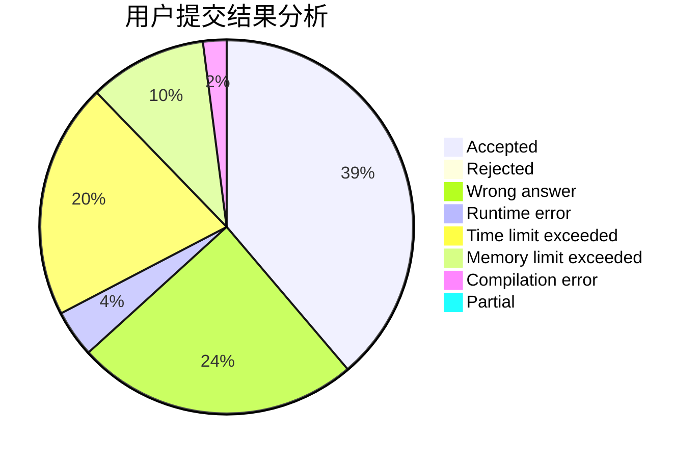
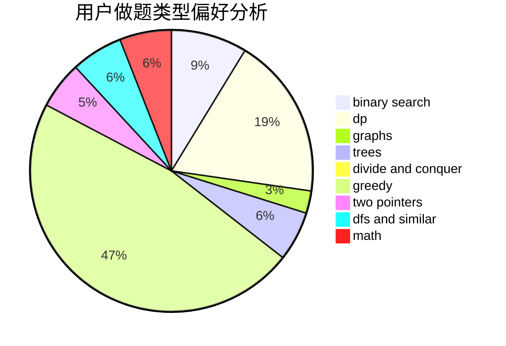

# namespace_std

<!-- tabs:start -->

#### **用户提交结果分析**

#### **用户做题类型偏好分析**

<!-- tabs:end -->
# 推荐题目
[288E](https://codeforces.com/contest/288/problem/E)
[484E](https://codeforces.com/contest/484/problem/E)
[233A](https://codeforces.com/contest/233/problem/A)
[1279F](https://codeforces.com/contest/1279/problem/F)
[34D](https://codeforces.com/contest/34/problem/D)
[863D](https://codeforces.com/contest/863/problem/D)
[1346B](https://codeforces.com/contest/1346/problem/B)
[988A](https://codeforces.com/contest/988/problem/A)
[730B](https://codeforces.com/contest/730/problem/B)
[1194A](https://codeforces.com/contest/1194/problem/A)
