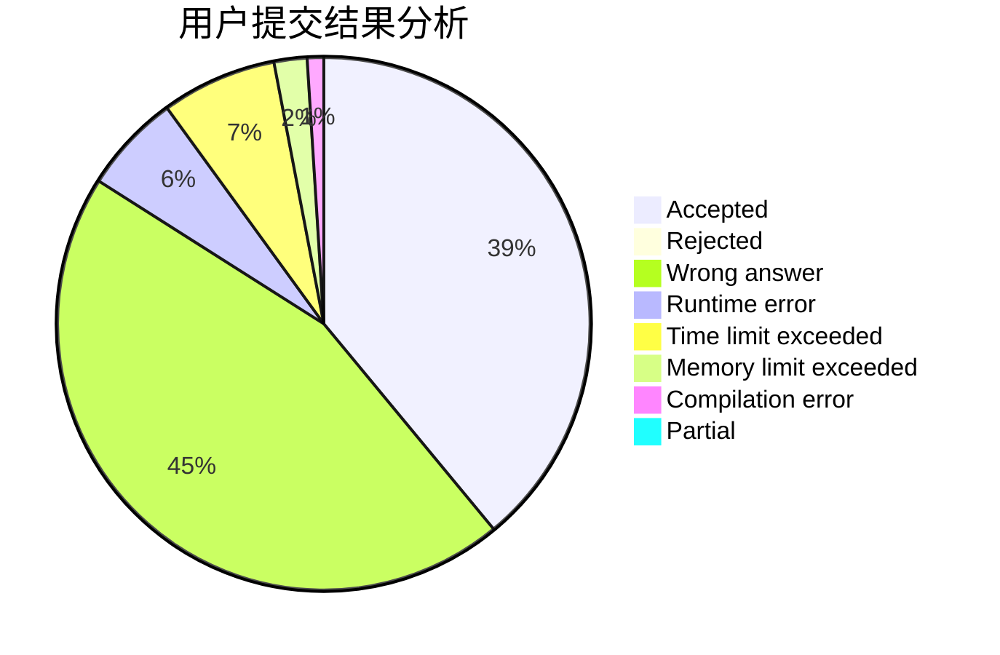
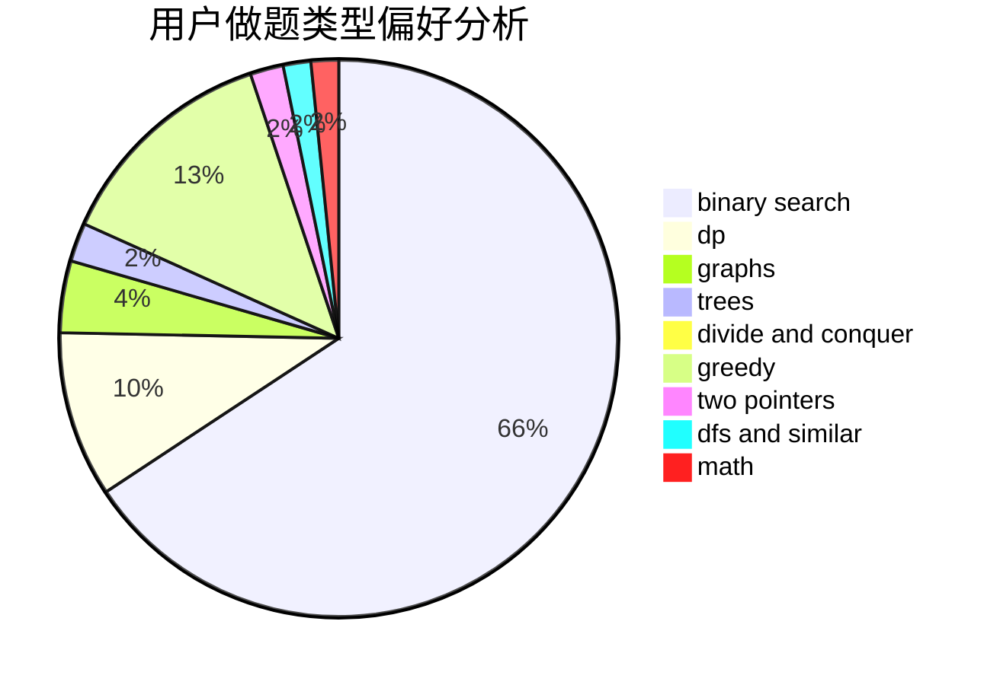

# nanatoday

<!-- tabs:start -->

#### **用户提交结果分析**

#### **用户做题类型偏好分析**

<!-- tabs:end -->
# 推荐题目
[1445C](https://codeforces.com/contest/1445/problem/C)
[847E](https://codeforces.com/contest/847/problem/E)
[333E](https://codeforces.com/contest/333/problem/E)
[1340E](https://codeforces.com/contest/1340/problem/E)
[102A](https://codeforces.com/contest/102/problem/A)
[446E](https://codeforces.com/contest/446/problem/E)
[846F](https://codeforces.com/contest/846/problem/F)
[171C](https://codeforces.com/contest/171/problem/C)
[1249E](https://codeforces.com/contest/1249/problem/E)
[1253F](https://codeforces.com/contest/1253/problem/F)
