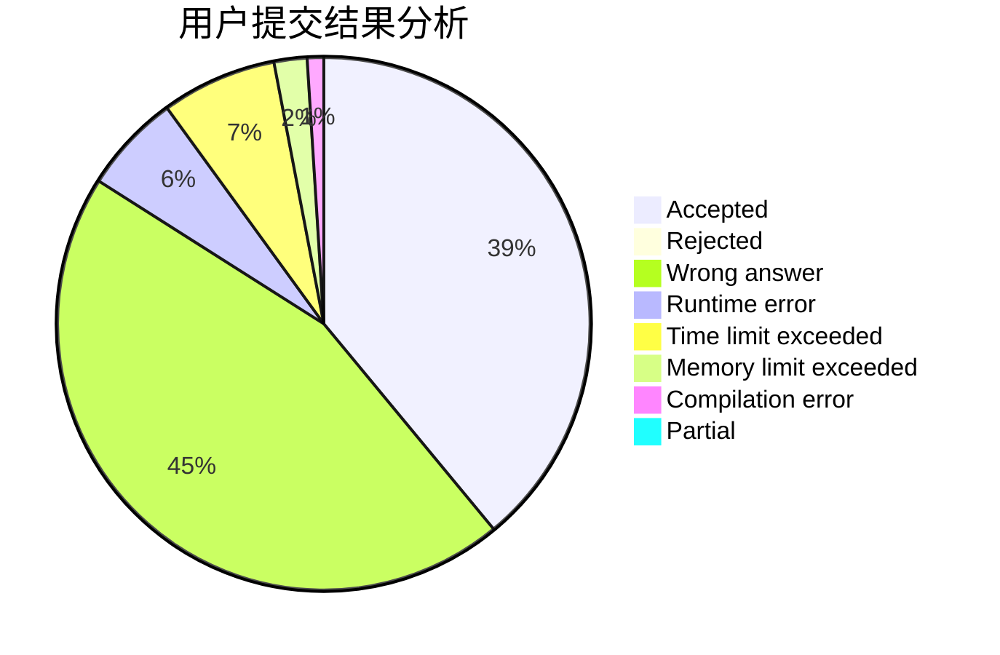
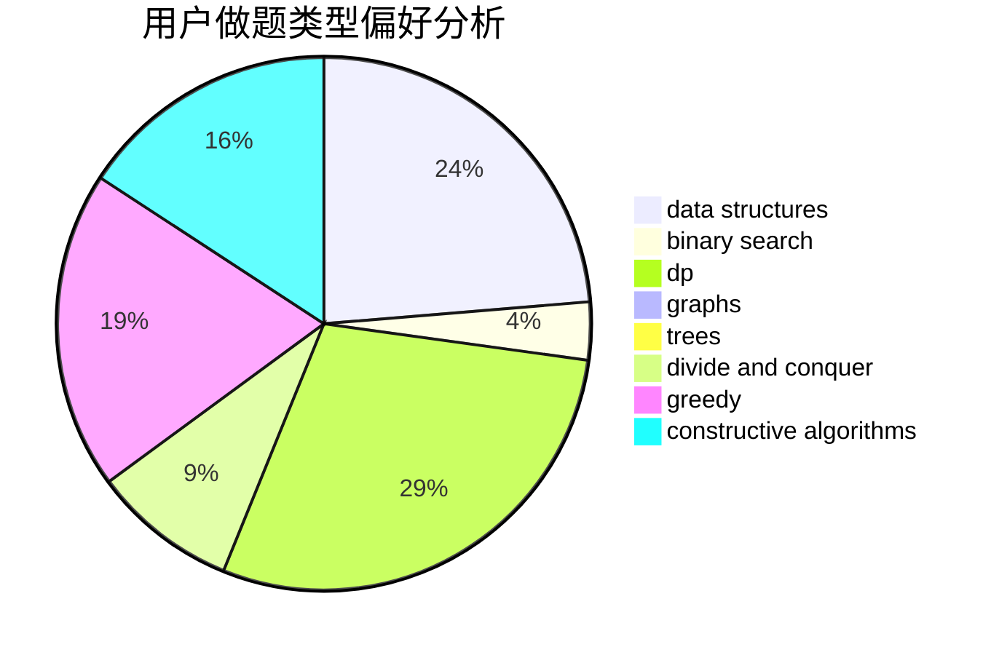
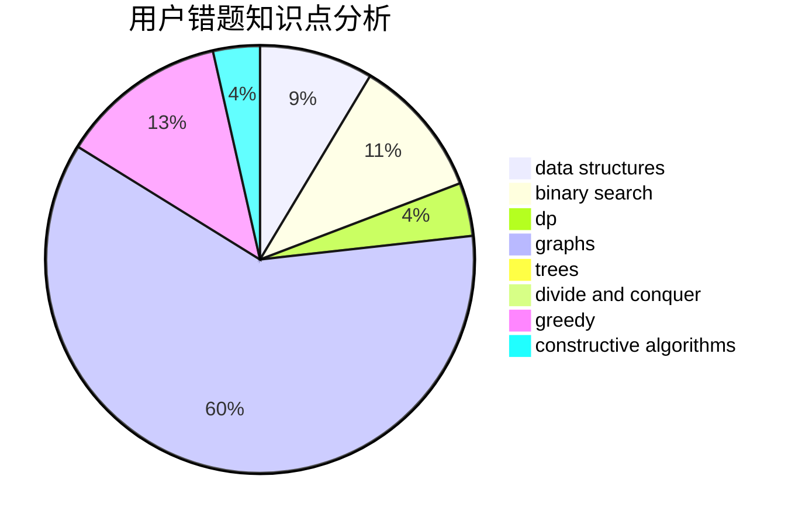

# nanatoday

<!-- tabs:start -->

#### **用户提交结果分析**

#### **用户做题类型偏好分析**

#### **用户错题知识点分析**

<!-- tabs:end -->
# 推荐题目
[1435C](https://codeforces.com/contest/1435/problem/C)		dsu,graphs,sortings,trees		  
[828E](https://codeforces.com/contest/828/problem/E)		dsu,graphs,sortings,trees		  
[30E](https://codeforces.com/contest/30/problem/E)		binary search,
                        constructive algorithms,
                        data structures,
                        greedy,
                        hashing,
                        strings		  
[1333F](https://codeforces.com/contest/1333/problem/F)		greedy,
                        implementation,
                        math,
                        number theory,
                        sortings,
                        two pointers		  
[1029D](https://codeforces.com/contest/1029/problem/D)		implementation,
                        math		  
[424A](https://codeforces.com/contest/424/problem/A)		implementation		  
[828C](https://codeforces.com/contest/828/problem/C)		dsu,graphs,sortings,trees		  
[1512C](https://codeforces.com/contest/1512/problem/C)		constructive algorithms,
                        implementation,
                        strings		  
[1244C](https://codeforces.com/contest/1244/problem/C)		brute force,
                        math,
                        number theory		  
[124A](https://codeforces.com/contest/124/problem/A)		math		  
