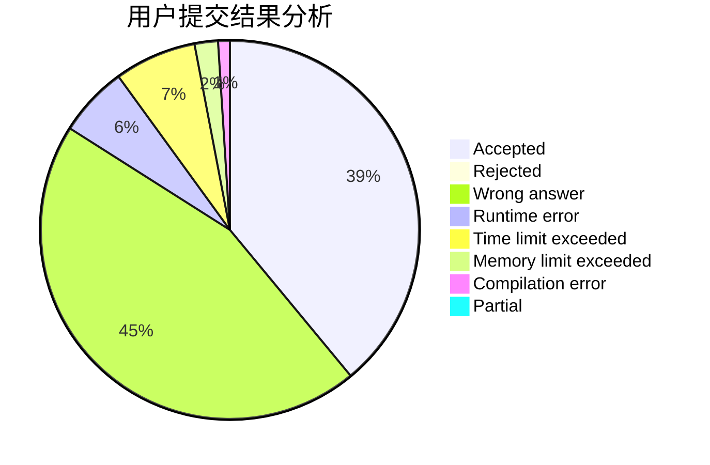
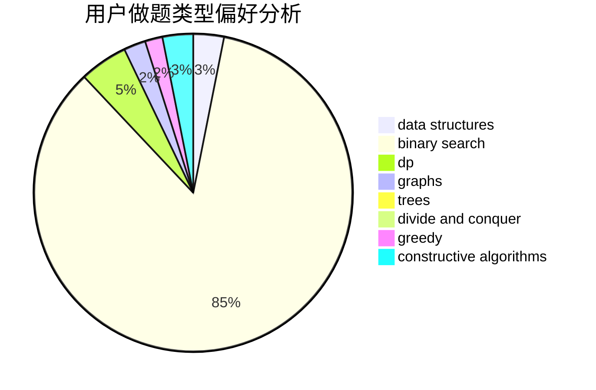
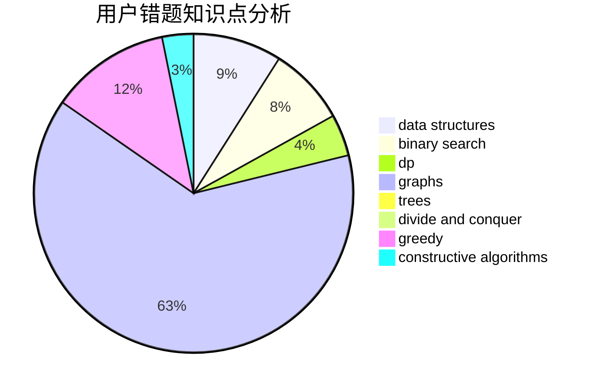

# nanatoday

<!-- tabs:start -->

#### **用户提交结果分析**

#### **用户做题类型偏好分析**

#### **用户错题知识点分析**

<!-- tabs:end -->
# 推荐题目
[1445C](https://codeforces.com/contest/1445/problem/C)		dsu,graphs,sortings,trees		  
[847E](https://codeforces.com/contest/847/problem/E)		binary search,
                        dp		  
[333E](https://codeforces.com/contest/333/problem/E)		binary search,
                        bitmasks,
                        brute force,
                        geometry,
                        sortings		  
[1340E](https://codeforces.com/contest/1340/problem/E)		graphs,
                        interactive,
                        probabilities		  
[102A](https://codeforces.com/contest/102/problem/A)		brute force		  
[446E](https://codeforces.com/contest/446/problem/E)		math,
                        matrices		  
[846F](https://codeforces.com/contest/846/problem/F)		data structures,
                        math,
                        probabilities,
                        two pointers		  
[171C](https://codeforces.com/contest/171/problem/C)		*special problem,
                        implementation		  
[1249E](https://codeforces.com/contest/1249/problem/E)		dp,
                        shortest paths		  
[1253F](https://codeforces.com/contest/1253/problem/F)		binary search,
                        dsu,
                        graphs,
                        shortest paths,
                        trees		  
