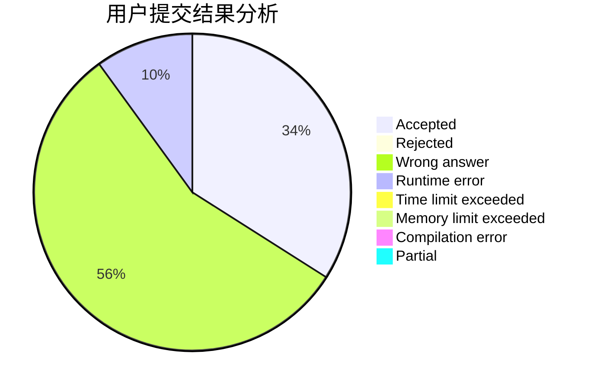
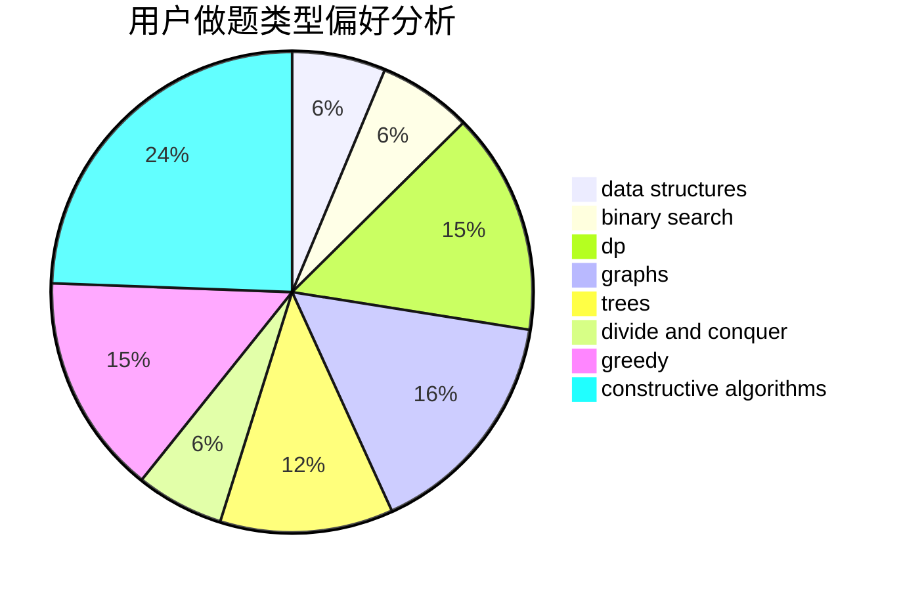
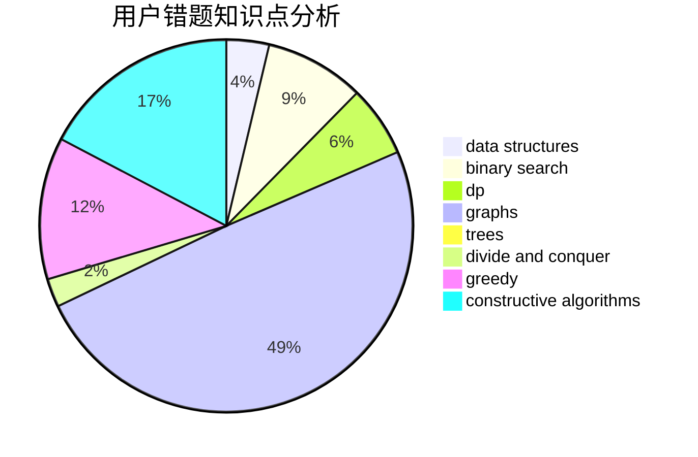

# Bowen123

<!-- tabs:start -->

#### **用户提交结果分析**

#### **用户做题类型偏好分析**

#### **用户错题知识点分析**

<!-- tabs:end -->
# 推荐题目
[579A](https://codeforces.com/contest/579/problem/A)		bitmasks		  
[492E](https://codeforces.com/contest/492/problem/E)		math		  
[198C](https://codeforces.com/contest/198/problem/C)		binary search,
                        geometry		  
[430C](https://codeforces.com/contest/430/problem/C)		dsu,graphs,sortings,trees		  
[57C](https://codeforces.com/contest/57/problem/C)		combinatorics,
                        math		  
[580B](https://codeforces.com/contest/580/problem/B)		binary search,
                        sortings,
                        two pointers		  
[1346E](https://codeforces.com/contest/1346/problem/E)		*special problem,
                        dp,
                        graphs		  
[512C](https://codeforces.com/contest/512/problem/C)		dsu,graphs,sortings,trees		  
[1028A](https://codeforces.com/contest/1028/problem/A)		implementation		  
[1070L](https://codeforces.com/contest/1070/problem/L)		constructive algorithms		  
