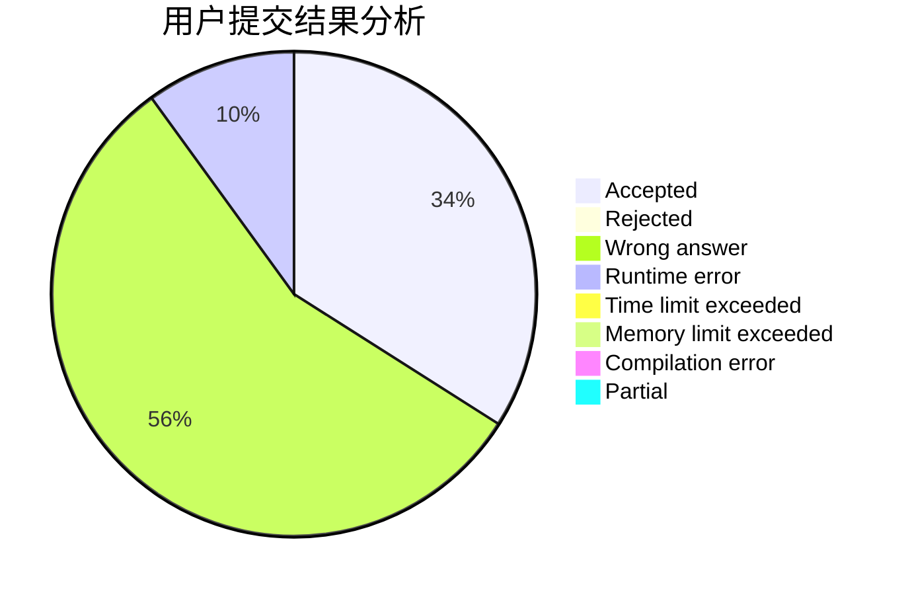
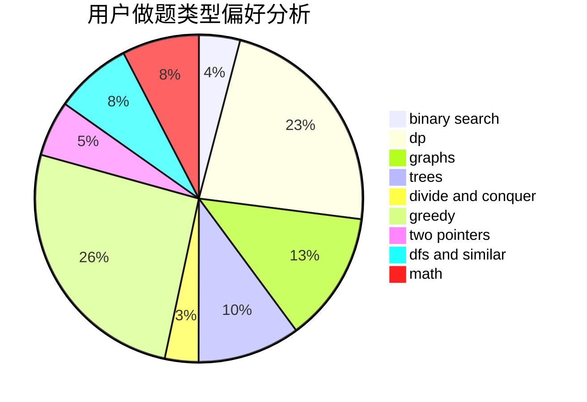

# Bowen123

<!-- tabs:start -->

#### **用户提交结果分析**

#### **用户做题类型偏好分析**

<!-- tabs:end -->
# 推荐题目
[579A](https://codeforces.com/contest/579/problem/A)
[492E](https://codeforces.com/contest/492/problem/E)
[198C](https://codeforces.com/contest/198/problem/C)
[430C](https://codeforces.com/contest/430/problem/C)
[57C](https://codeforces.com/contest/57/problem/C)
[580B](https://codeforces.com/contest/580/problem/B)
[1346E](https://codeforces.com/contest/1346/problem/E)
[512C](https://codeforces.com/contest/512/problem/C)
[1028A](https://codeforces.com/contest/1028/problem/A)
[1070L](https://codeforces.com/contest/1070/problem/L)
