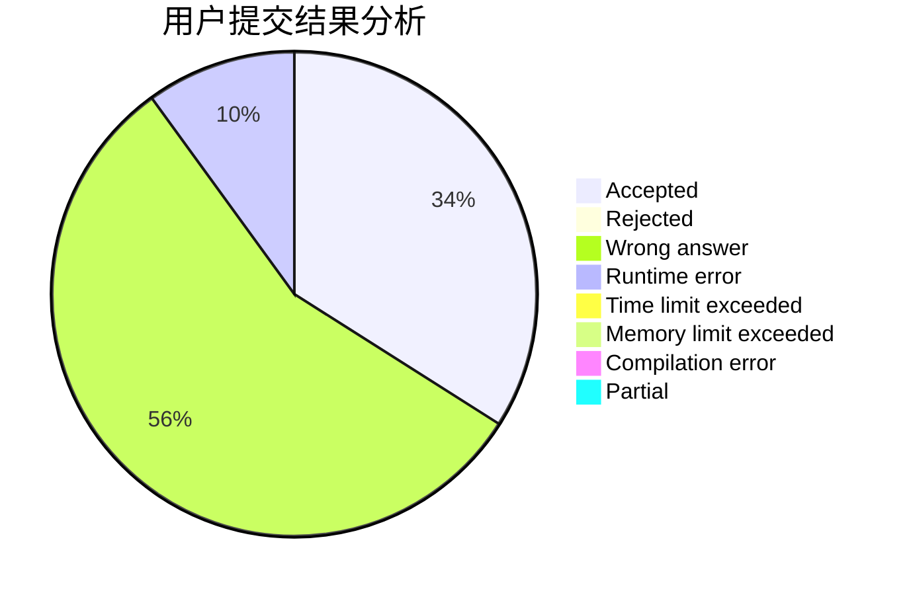
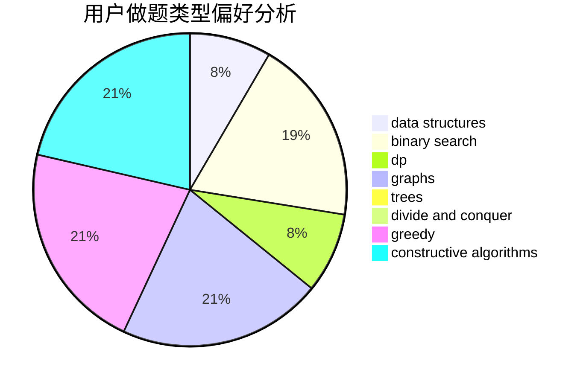
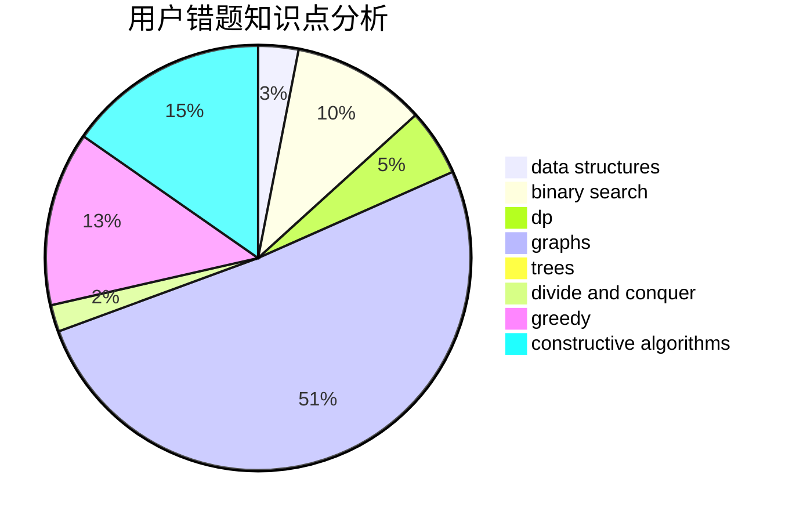

# Bowen123
<!-- tabs:start -->
#### **用户提交结果分析**

#### **用户做题类型偏好分析**

#### **用户错题知识点分析**

<!-- tabs:end -->
# 推荐题目
[Planet Lapituletti](http://codeforces.com/problemset/problem/1493/B)		brute force,
                        implementation		  
[Kyoya and Train](http://codeforces.com/problemset/problem/553/E)		dp,
                        fft,
                        graphs,
                        math,
                        probabilities		  
[Cartoons](http://codeforces.com/problemset/problem/1297/B)		*special problem,
                        implementation,
                        sortings		  
[Love Triangles](http://codeforces.com/problemset/problem/553/C)		dfs and similar,
                        dsu,
                        graphs		  
[Nearest Opposite Parity](http://codeforces.com/problemset/problem/1272/E)		dfs and similar,
                        graphs,
                        shortest paths		  
[A Piece of Cake](http://codeforces.com/problemset/problem/171/C)		*special problem,
                        implementation		  
[Long Colorful Strip](http://codeforces.com/problemset/problem/1178/F2)		dp		  
[Perfect Triples](https://codeforces.com/contest/1339/problem/E)		bitmasks,
                        brute force,
                        constructive algorithms,
                        divide and conquer,
                        math		  
[Numbers](http://codeforces.com/problemset/problem/241/D)		nan		  
[Case of Chocolate](http://codeforces.com/problemset/problem/555/C)		data structures		  
<!-- tabs:start -->
#### **data structures**
[Planet Lapituletti](http://codeforces.com/problemset/problem/555/C)		data structures		  
[Kyoya and Train](http://codeforces.com/problemset/problem/555/B)		data structures,
                        greedy,
                        sortings		  
[Cartoons](http://codeforces.com/problemset/problem/466/C)		binary search,
                        brute force,
                        data structures,
                        dp,
                        two pointers		  
[Love Triangles](http://codeforces.com/problemset/problem/1379/D)		binary search,
                        brute force,
                        data structures,
                        sortings,
                        two pointers		  
[Nearest Opposite Parity](http://codeforces.com/problemset/problem/1492/C)		binary search,
                        data structures,
                        dp,
                        greedy,
                        two pointers		  
[A Piece of Cake](http://codeforces.com/problemset/problem/1490/G)		binary search,
                        data structures,
                        math		  
[Long Colorful Strip](http://codeforces.com/problemset/problem/1479/D)		binary search,
                        bitmasks,
                        brute force,
                        data structures,
                        probabilities,
                        trees		  
[Perfect Triples](http://codeforces.com/problemset/problem/1497/A)		brute force,
                        data structures,
                        greedy,
                        sortings		  
[Numbers](http://codeforces.com/problemset/problem/1491/C)		brute force,
                        data structures,
                        dp,
                        greedy,
                        implementation		  
[Case of Chocolate](http://codeforces.com/problemset/problem/1492/B)		data structures,
                        greedy,
                        math		  
#### **binary search**
[Planet Lapituletti](https://codeforces.com/contest/480/problem/A)		binary search,
                        greedy,
                        sortings		  
[Kyoya and Train](http://codeforces.com/problemset/problem/555/D)		binary search,
                        implementation,
                        math		  
[Cartoons](http://codeforces.com/problemset/problem/553/D)		binary search,
                        graphs,
                        greedy		  
[Love Triangles](http://codeforces.com/problemset/problem/505/E)		binary search,
                        greedy		  
[Nearest Opposite Parity](http://codeforces.com/problemset/problem/1170/E)		*special problem,
                        binary search		  
[A Piece of Cake](http://codeforces.com/problemset/problem/466/C)		binary search,
                        brute force,
                        data structures,
                        dp,
                        two pointers		  
[Long Colorful Strip](http://codeforces.com/problemset/problem/1379/D)		binary search,
                        brute force,
                        data structures,
                        sortings,
                        two pointers		  
[Perfect Triples](http://codeforces.com/problemset/problem/1492/C)		binary search,
                        data structures,
                        dp,
                        greedy,
                        two pointers		  
[Numbers](http://codeforces.com/problemset/problem/1463/D)		binary search,
                        constructive algorithms,
                        greedy,
                        two pointers		  
[Case of Chocolate](http://codeforces.com/problemset/problem/1490/G)		binary search,
                        data structures,
                        math		  
#### **dp**
[Planet Lapituletti](http://codeforces.com/problemset/problem/553/E)		dp,
                        fft,
                        graphs,
                        math,
                        probabilities		  
[Kyoya and Train](http://codeforces.com/problemset/problem/1178/F2)		dp		  
[Cartoons](http://codeforces.com/problemset/problem/1027/E)		combinatorics,
                        dp,
                        math		  
[Love Triangles](http://codeforces.com/problemset/problem/474/D)		dp		  
[Nearest Opposite Parity](http://codeforces.com/problemset/problem/106/C)		dp		  
[A Piece of Cake](https://codeforces.com/contest/480/problem/B)		dp,
                        graphs		  
[Long Colorful Strip](http://codeforces.com/problemset/problem/1108/D)		constructive algorithms,
                        dp,
                        greedy		  
[Perfect Triples](http://codeforces.com/problemset/problem/466/C)		binary search,
                        brute force,
                        data structures,
                        dp,
                        two pointers		  
[Numbers](http://codeforces.com/problemset/problem/337/D)		dfs and similar,
                        divide and conquer,
                        dp,
                        trees		  
[Case of Chocolate](http://codeforces.com/problemset/problem/1503/E)		combinatorics,
                        dp,
                        math		  
#### **graph**
[Planet Lapituletti](http://codeforces.com/problemset/problem/553/E)		dp,
                        fft,
                        graphs,
                        math,
                        probabilities		  
[Kyoya and Train](http://codeforces.com/problemset/problem/553/C)		dfs and similar,
                        dsu,
                        graphs		  
[Cartoons](http://codeforces.com/problemset/problem/1272/E)		dfs and similar,
                        graphs,
                        shortest paths		  
[Love Triangles](http://codeforces.com/problemset/problem/402/C)		brute force,
                        constructive algorithms,
                        graphs		  
[Nearest Opposite Parity](http://codeforces.com/problemset/problem/1070/I)		flows,
                        graph matchings,
                        graphs		  
[A Piece of Cake](http://codeforces.com/problemset/problem/553/D)		binary search,
                        graphs,
                        greedy		  
[Long Colorful Strip](https://codeforces.com/contest/480/problem/B)		dp,
                        graphs		  
[Perfect Triples](http://codeforces.com/problemset/problem/555/E)		dfs and similar,
                        graphs,
                        trees		  
[Numbers](http://codeforces.com/problemset/problem/1487/C)		brute force,
                        constructive algorithms,
                        dfs and similar,
                        graphs,
                        greedy,
                        implementation,
                        math		  
[Case of Chocolate](http://codeforces.com/problemset/problem/1437/C)		dp,
                        flows,
                        graph matchings,
                        greedy,
                        math,
                        sortings		  
#### **trees**
[Planet Lapituletti](http://codeforces.com/problemset/problem/555/E)		dfs and similar,
                        graphs,
                        trees		  
[Kyoya and Train](http://codeforces.com/problemset/problem/337/D)		dfs and similar,
                        divide and conquer,
                        dp,
                        trees		  
[Cartoons](http://codeforces.com/problemset/problem/1479/D)		binary search,
                        bitmasks,
                        brute force,
                        data structures,
                        probabilities,
                        trees		  
[Love Triangles](http://codeforces.com/problemset/problem/1511/C)		brute force,
                        data structures,
                        implementation,
                        trees		  
[Nearest Opposite Parity](http://codeforces.com/problemset/problem/1499/F)		combinatorics,
                        dfs and similar,
                        dp,
                        trees		  
[A Piece of Cake](http://codeforces.com/problemset/problem/1491/E)		brute force,
                        dfs and similar,
                        divide and conquer,
                        number theory,
                        trees		  
[Long Colorful Strip](http://codeforces.com/problemset/problem/1466/D)		data structures,
                        greedy,
                        sortings,
                        trees		  
[Perfect Triples](http://codeforces.com/problemset/problem/1495/D)		combinatorics,
                        dfs and similar,
                        graphs,
                        math,
                        shortest paths,
                        trees		  
[Numbers](http://codeforces.com/problemset/problem/1303/G)		data structures,
                        divide and conquer,
                        geometry,
                        trees		  
[Case of Chocolate](http://codeforces.com/problemset/problem/1454/E)		combinatorics,
                        dfs and similar,
                        graphs,
                        trees		  
#### **divide and conquer**
[Planet Lapituletti](https://codeforces.com/contest/1339/problem/E)		bitmasks,
                        brute force,
                        constructive algorithms,
                        divide and conquer,
                        math		  
[Kyoya and Train](http://codeforces.com/problemset/problem/337/D)		dfs and similar,
                        divide and conquer,
                        dp,
                        trees		  
[Cartoons](http://codeforces.com/problemset/problem/1461/D)		binary search,
                        brute force,
                        data structures,
                        divide and conquer,
                        implementation,
                        sortings		  
[Love Triangles](http://codeforces.com/problemset/problem/1466/G)		combinatorics,
                        divide and conquer,
                        hashing,
                        math,
                        string suffix structures,
                        strings		  
[Nearest Opposite Parity](http://codeforces.com/problemset/problem/1490/D)		dfs and similar,
                        divide and conquer,
                        implementation		  
[A Piece of Cake](https://codeforces.com/contest/1483/problem/C)		data structures,
                        divide and conquer,
                        dp		  
[Long Colorful Strip](http://codeforces.com/problemset/problem/1491/E)		brute force,
                        dfs and similar,
                        divide and conquer,
                        number theory,
                        trees		  
[Perfect Triples](http://codeforces.com/problemset/problem/1303/G)		data structures,
                        divide and conquer,
                        geometry,
                        trees		  
[Numbers](http://codeforces.com/problemset/problem/1494/D)		constructive algorithms,
                        data structures,
                        dfs and similar,
                        divide and conquer,
                        dsu,
                        greedy,
                        sortings,
                        trees		  
[Case of Chocolate](http://codeforces.com/problemset/problem/1482/E)		data structures,
                        divide and conquer,
                        dp		  
#### **greedy**
[Planet Lapituletti](http://codeforces.com/problemset/problem/1038/C)		greedy,
                        sortings		  
[Kyoya and Train](https://codeforces.com/contest/480/problem/A)		binary search,
                        greedy,
                        sortings		  
[Cartoons](http://codeforces.com/problemset/problem/553/D)		binary search,
                        graphs,
                        greedy		  
[Love Triangles](http://codeforces.com/problemset/problem/555/B)		data structures,
                        greedy,
                        sortings		  
[Nearest Opposite Parity](http://codeforces.com/problemset/problem/1183/D)		greedy,
                        sortings		  
[A Piece of Cake](http://codeforces.com/problemset/problem/505/E)		binary search,
                        greedy		  
[Long Colorful Strip](http://codeforces.com/problemset/problem/1108/D)		constructive algorithms,
                        dp,
                        greedy		  
[Perfect Triples](http://codeforces.com/problemset/problem/1070/D)		greedy		  
[Numbers](http://codeforces.com/problemset/problem/1512/E)		brute force,
                        greedy,
                        math		  
[Case of Chocolate](http://codeforces.com/problemset/problem/1492/C)		binary search,
                        data structures,
                        dp,
                        greedy,
                        two pointers		  
#### **constructive algorithms**
[Planet Lapituletti](https://codeforces.com/contest/1339/problem/E)		bitmasks,
                        brute force,
                        constructive algorithms,
                        divide and conquer,
                        math		  
[Kyoya and Train](http://codeforces.com/problemset/problem/402/C)		brute force,
                        constructive algorithms,
                        graphs		  
[Cartoons](http://codeforces.com/problemset/problem/1119/G)		constructive algorithms,
                        implementation		  
[Love Triangles](http://codeforces.com/problemset/problem/1108/D)		constructive algorithms,
                        dp,
                        greedy		  
[Nearest Opposite Parity](http://codeforces.com/problemset/problem/1512/C)		constructive algorithms,
                        implementation,
                        strings		  
[A Piece of Cake](http://codeforces.com/problemset/problem/1493/A)		constructive algorithms,
                        greedy		  
[Long Colorful Strip](http://codeforces.com/problemset/problem/1463/D)		binary search,
                        constructive algorithms,
                        greedy,
                        two pointers		  
[Perfect Triples](https://codeforces.com/contest/1456/problem/B)		bitmasks,
                        brute force,
                        constructive algorithms		  
[Numbers](http://codeforces.com/problemset/problem/1492/D)		bitmasks,
                        constructive algorithms,
                        greedy,
                        math		  
[Case of Chocolate](https://codeforces.com/contest/1504/problem/D)		constructive algorithms,
                        games,
                        interactive		  
#### **sortings**
[Planet Lapituletti](http://codeforces.com/problemset/problem/1297/B)		*special problem,
                        implementation,
                        sortings		  
[Kyoya and Train](http://codeforces.com/problemset/problem/1038/C)		greedy,
                        sortings		  
[Cartoons](https://codeforces.com/contest/480/problem/A)		binary search,
                        greedy,
                        sortings		  
[Love Triangles](http://codeforces.com/problemset/problem/555/B)		data structures,
                        greedy,
                        sortings		  
[Nearest Opposite Parity](http://codeforces.com/problemset/problem/1183/D)		greedy,
                        sortings		  
[A Piece of Cake](http://codeforces.com/problemset/problem/1121/A)		implementation,
                        sortings		  
[Long Colorful Strip](http://codeforces.com/problemset/problem/1379/D)		binary search,
                        brute force,
                        data structures,
                        sortings,
                        two pointers		  
[Perfect Triples](https://codeforces.com/contest/1496/problem/C)		geometry,
                        greedy,
                        math,
                        sortings		  
[Numbers](http://codeforces.com/problemset/problem/1495/A)		geometry,
                        greedy,
                        math,
                        sortings		  
[Case of Chocolate](http://codeforces.com/problemset/problem/1497/A)		brute force,
                        data structures,
                        greedy,
                        sortings		  
<!-- tabs:end -->
