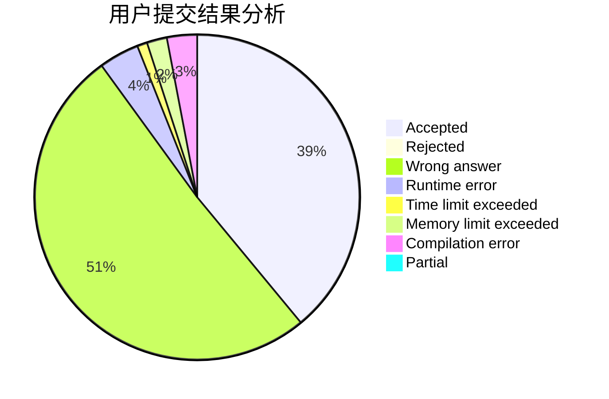
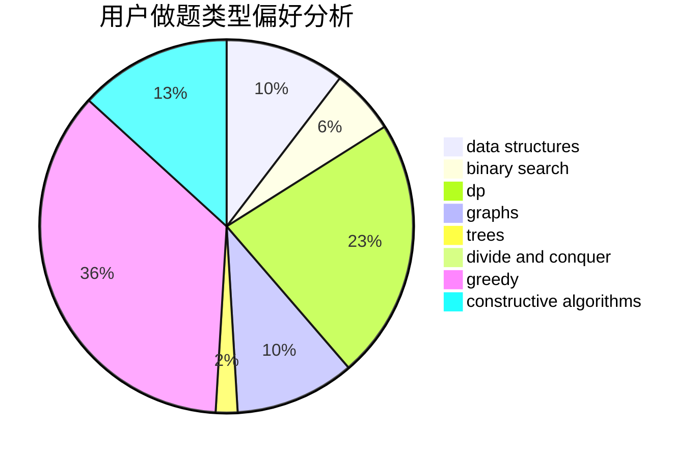
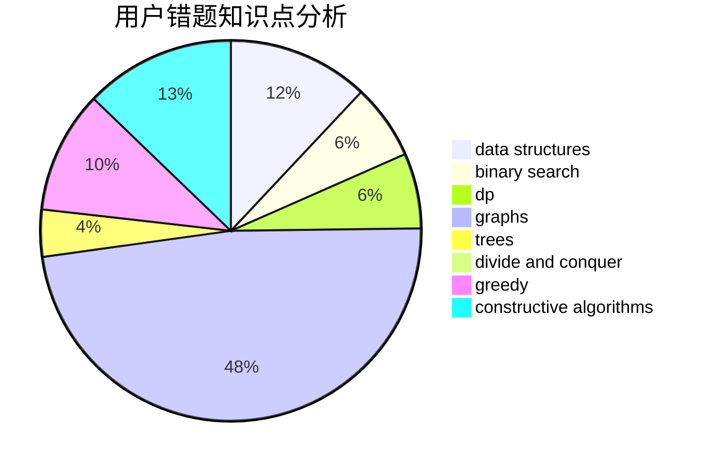

# nancheng58

<!-- tabs:start -->

#### **用户提交结果分析**

#### **用户做题类型偏好分析**

#### **用户错题知识点分析**

<!-- tabs:end -->
# 推荐题目
[1129D](https://codeforces.com/contest/1129/problem/D)		data structures,
                        dp		  
[1279E](https://codeforces.com/contest/1279/problem/E)		combinatorics,
                        dp		  
[314C](https://codeforces.com/contest/314/problem/C)		data structures,
                        dp		  
[466D](https://codeforces.com/contest/466/problem/D)		combinatorics,
                        dp		  
[1080E](https://codeforces.com/contest/1080/problem/E)		strings		  
[601A](https://codeforces.com/contest/601/problem/A)		graphs,
                        shortest paths		  
[552A](https://codeforces.com/contest/552/problem/A)		implementation,
                        math		  
[11732](https://codeforces.com/contest/1173/problem/2)		dsu,graphs,sortings,trees		  
[780F](https://codeforces.com/contest/780/problem/F)		bitmasks,
                        dp,
                        graphs,
                        matrices		  
[105B](https://codeforces.com/contest/105/problem/B)		brute force,
                        probabilities		  
