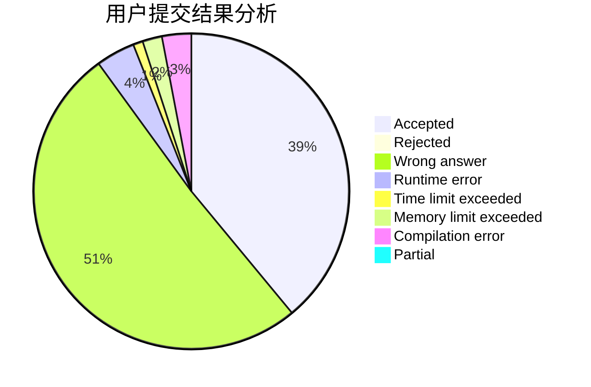
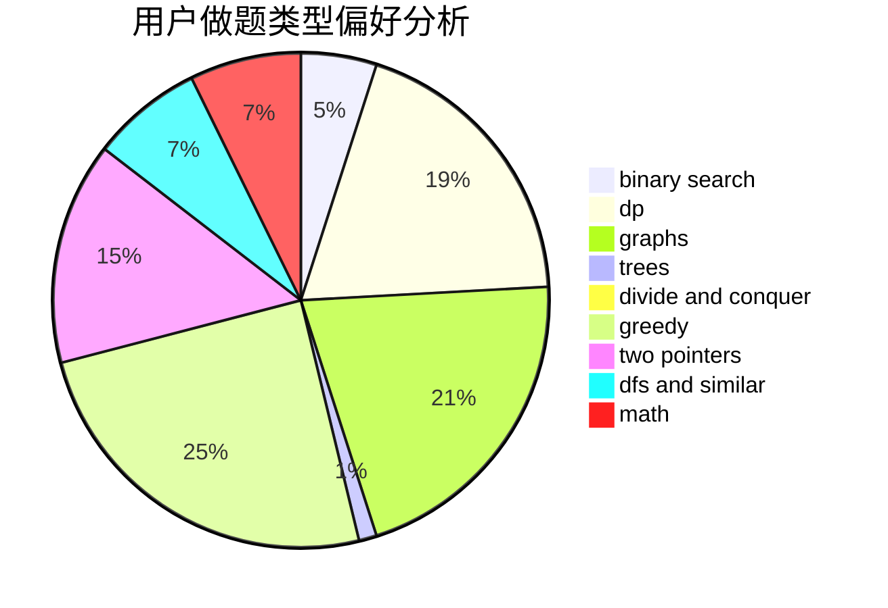

# nancheng58

<!-- tabs:start -->

#### **用户提交结果分析**

#### **用户做题类型偏好分析**

<!-- tabs:end -->
# 推荐题目
[1129D](https://codeforces.com/contest/1129/problem/D)
[1279E](https://codeforces.com/contest/1279/problem/E)
[314C](https://codeforces.com/contest/314/problem/C)
[466D](https://codeforces.com/contest/466/problem/D)
[1080E](https://codeforces.com/contest/1080/problem/E)
[601A](https://codeforces.com/contest/601/problem/A)
[552A](https://codeforces.com/contest/552/problem/A)
[11732](https://codeforces.com/contest/1173/problem/2)
[780F](https://codeforces.com/contest/780/problem/F)
[105B](https://codeforces.com/contest/105/problem/B)
