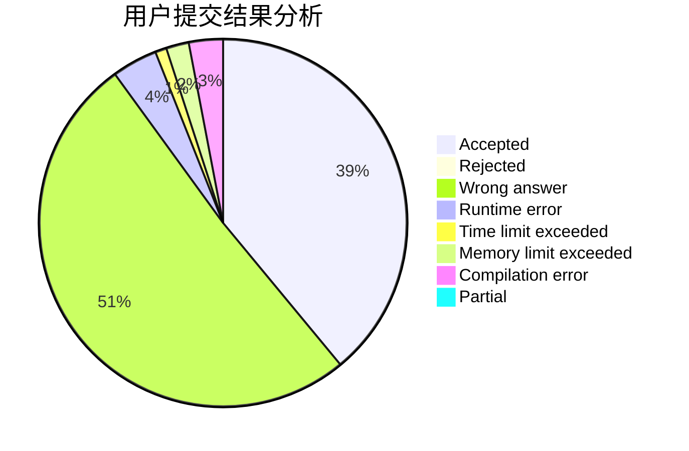
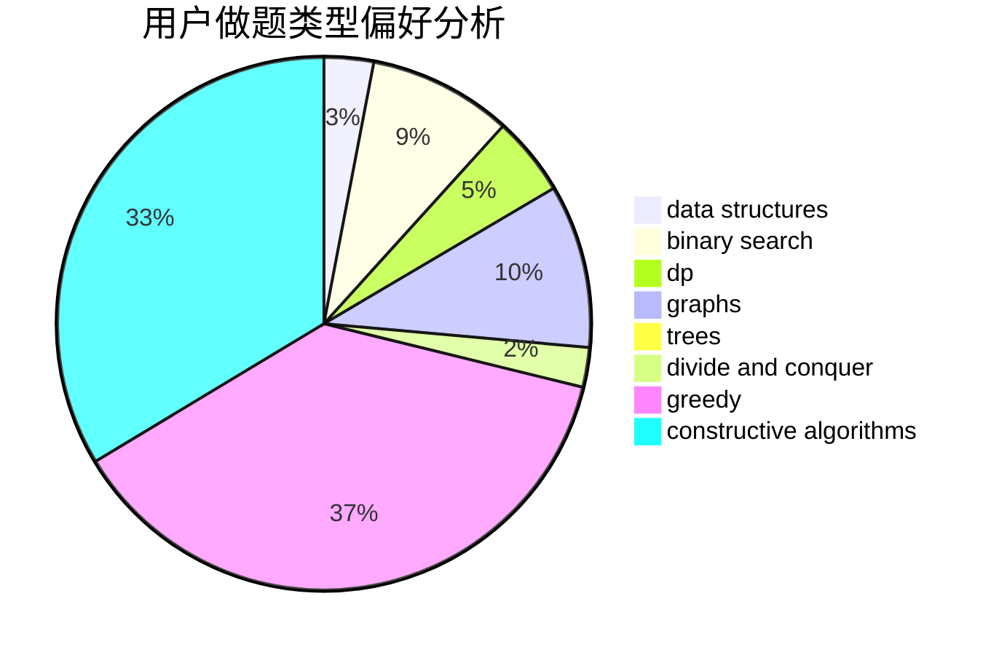
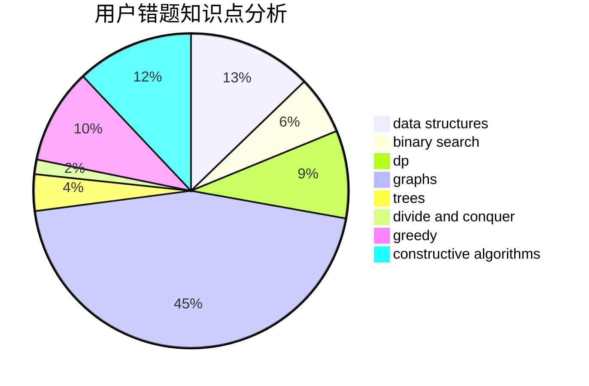

# nancheng58

<!-- tabs:start -->

#### **用户提交结果分析**

#### **用户做题类型偏好分析**

#### **用户错题知识点分析**

<!-- tabs:end -->
# 推荐题目
[1119H](https://codeforces.com/contest/1119/problem/H)		fft,
                        math		  
[1270E](https://codeforces.com/contest/1270/problem/E)		constructive algorithms,
                        geometry,
                        math		  
[297D](https://codeforces.com/contest/297/problem/D)		constructive algorithms		  
[446C](https://codeforces.com/contest/446/problem/C)		data structures,
                        math,
                        number theory		  
[1080B](https://codeforces.com/contest/1080/problem/B)		math		  
[580E](https://codeforces.com/contest/580/problem/E)		data structures,
                        hashing,
                        strings		  
[528A](https://codeforces.com/contest/528/problem/A)		dsu,graphs,sortings,trees		  
[1168C](https://codeforces.com/contest/1168/problem/C)		bitmasks,
                        dp		  
[762B](https://codeforces.com/contest/762/problem/B)		greedy,
                        implementation,
                        sortings,
                        two pointers		  
[1059C](https://codeforces.com/contest/1059/problem/C)		constructive algorithms,
                        math		  
