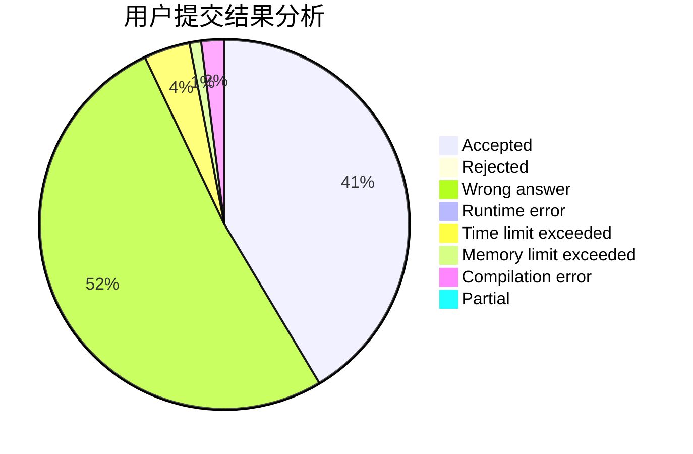
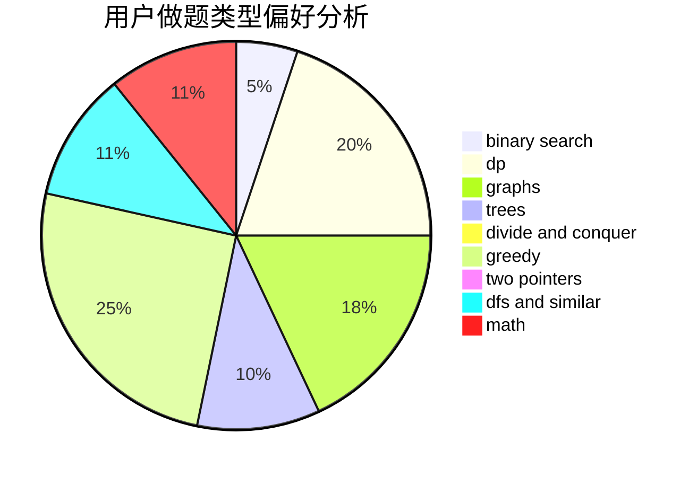

# nanmenyangde

<!-- tabs:start -->

#### **用户提交结果分析**

#### **用户做题类型偏好分析**

<!-- tabs:end -->
# 推荐题目
[1028G](https://codeforces.com/contest/1028/problem/G)
[641E](https://codeforces.com/contest/641/problem/E)
[1109F](https://codeforces.com/contest/1109/problem/F)
[1269B](https://codeforces.com/contest/1269/problem/B)
[376A](https://codeforces.com/contest/376/problem/A)
[723D](https://codeforces.com/contest/723/problem/D)
[7E](https://codeforces.com/contest/7/problem/E)
[1221G](https://codeforces.com/contest/1221/problem/G)
[1152A](https://codeforces.com/contest/1152/problem/A)
[1324C](https://codeforces.com/contest/1324/problem/C)
