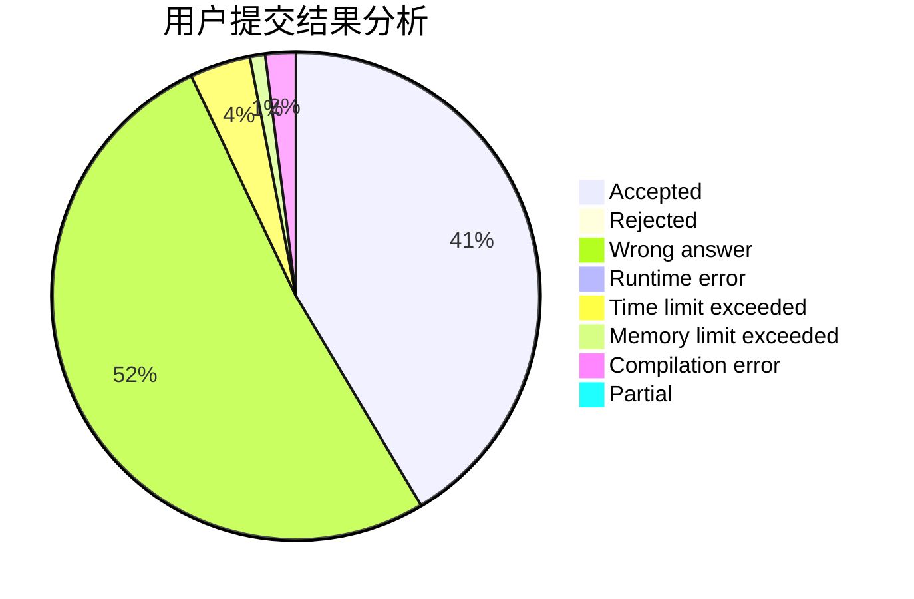
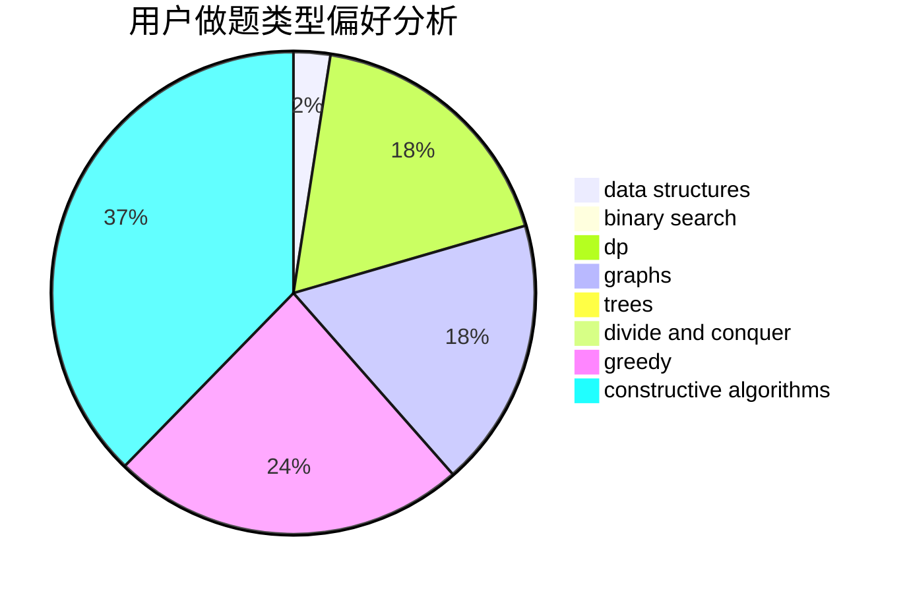
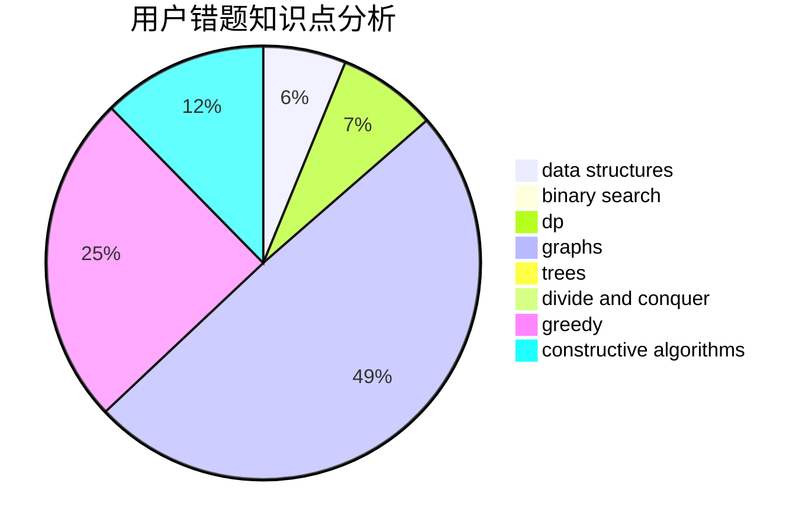

# nanmenyangde

<!-- tabs:start -->

#### **用户提交结果分析**

#### **用户做题类型偏好分析**

#### **用户错题知识点分析**

<!-- tabs:end -->
# 推荐题目
[1028C](https://codeforces.com/contest/1028/problem/C)		geometry,
                        implementation,
                        sortings		  
[61B](https://codeforces.com/contest/61/problem/B)		strings		  
[1109B](https://codeforces.com/contest/1109/problem/B)		constructive algorithms,
                        hashing,
                        strings		  
[1263D](https://codeforces.com/contest/1263/problem/D)		dfs and similar,
                        dsu,
                        graphs		  
[349B](https://codeforces.com/contest/349/problem/B)		data structures,
                        dp,
                        greedy,
                        implementation		  
[704D](https://codeforces.com/contest/704/problem/D)		flows,
                        greedy		  
[782A](https://codeforces.com/contest/782/problem/A)		dsu,graphs,sortings,trees		  
[1216C](https://codeforces.com/contest/1216/problem/C)		geometry,
                        math		  
[1150A](https://codeforces.com/contest/1150/problem/A)		greedy,
                        implementation		  
[1314D](https://codeforces.com/contest/1314/problem/D)		dsu,graphs,sortings,trees		  
