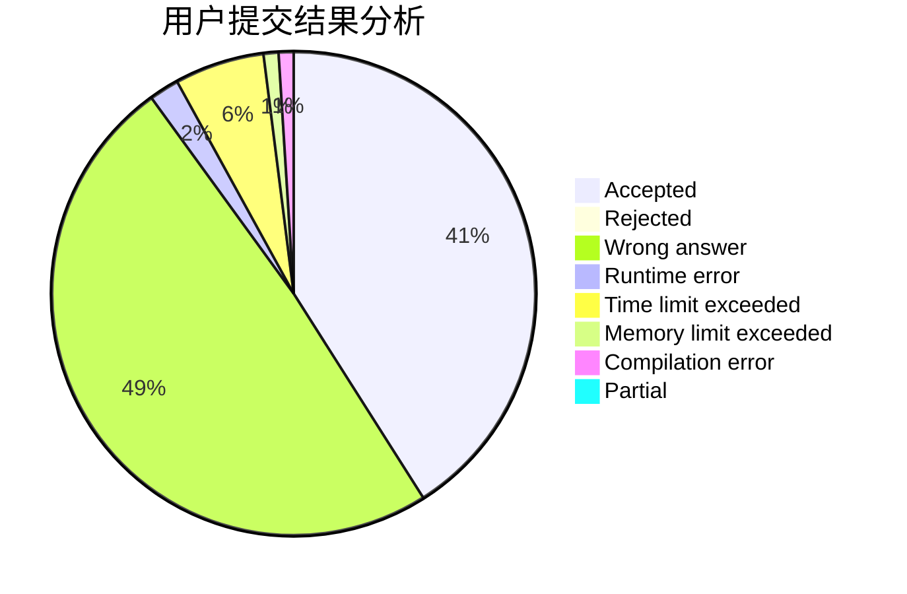
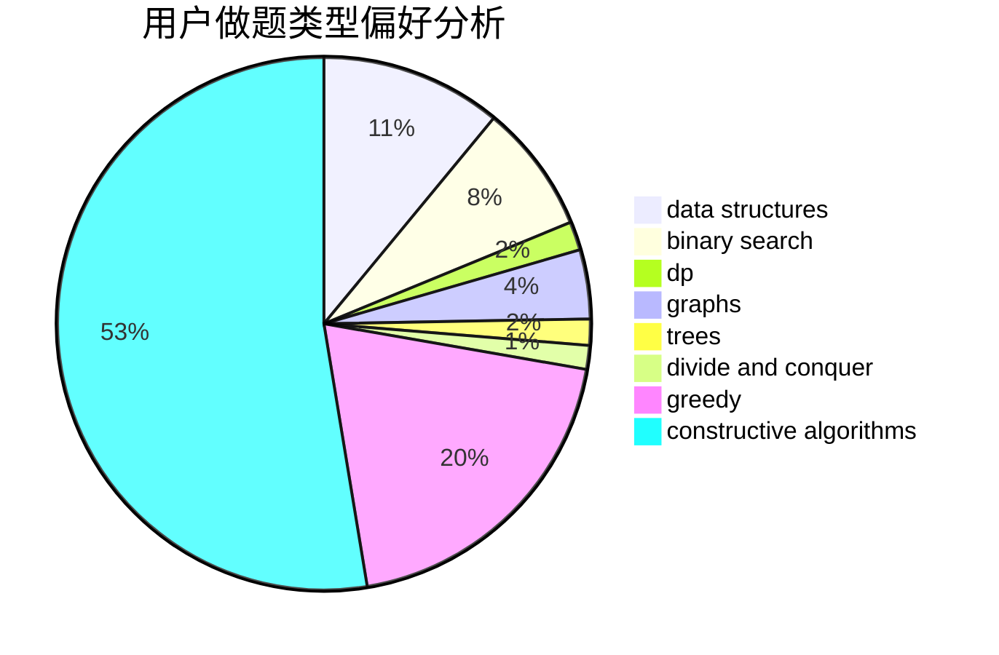
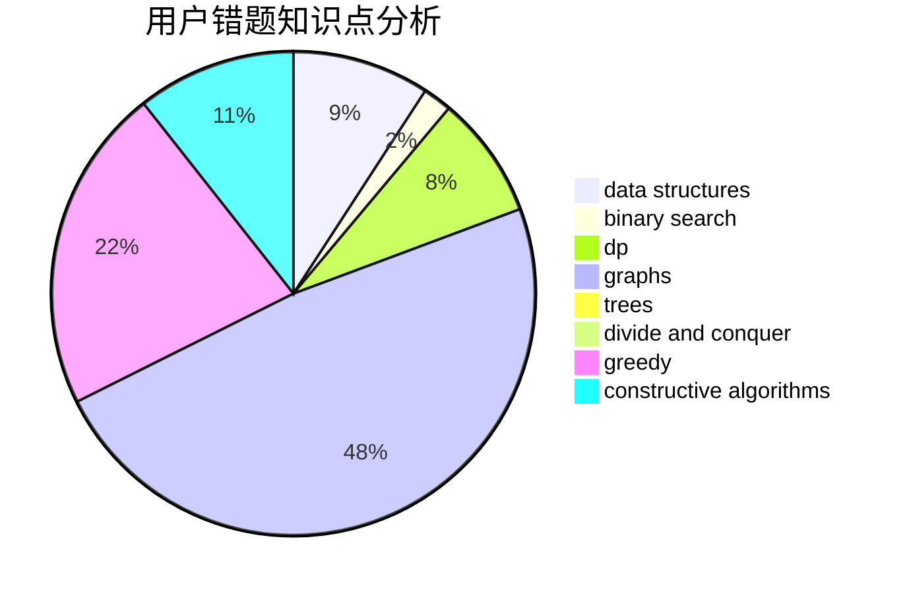

# nantf

<!-- tabs:start -->

#### **用户提交结果分析**

#### **用户做题类型偏好分析**

#### **用户错题知识点分析**

<!-- tabs:end -->
# 推荐题目
[1494B](https://codeforces.com/contest/1494/problem/B)		bitmasks,
                        brute force,
                        greedy,
                        implementation		  
[1241C](https://codeforces.com/contest/1241/problem/C)		dsu,graphs,sortings,trees		  
[1238E](https://codeforces.com/contest/1238/problem/E)		bitmasks,
                        dp		  
[866D](https://codeforces.com/contest/866/problem/D)		dsu,graphs,sortings,trees		  
[404C](https://codeforces.com/contest/404/problem/C)		dfs and similar,
                        graphs,
                        sortings		  
[1002C2](https://codeforces.com/contest/1002C/problem/2)		nan		  
[803G](https://codeforces.com/contest/803/problem/G)		data structures		  
[236D](https://codeforces.com/contest/236/problem/D)		dsu,graphs,sortings,trees		  
[1120B](https://codeforces.com/contest/1120/problem/B)		constructive algorithms,
                        greedy,
                        implementation,
                        math		  
[1207E](https://codeforces.com/contest/1207/problem/E)		bitmasks,
                        interactive,
                        math		  
