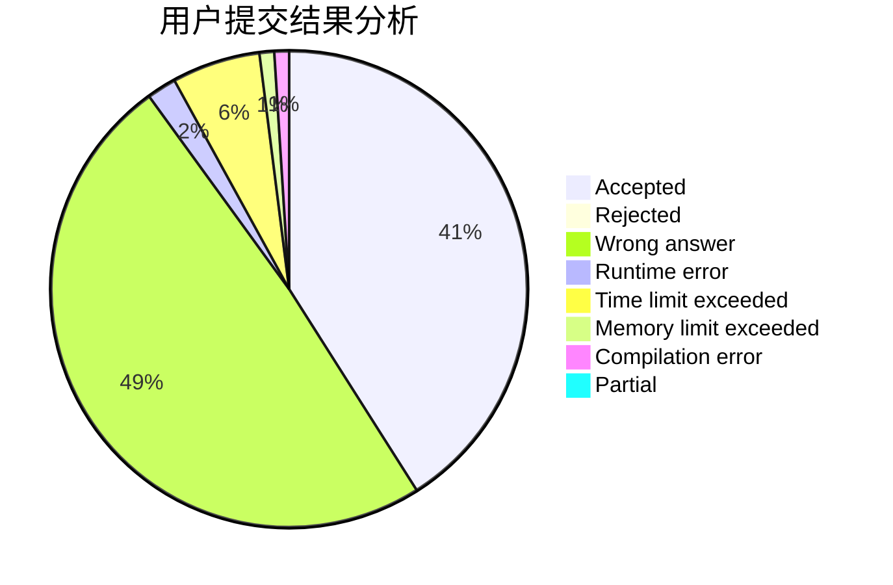
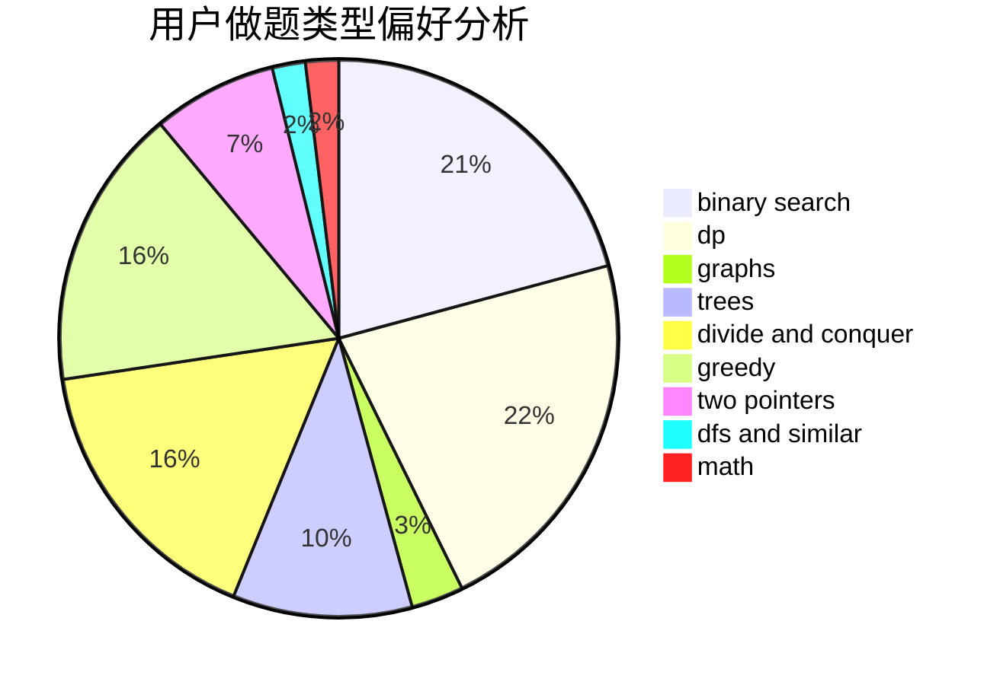

# nantf

<!-- tabs:start -->

#### **用户提交结果分析**

#### **用户做题类型偏好分析**

<!-- tabs:end -->
# 推荐题目
[1503B](https://codeforces.com/contest/1503/problem/B)
[12471](https://codeforces.com/contest/1247/problem/1)
[1243E](https://codeforces.com/contest/1243/problem/E)
[886F](https://codeforces.com/contest/886/problem/F)
[433B](https://codeforces.com/contest/433/problem/B)
[10024](https://codeforces.com/contest/1002/problem/4)
[81C](https://codeforces.com/contest/81/problem/C)
[25A](https://codeforces.com/contest/25/problem/A)
[112A](https://codeforces.com/contest/112/problem/A)
[1213A](https://codeforces.com/contest/1213/problem/A)
