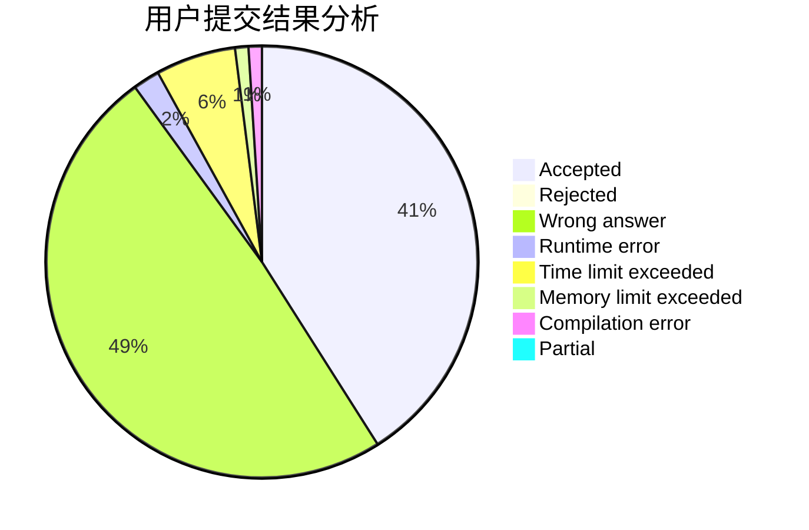
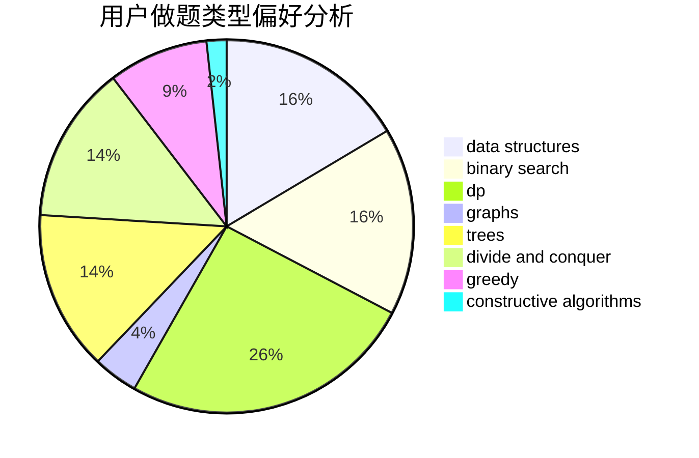
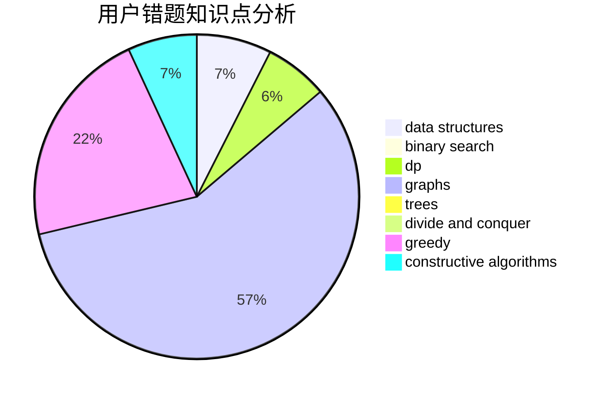

# nantf

<!-- tabs:start -->

#### **用户提交结果分析**

#### **用户做题类型偏好分析**

#### **用户错题知识点分析**

<!-- tabs:end -->
# 推荐题目
[1503B](https://codeforces.com/contest/1503/problem/B)		constructive algorithms,
                        games,
                        interactive		  
[12471](https://codeforces.com/contest/1247/problem/1)		dsu,graphs,sortings,trees		  
[1243E](https://codeforces.com/contest/1243/problem/E)		dsu,graphs,sortings,trees		  
[886F](https://codeforces.com/contest/886/problem/F)		geometry		  
[433B](https://codeforces.com/contest/433/problem/B)		dp,
                        implementation,
                        sortings		  
[10024](https://codeforces.com/contest/1002/problem/4)		dsu,graphs,sortings,trees		  
[81C](https://codeforces.com/contest/81/problem/C)		greedy,
                        math,
                        sortings		  
[25A](https://codeforces.com/contest/25/problem/A)		brute force		  
[112A](https://codeforces.com/contest/112/problem/A)		implementation,
                        strings		  
[1213A](https://codeforces.com/contest/1213/problem/A)		math		  
