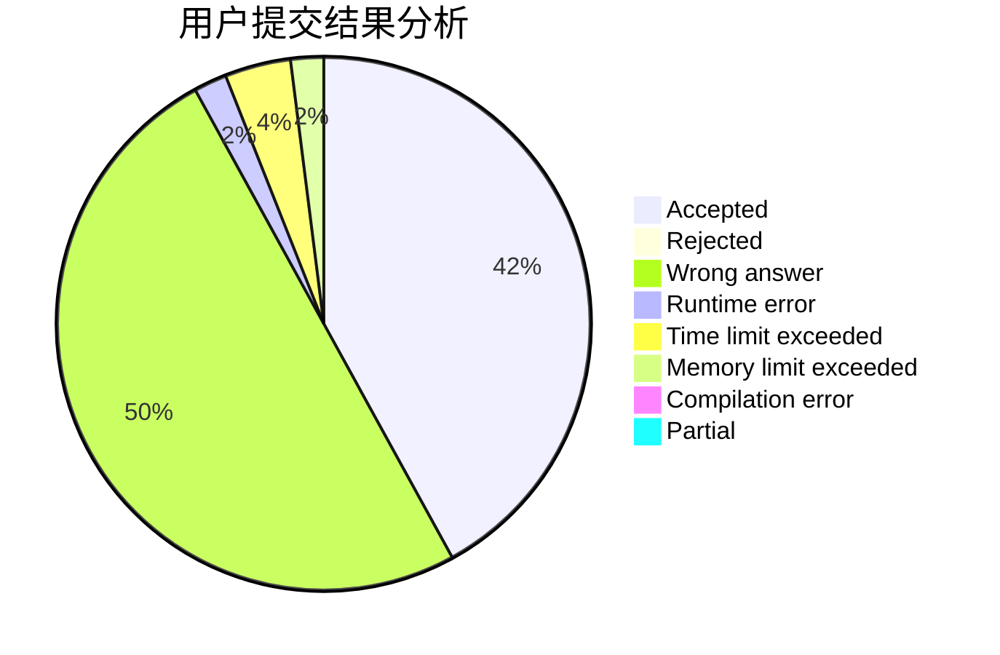
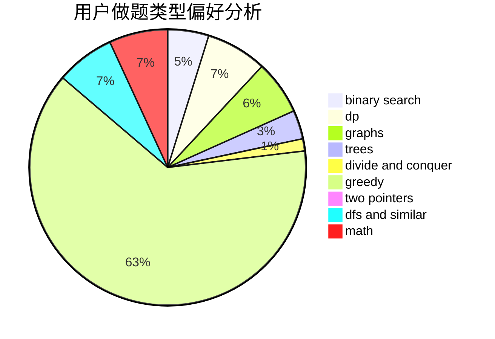

# nao-nao

<!-- tabs:start -->

#### **用户提交结果分析**

#### **用户做题类型偏好分析**

<!-- tabs:end -->
# 推荐题目
[279A](https://codeforces.com/contest/279/problem/A)
[288E](https://codeforces.com/contest/288/problem/E)
[1077C](https://codeforces.com/contest/1077/problem/C)
[3D](https://codeforces.com/contest/3/problem/D)
[10022](https://codeforces.com/contest/1002/problem/2)
[1070D](https://codeforces.com/contest/1070/problem/D)
[acmsguru4](https://codeforces.com/contest/acmsguru/problem/4)
[911G](https://codeforces.com/contest/911/problem/G)
[818D](https://codeforces.com/contest/818/problem/D)
[725A](https://codeforces.com/contest/725/problem/A)
