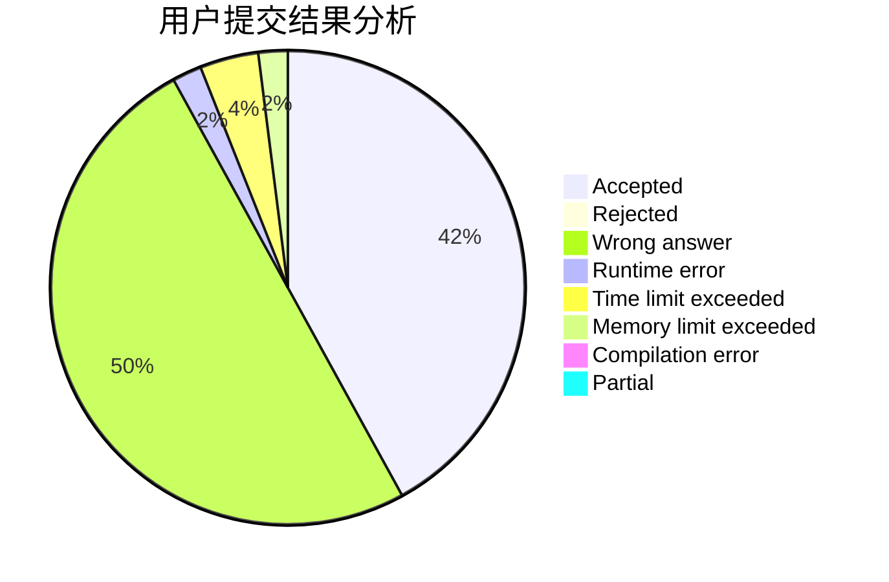
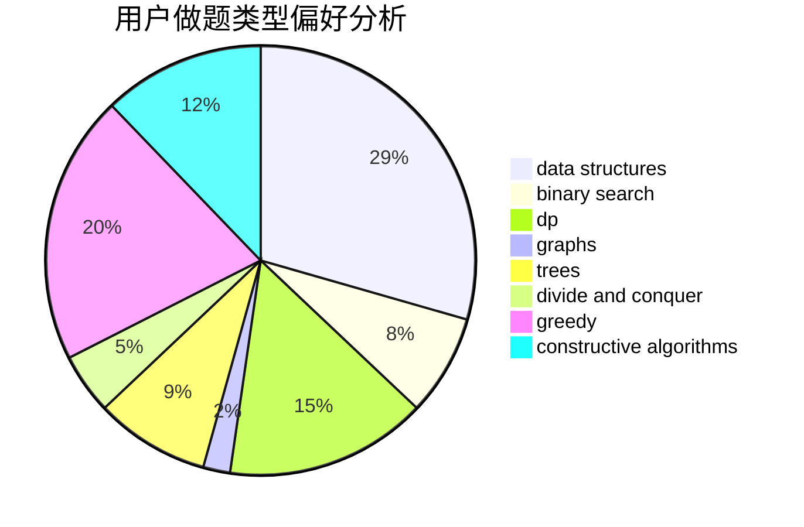

# nao-nao

<!-- tabs:start -->

#### **用户提交结果分析**

#### **用户做题类型偏好分析**

#### **用户错题知识点分析**

<!-- tabs:end -->
# 推荐题目
[279A](https://codeforces.com/contest/279/problem/A)		brute force,
                        geometry,
                        implementation		  
[288E](https://codeforces.com/contest/288/problem/E)		dp,
                        implementation,
                        math		  
[1077C](https://codeforces.com/contest/1077/problem/C)		nan		  
[3D](https://codeforces.com/contest/3/problem/D)		greedy		  
[10022](https://codeforces.com/contest/1002/problem/2)		dsu,graphs,sortings,trees		  
[1070D](https://codeforces.com/contest/1070/problem/D)		greedy		  
[acmsguru4](https://codeforces.com/contest/acmsguru/problem/4)		dsu,graphs,sortings,trees		  
[911G](https://codeforces.com/contest/911/problem/G)		data structures		  
[818D](https://codeforces.com/contest/818/problem/D)		data structures,
                        implementation		  
[725A](https://codeforces.com/contest/725/problem/A)		implementation		  
