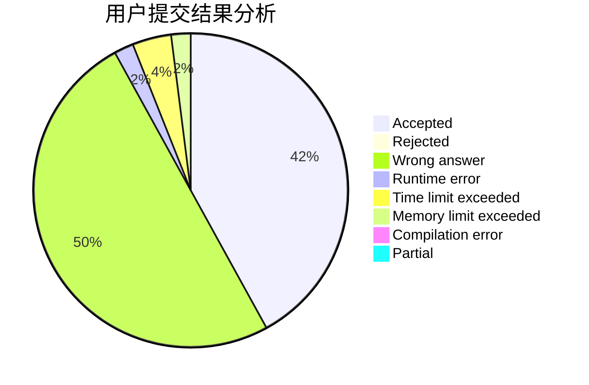
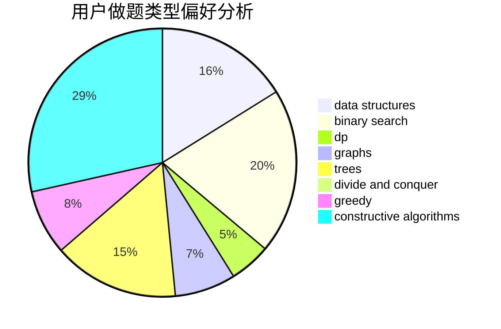

# nao-nao

<!-- tabs:start -->

#### **用户提交结果分析**

#### **用户做题类型偏好分析**

#### **用户错题知识点分析**

<!-- tabs:end -->
# 推荐题目
[260C](https://codeforces.com/contest/260/problem/C)		constructive algorithms,
                        greedy,
                        implementation		  
[272E](https://codeforces.com/contest/272/problem/E)		combinatorics,
                        constructive algorithms,
                        graphs		  
[1077B](https://codeforces.com/contest/1077/problem/B)		greedy		  
[370B](https://codeforces.com/contest/370/problem/B)		implementation		  
[1002A4](https://codeforces.com/contest/1002A/problem/4)		nan		  
[1070A](https://codeforces.com/contest/1070/problem/A)		dp,
                        graphs,
                        number theory,
                        shortest paths		  
[986B](https://codeforces.com/contest/986/problem/B)		combinatorics,
                        math		  
[894A](https://codeforces.com/contest/894/problem/A)		brute force,
                        dp		  
[802N](https://codeforces.com/contest/802/problem/N)		binary search,
                        flows,
                        graphs		  
[706D](https://codeforces.com/contest/706/problem/D)		binary search,
                        bitmasks,
                        data structures,
                        trees		  
