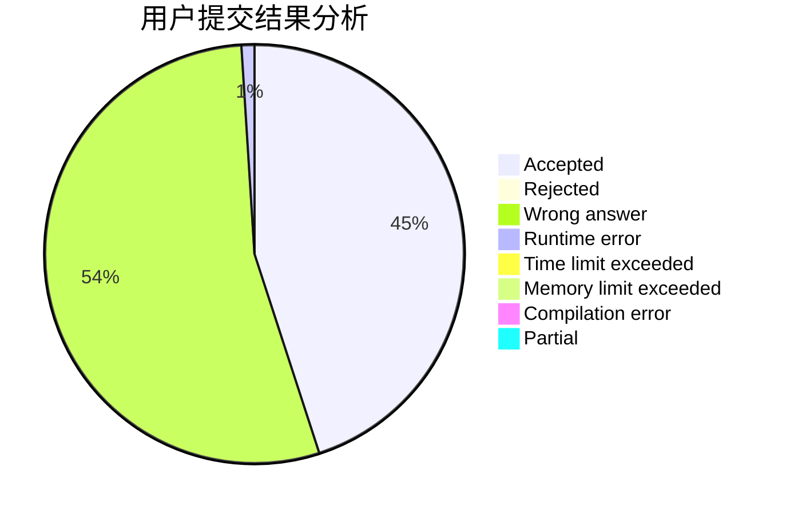
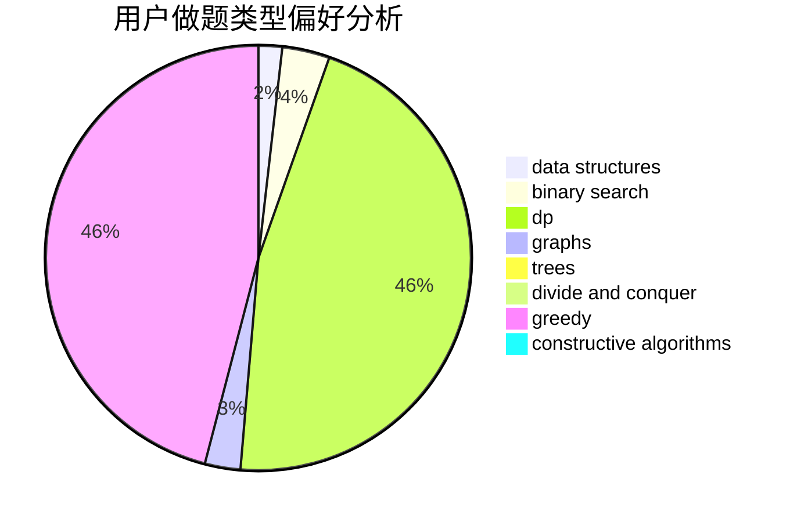
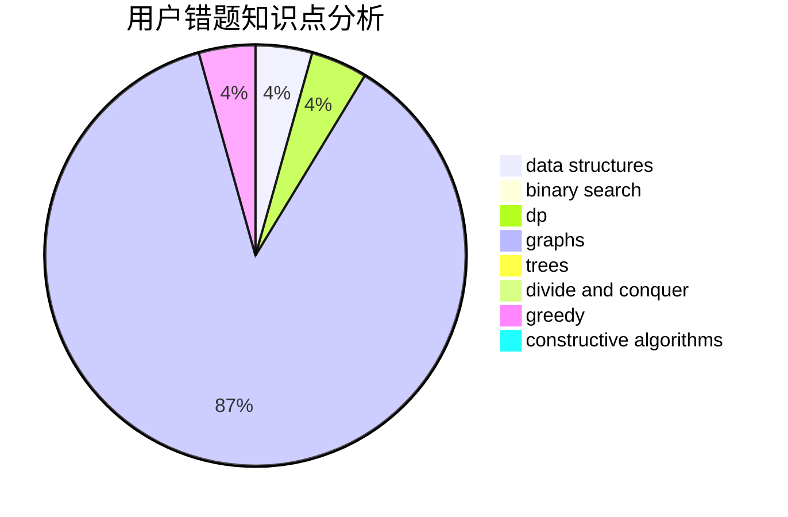

# ncuPeterliang

<!-- tabs:start -->

#### **用户提交结果分析**

#### **用户做题类型偏好分析**

#### **用户错题知识点分析**

<!-- tabs:end -->
# 推荐题目
[727A](https://codeforces.com/contest/727/problem/A)		brute force,
                        dfs and similar,
                        math		  
[427B](https://codeforces.com/contest/427/problem/B)		data structures,
                        implementation		  
[199E](https://codeforces.com/contest/199/problem/E)		dsu,graphs,sortings,trees		  
[462B](https://codeforces.com/contest/462/problem/B)		greedy		  
[25E](https://codeforces.com/contest/25/problem/E)		hashing,
                        strings		  
[919E](https://codeforces.com/contest/919/problem/E)		chinese remainder theorem,
                        math,
                        number theory		  
[1293A](https://codeforces.com/contest/1293/problem/A)		binary search,
                        brute force,
                        implementation		  
[144E](https://codeforces.com/contest/144/problem/E)		data structures,
                        greedy		  
[785C](https://codeforces.com/contest/785/problem/C)		binary search,
                        math		  
[1432A](https://codeforces.com/contest/1432/problem/A)		dsu,graphs,sortings,trees		  
