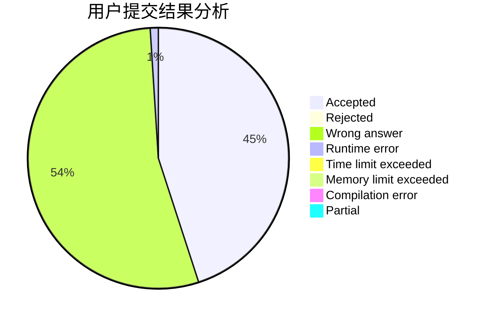
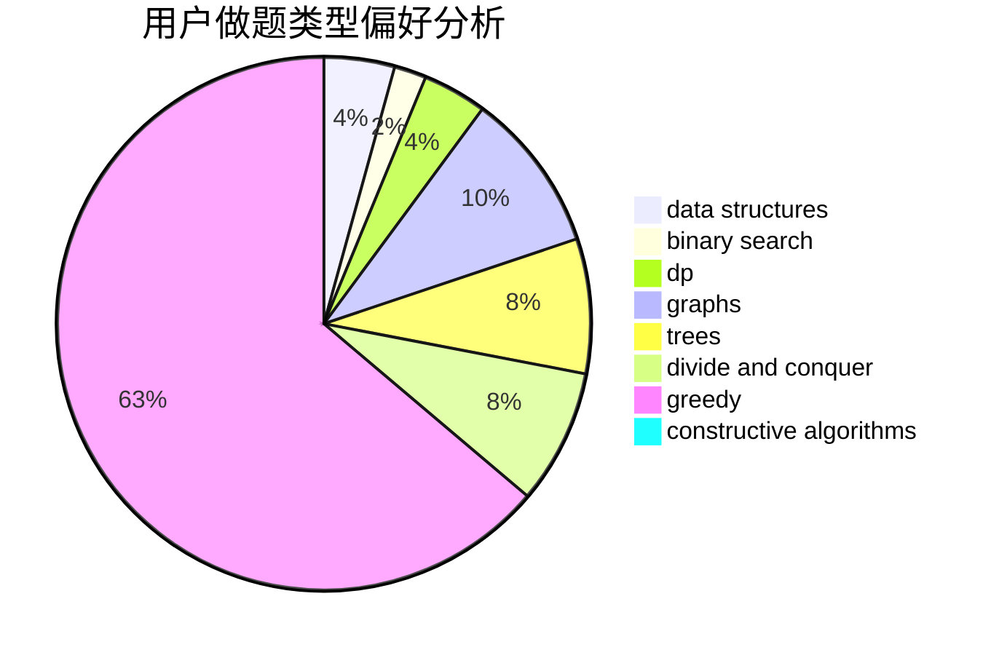
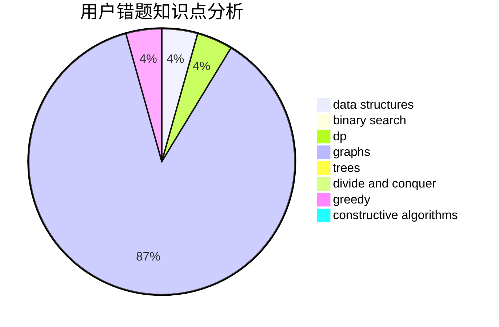

# ncuPeterliang

<!-- tabs:start -->

#### **用户提交结果分析**

#### **用户做题类型偏好分析**

#### **用户错题知识点分析**

<!-- tabs:end -->
# 推荐题目
[708A](https://codeforces.com/contest/708/problem/A)		constructive algorithms,
                        greedy,
                        implementation,
                        strings		  
[39E](https://codeforces.com/contest/39/problem/E)		dp,
                        games		  
[171G](https://codeforces.com/contest/171/problem/G)		*special problem		  
[441D](https://codeforces.com/contest/441/problem/D)		constructive algorithms,
                        dsu,
                        graphs,
                        implementation,
                        math,
                        string suffix structures		  
[238C](https://codeforces.com/contest/238/problem/C)		dfs and similar,
                        dp,
                        greedy,
                        trees		  
[903E](https://codeforces.com/contest/903/problem/E)		brute force,
                        hashing,
                        implementation,
                        strings		  
[1285F](https://codeforces.com/contest/1285/problem/F)		binary search,
                        combinatorics,
                        number theory		  
[1438D](https://codeforces.com/contest/1438/problem/D)		bitmasks,
                        constructive algorithms,
                        math		  
[766A](https://codeforces.com/contest/766/problem/A)		constructive algorithms,
                        strings		  
[1423K](https://codeforces.com/contest/1423/problem/K)		binary search,
                        math,
                        number theory,
                        two pointers		  
