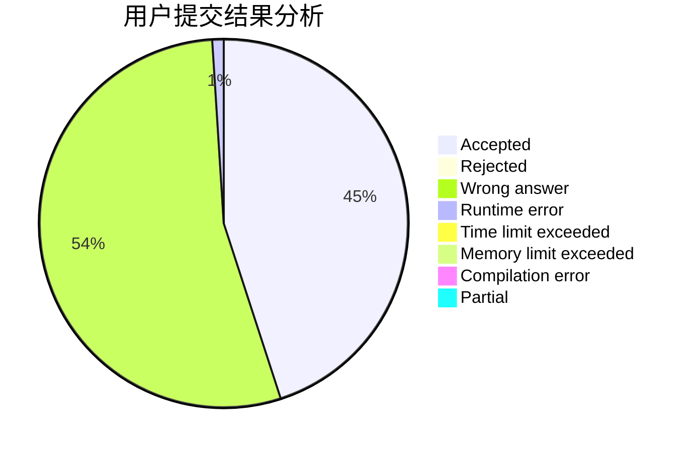
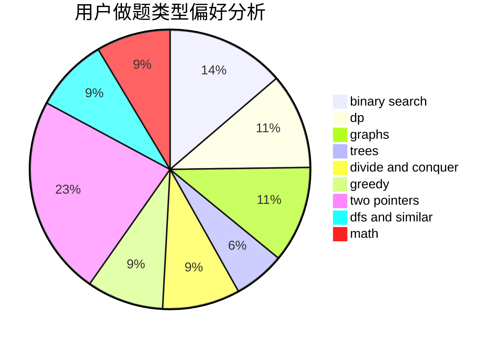

# ncuPeterliang

<!-- tabs:start -->

#### **用户提交结果分析**

#### **用户做题类型偏好分析**

<!-- tabs:end -->
# 推荐题目
[727A](https://codeforces.com/contest/727/problem/A)
[427B](https://codeforces.com/contest/427/problem/B)
[199E](https://codeforces.com/contest/199/problem/E)
[462B](https://codeforces.com/contest/462/problem/B)
[25E](https://codeforces.com/contest/25/problem/E)
[919E](https://codeforces.com/contest/919/problem/E)
[1293A](https://codeforces.com/contest/1293/problem/A)
[144E](https://codeforces.com/contest/144/problem/E)
[785C](https://codeforces.com/contest/785/problem/C)
[1432A](https://codeforces.com/contest/1432/problem/A)
